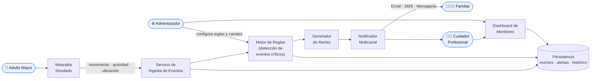

# SeniorCareHub

> **Plataforma Inteligente Distribuida de Monitoreo y Asistencia para Adultos Mayores**

-orange)


SeniorCareHub es una plataforma **IoT distribuida** que recibe datos desde un dispositivo *wearable* simulado, detecta eventos críticos mediante reglas configurables y notifica a familiares o cuidadores a través de múltiples canales, priorizando **disponibilidad**, **tolerancia a fallas** y **baja latencia** en la entrega de alertas.

> 📌 El proyecto está orientado principalmente al **diseño arquitectónico** del sistema —definición de subsistemas, contratos e integración entre componentes— más que a la implementación completa de una solución productiva.

---

## 📑 Tabla de contenidos

1. [Contexto y problema](#-contexto-y-problema)
2. [Objetivo](#-objetivo)
3. [Arquitectura (visión general)](#-arquitectura-visión-general)
4. [Alcance](#-alcance)
5. [Usuarios y casos de uso](#-usuarios-y-casos-de-uso)
6. [Stakeholders](#-stakeholders)
7. [Atributos de calidad y complejidad cubierta](#-atributos-de-calidad-y-complejidad-cubierta)
8. [Estructura del repositorio](#-estructura-del-repositorio)
9. [Documentación](#-documentación)
10. [Equipo](#-equipo)
11. [Información académica](#-información-académica)
12. [Estado del proyecto](#-estado-del-proyecto)

---

## 🎯 Contexto y problema

Los adultos mayores que viven solos o requieren supervisión parcial pueden enfrentar situaciones de riesgo como **caídas**, **períodos prolongados de inactividad** o **desorientación**. En muchos casos, la detección tardía de estos eventos limita la capacidad de respuesta de familiares y cuidadores.

El envejecimiento de la población es uno de los principales desafíos sociales y tecnológicos actuales. Existen dispositivos *wearables* capaces de capturar movimiento, actividad física y ubicación, pero su utilidad depende de la capacidad de **procesar esos datos y generar alertas oportunas**. SeniorCareHub aborda este problema centralizando eventos de dispositivos inteligentes, aplicando reglas configurables para identificar situaciones de riesgo y distribuyendo notificaciones por diferentes canales.

---

## 🚀 Objetivo

Diseñar una plataforma IoT distribuida que:

- Reciba datos desde un dispositivo *wearable* simulado.
- Detecte eventos críticos mediante **reglas configurables**.
- Notifique a familiares o cuidadores a través de **múltiples canales externos**.
- Priorice **disponibilidad, tolerancia a fallas y baja latencia** en la entrega de alertas.

---

## 🏗️ Arquitectura (visión general)



**Flujo principal:** el *wearable* simulado emite eventos → el servicio de **ingesta** los recibe y persiste → el **motor de reglas** evalúa condiciones de riesgo → el **generador de alertas** crea la alerta → el **notificador multicanal** la entrega por Email / SMS / mensajería. El **dashboard** ofrece monitoreo en tiempo real y el **administrador** configura reglas y canales.

> 🧩 Los componentes y contratos detallados se documentarán como ADRs en [`/decisiones`](./decisiones) y diagramas en [`/diagramas`](./diagramas).

---

## 📦 Alcance

### ✅ Incluye — el sistema HACE

- Recepción de eventos desde un *wearable* simulado.
- Procesamiento y detección de eventos críticos mediante reglas configurables.
- Dashboard de monitoreo para seguimiento de usuarios.
- Generación y envío de alertas multicanal.

### ⛔ Fuera de alcance — el sistema NO HACE

- Diagnóstico médico.
- Desarrollo de hardware físico real.
- Integración con sistemas hospitalarios o expedientes clínicos.

---

## 👥 Usuarios y casos de uso

| Tipo de usuario | Casos de uso principales |
|---|---|
| **Adulto Mayor** | Registrar dispositivo *wearable*, consultar estado general, visualizar historial de actividad |
| **Familiar** | Recibir alertas, consultar ubicación y estado, revisar historial de eventos |
| **Cuidador Profesional** | Monitorear múltiples adultos mayores, gestionar incidentes, registrar seguimiento |
| **Administrador del Sistema** | Configurar reglas, gestionar usuarios, administrar canales de notificación y monitorear la operación |

---

## 🤝 Stakeholders

| Stakeholder | Rol | Intereses principales | Preocupaciones / restricciones |
|---|---|---|---|
| **Adulto Mayor** | Usuario principal | Seguridad, autonomía y monitoreo continuo | Privacidad y falsas alarmas |
| **Familiar** | Receptor de alertas | Alertas oportunas y confiables | Retrasos o pérdida de notificaciones |
| **Cuidador Profesional** | Supervisor operativo | Monitoreo eficiente de múltiples usuarios | Sobrecarga de alertas |
| **Administrador del Sistema** | Operación de la plataforma | Disponibilidad y gestión eficiente | Fallos operativos |

---

## 🎚️ Atributos de calidad y complejidad cubierta

La propuesta cumple con los siguientes criterios de complejidad:

- **Múltiples actores** con responsabilidades diferenciadas.
- **Persistencia no trivial** de eventos, alertas y datos históricos de monitoreo.
- **Distribución y tolerancia a fallas** mediante una arquitectura distribuida.
- **Subsistemas con fronteras claras** e interfaces definidas.
- **Integración con servicios externos** de notificación (correo electrónico, SMS o mensajería).
- **Atributos de calidad en tensión**, especialmente disponibilidad, rendimiento y confiabilidad.

---

## 🗂️ Estructura del repositorio

```text
pswe04-senior-care-hub-c2-2026/
├── README.md            ← este documento
├── docs/                ← documentación del proyecto
│   ├── PSWE04_SeniorCareHub_Documento_Proyecto.md   (documento de diseño – template PSWE-04)
│   └── s03-propuesta.md                              (propuesta S03)
├── decisiones/          ← Decisiones Arquitectónicas (ADRs)
└── diagramas/           ← diagramas del sistema (C4, secuencia, despliegue, etc.)
```

---

## 📚 Documentación

| Documento | Descripción |
|---|---|
| [Documento de Diseño de Software](./docs/PSWE04_SeniorCareHub_Documento_Proyecto.md) | Documento principal bajo el template estándar PSWE-04. |
| [Propuesta S03](./docs/s03-propuesta.md) | Propuesta inicial: contexto, objetivo, alcance y complejidad. |
| [Decisiones arquitectónicas (ADRs)](./decisiones) | Registro de decisiones de diseño del proyecto. |
| [Diagramas](./diagramas) | Diagramas de arquitectura y diseño del sistema. |

---

## 👩‍💻 Equipo

**Grupo 3**

| Integrante | Carné |
|---|---|
| Roberto Obed Del Cid Winter | P000024239 |
| Lisdiana Mercedes Rodriguez Alvarado | P000030183 |
| Maria Isabel Vallejos Rodriguez | P000020526 |

---

## 🎓 Información académica

| Campo | Detalle |
|---|---|
| **Curso** | PSWE-04 — Diseño de Software |
| **Programa** | Maestría Profesional en Ingeniería del Software |
| **Universidad** | Universidad Cenfotec |
| **Docente** | Juan Mauricio Leandro Jimenez |
| **Cuatrimestre** | 2026 — II Cuatrimestre |
| **Repositorio** | https://github.com/pswe04-seniorcarehub/pswe04-senior-care-hub-c2-2026 |

---

## 📌 Estado del proyecto

| Versión | Fecha | Hito | Estado |
|---|---|---|---|
| 0.1 | 2026-05-26 | Propuesta (S03) | 🟠 En progreso |

---

<sub>Documento generado bajo el template estándar PSWE-04 — Universidad Cenfotec — Maestría Profesional en Ingeniería del Software.</sub>
