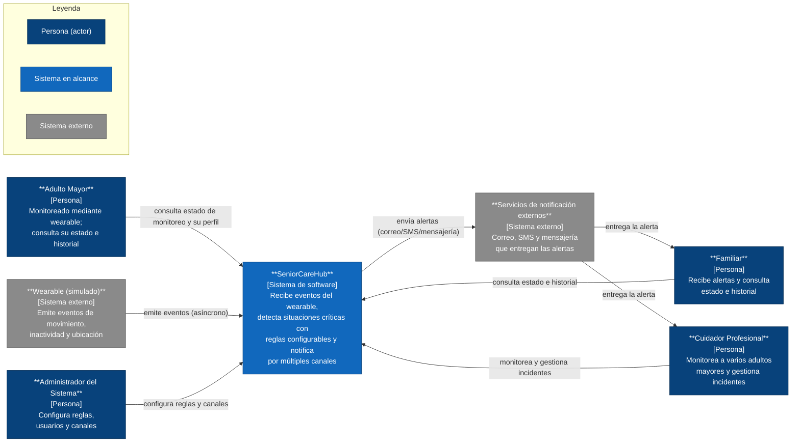

# SeniorCareHub
> Documento de Diseño de Software — PSWE-04  
> Universidad Cenfotec · Maestría Profesional en Ingeniería del Software

---

| Campo | Detalle |
|---|---|
| **Nombre del sistema** | SeniorCareHub – Plataforma Inteligente de Monitoreo y Asistencia para Adultos Mayores |
| **Grupo** | 3 |
| **Integrantes** | Roberto Obed Del Cid Winter — P000024239, Lisdiana Mercedes Rodriguez Alvarado — P000030183, Maria Isabel Vallejos Rodriguez — P000020526|
| **URL del repositorio** | https://github.com/pswe04-seniorcarehub/pswe04-senior-care-hub-c2-2026.git |
| **Docente** | Juan Mauricio Leandro Jimenez |
| **Cuatrimestre** | 2026 — II Cuatrimestre |
| **Versión del documento** | 0.2 — Avance 1(S07) |
| **Fecha de última actualización** | 2026-06-23 |

---

## Historial de versiones

| Versión | Fecha | Hito | Cambios principales | Autor(es) |
|---|---|---|---|---|
| 0.1 | 2026-05-26 | Propuesta (S03) | Creación del documento inicial | Roberto Obed Del Cid Winter, Lisdiana Mercedes Rodriguez Alvarado, Maria Isabel Vallejos Rodriguez |
| 0.2 | 2026-06-23 | Avance 1 (S07) | Desarrollo del contexto del sistema, alcance, usuarios, stakeholders, drivers arquitectónicos, escenarios de calidad y vista de contexto C4. | Roberto Obed Del Cid Winter — P000024239, Lisdiana Mercedes Rodriguez Alvarado — P000030183, Maria Isabel Vallejos Rodriguez — P000020526 |

---

## Tabla de contenidos

1. [Descripción del sistema y alcance](#1-descripción-del-sistema-y-alcance)
2. [Stakeholders](#2-stakeholders)
3. [Drivers arquitectónicos](#3-drivers-arquitectónicos)
4. [Requerimientos de calidad — Escenarios](#4-requerimientos-de-calidad--escenarios)
7. [Vistas arquitectónicas](#7-vistas-arquitectónicas)
   - 7.1 [Vista de contexto](#71-vista-de-contexto)

---

# BLOQUE 1 — CONTEXTO Y PROBLEMA
*Hito: Propuesta (S03)*

---

## 1. Descripción del sistema y alcance

### 1.1 Descripción general

Los adultos mayores que viven solos o requieren supervisión parcial pueden enfrentar situaciones de riesgo como caídas, períodos prolongados de inactividad o desorientación. En muchos casos, la detección tardía de estas situaciones limita la capacidad de respuesta de familiares y cuidadores, incrementando el riesgo de consecuencias graves para la salud y seguridad de la persona.

SeniorCareHub es una plataforma inteligente de monitoreo asistido orientada al cuidado de adultos mayores. Su propósito es apoyar a familiares y cuidadores mediante la identificación oportuna de situaciones de riesgo y la generación de alertas que permitan una respuesta rápida ante posibles emergencias. Cuando ocurre una situación de riesgo, el sistema debe ser capaz de identificar el evento, evaluarlo según las condiciones definidas para cada perfil de monitoreo y comunicar oportunamente la información relevante a familiares o cuidadores. De esta manera, SeniorCareHub busca detectar eventos críticos, clasificarlos y entregar alertas oportunas y confiables, contribuyendo a la seguridad y autonomía de las personas monitoreadas.

La necesidad de una solución de software surge porque la supervisión permanente por parte de familiares o cuidadores no siempre es posible. Un sistema automatizado permite centralizar el monitoreo, detectar eventos relevantes de forma continua y comunicar oportunamente situaciones que requieren atención, reduciendo los tiempos de respuesta y mejorando la capacidad de reacción ante incidentes.

### 1.2 Contexto del negocio o dominio

SeniorCareHub se ubica dentro del dominio de monitoreo asistido para adultos mayores, un área orientada a mejorar la seguridad y calidad de vida de personas que viven solas o requieren supervisión parcial. En este contexto, familiares y cuidadores necesitan mantenerse informados sobre situaciones que puedan representar un riesgo para la integridad o bienestar de la persona monitoreada, como caídas, periodos prolongados de inactividad, desplazamientos fuera de áreas seguras u otros eventos que requieran atención.

En muchos casos, el monitoreo de adultos mayores depende de llamadas periódicas, visitas presenciales o mecanismos de supervisión limitados por parte de familiares y cuidadores. Estos procesos pueden resultar insuficientes para detectar oportunamente situaciones de emergencia, especialmente cuando no existe supervisión continua. El sistema busca apoyar este proceso mediante una plataforma inteligente capaz de recibir, analizar y evaluar eventos asociados al monitoreo de cada adulto mayor. En este contexto, el término inteligente se refiere a la capacidad de interpretar los eventos recibidos, aplicar reglas configurables y determinar cuándo una situación requiere atención. Esto permite adaptar los criterios de detección y clasificación de riesgos según las características y necesidades de cada persona monitoreada.

Para los fines de este proyecto, no se contempla el uso de dispositivos wearable reales. En su lugar, se utilizarán simulaciones que representen los eventos que dichos dispositivos podrían generar en un entorno operativo real. Entre los eventos considerados se incluyen caídas, periodos prolongados de inactividad, desplazamientos fuera de zonas seguras y pérdida de comunicación. Cada evento simulado incluirá información básica como identificación del usuario monitoreado, tipo de evento, fecha y hora de ocurrencia, nivel de criticidad estimado y, cuando corresponda, ubicación aproximada.

La naturaleza del dominio exige que los eventos críticos sean identificados y comunicados oportunamente, y que los mecanismos de notificación mantengan altos niveles de disponibilidad y confiabilidad para apoyar la atención de emergencias. Desde la perspectiva del dominio, el sistema debe manejar información personal y sensible relacionada con los usuarios monitoreados, incluyendo datos de actividad, estado general y posibles datos de ubicación. Por esta razón, la privacidad y la protección de la información constituyen consideraciones relevantes para el diseño de la solución. 

### 1.3 Alcance del sistema

**Dentro del alcance — el sistema HACE:**

- Recibir y procesar eventos simulados que representan la información generada por dispositivos wearable asociados a adultos mayores monitoreados.
- Detectar y clasificar situaciones de riesgo, como caídas, periodos prolongados de inactividad, desplazamientos fuera de áreas seguras o pérdida de comunicación con el dispositivo.
- Permitir configurar perfiles individuales de monitoreo, incluyendo reglas de detección, criterios de criticidad y mecanismos de notificación para cada adulto mayor.
- Generar y enviar alertas a familiares y cuidadores, así como notificaciones relevantes al adulto mayor cuando corresponda, a través de múltiples canales de comunicación.
- Aplicar reglas configurables para determinar la criticidad de los eventos y priorizar las alertas generadas.
- Permitir el monitoreo del estado de los adultos mayores mediante paneles de seguimiento e historial de eventos y alertas.
- Mantener un registro histórico de eventos, alertas y acciones relevantes para consulta y seguimiento.
- Gestionar usuarios, roles y permisos diferenciados para adultos mayores, familiares, cuidadores y administradores, garantizando que cada tipo de usuario acceda únicamente a la información y funcionalidades correspondientes a sus responsabilidades.
- Permitir registrar y dar seguimiento al estado de las alertas generadas, incluyendo su atención, confirmación o descarte en casos de posibles falsas alarmas.

**Fuera del alcance — el sistema NO HACE:**

- Realizar diagnósticos médicos, emitir recomendaciones clínicas o sustituir la valoración de profesionales de salud.
- Contactar directamente servicios de emergencia, ambulancias, hospitales o cuerpos de rescate. La responsabilidad del sistema se limita a la detección de eventos y generación de alertas para familiares y cuidadores.
- Desarrollar o administrar hardware físico real; los dispositivos wearable se consideran componentes externos al sistema.
- Integrarse con sistemas hospitalarios, expedientes clínicos electrónicos o plataformas médicas institucionales.
- Monitorear signos vitales médicos especializados ni interpretar información clínica compleja.
- Garantizar la respuesta o intervención de familiares, cuidadores o terceros una vez enviada una alerta. La responsabilidad del sistema se limita a la detección de eventos, clasificación de riesgos y generación de las notificaciones correspondientes.
- Garantizar que toda alerta generada corresponda a una emergencia real. El sistema clasifica y prioriza eventos según reglas configurables, pero la confirmación final depende de la revisión humana.
- Sustituir la supervisión humana o el cuidado presencial de los adultos mayores.

### 1.4 Usuarios y casos de uso principales

| Tipo de usuario | Casos de uso principales |
|---|---|
| Adulto Mayor | Consultar el estado de su monitoreo y del dispositivo wearable, visualizar historial de eventos y alertas asociadas a su perfil, recibir notificaciones relevantes relacionadas con su monitoreo |
| Familiar | Recibir alertas de emergencia en tiempo real, consultar el estado actual del adulto mayor y del dispositivo wearable, visualizar historial de eventos y alertas, configurar preferencias de notificación, confirmar o dar seguimiento a alertas recibidas |
| Cuidador Profesional | Monitorear múltiples adultos mayores, recibir, visualizar y priorizar alertas activas, consultar historial de eventos, registrar seguimiento de incidentes y posibles falsas alarmas, ajustar perfiles de monitoreo de adultos mayores bajo su supervisión |
| Administrador del Sistema | Administrar usuarios, roles y permisos, configurar reglas y parámetros generales de monitoreo, administrar canales de notificación, supervisar la operación del sistema, consultar métricas y eventos de la plataforma |

---

## 2. Stakeholders

| Stakeholder | Rol | Intereses principales | Preocupaciones o restricciones |
|---|---|---|---|
| Adulto Mayor | Usuario principal | Seguridad, autonomía y monitoreo continuo | Privacidad y falsas alarmas |
| Familiar | Receptor de alertas | Recibir alertas oportunas y confiables | Retrasos o pérdida de notificaciones |
| Cuidador Profesional | Supervisor operativo | Monitoreo eficiente de múltiples usuarios | Sobrecarga de alertas |
| Administrador del Sistema | Operación de la plataforma | Disponibilidad y gestión eficiente | Fallos operativos |

---

## 3. Drivers arquitectónicos

Los drivers son los factores que más moldean la arquitectura de SeniorCareHub. Se clasifican en tres categorías: requerimientos funcionales con impacto estructural, atributos de calidad prioritarios y restricciones no negociables. Cada driver referencia al stakeholder que lo origina (sección 2). Las justificaciones se centran en *por qué* cada elemento condiciona la arquitectura, sin comprometer todavía una tecnología ni un patrón de solución (eso corresponde a las vistas y decisiones posteriores).

### 3.1 Requerimientos funcionales clave

| ID | Requerimiento | Stakeholder | Por qué es un driver (impacto arquitectónico) |
|---|---|---|---|
| RF-01 | El sistema recibe un flujo continuo de eventos (movimiento, inactividad, ubicación) desde el wearable de cada adulto mayor. | Adulto Mayor, Familiar, Cuidador Profesional | El ingreso continuo y permanente de eventos obliga a que la arquitectura acepte y conserve la entrada con independencia del ritmo al que se procesa, tolerando variaciones de carga y fallos momentáneos sin perder eventos. Esto separa la responsabilidad de recibir los datos de la de analizarlos y convierte la ingesta en una preocupación estructural propia, además de exigir que la arquitectura no quede atada al dispositivo concreto que los emite. |
| RF-02 | El sistema determina si un evento es crítico aplicando reglas configurables (umbrales de inactividad, zonas, etc.) que el administrador modifica sin intervención del equipo de desarrollo. | Administrador del Sistema, Cuidador Profesional | Que las reglas cambien sin tocar el código obliga a que el comportamiento de detección no esté fijo, sino determinado por configuración que la arquitectura debe poder leer y aplicar en tiempo de ejecución. Esto separa la política (qué se considera crítico) del mecanismo (cómo se evalúa) y condiciona dónde reside y cómo se gobierna esa configuración dentro de la estructura. |
| RF-03 | Ante un evento crítico de un adulto mayor, el sistema notifica a sus familiares y cuidadores a través de múltiples canales externos (correo, SMS, mensajería). | Adulto Mayor, Familiar, Cuidador Profesional | Notificar por varios canales que pueden cambiar (agregarse o quitarse) y que dependen de servicios externos no controlados obliga a que la lógica de detección no quede acoplada a un canal concreto y a que la arquitectura aísle esas dependencias para que sus fallos o cambios no se propaguen al núcleo. La entrega de la alerta se vuelve una preocupación estructural, separada de la decisión de cuándo alertar. |
| RF-04 | Cuidadores y familiares consultan estado e historial en el dashboard; un mismo cuidador supervisa a varios adultos mayores. | Cuidador Profesional, Familiar | La relación muchos-a-muchos (un cuidador con varios adultos mayores; un adulto mayor con varios familiares) condiciona el modelo de datos, el acceso a la información histórica y la autorización basada en la relación entre actores (quién puede ver a quién). |
| RF-05 | El sistema permite definir y administrar perfiles de monitoreo individuales para cada adulto mayor, incluyendo criterios de detección, niveles de criticidad y destinatarios de las notificaciones. | Administrador del Sistema, Cuidador Profesional | Que cada adulto mayor tenga su propia configuración (criterios, criticidad y destinatarios) impide que la detección y la notificación se comporten de forma única y global: la arquitectura debe sostener comportamiento parametrizado por sujeto, que los caminos de detección y notificación leen y aplican. Esto condiciona el modelo de datos (relación entre perfiles, adultos mayores y destinatarios) y exige que la configuración sea una preocupación de primer nivel, desacoplada de la lógica para poder cambiar sin reescritura. |

### 3.2 Atributos de calidad prioritarios

| ID | Atributo | Importancia | Stakeholder | Justificación (meta medible y porqué) |
|---|---|---|---|---|
| QA-01 | Disponibilidad | Alta | Adulto Mayor, Familiar, Cuidador, Administrador | **Meta:** pipeline crítico (ingesta → detección → notificación) disponible ≥ 99.5 % mensual (≈ ≤ 3.6 h de caída/mes). Si el sistema está caído, no llegan alertas, no se puede monitorear ni consultar el estado; la seguridad del adulto mayor depende de que el monitoreo no se interrumpa. |
| QA-02 | Rendimiento (latencia de alerta) | Alta | Adulto Mayor, Familiar, Cuidador | **Meta:** desde la recepción de un evento crítico hasta el despacho de la notificación ≤ 5 s en el percentil 95, bajo carga normal. Una alerta tardía pierde su valor; la latencia afecta a todos los implicados en recibir la alerta y actuar a tiempo. |
| QA-03 | Tolerancia a fallos / Resiliencia | Alta | Adulto Mayor, Familiar, Cuidador, Administrador | **Meta:** 0 alertas críticas perdidas; entrega "al menos una vez" con reintentos; ante la caída de un canal externo o de un componente no crítico, el sistema sigue operando y notificando (degradación sin pérdida). Perder una alerta crítica es el peor fallo posible. |
| QA-04 | Seguridad y privacidad | Alta | Adulto Mayor, Familiar, Cuidador, Administrador | **Meta:** 100 % de los datos sensibles (ubicación, identidad) cifrados en tránsito y en reposo; acceso por rol y por relación; alineado a la Ley 8968 (CR). Se maneja ubicación y estado de personas vulnerables: todos los actores tienen interés en su protección y existe marco regulatorio aplicable. |
| QA-05 | Modificabilidad | Alta | Administrador, Cuidador | **Meta:** cambiar un umbral, un perfil de monitoreo o un canal de notificación no requiere recompilar ni redesplegar el núcleo; el comportamiento de detección y notificación se ajusta mediante configuración. Las reglas, los perfiles (RF-02, RF-05) y los canales son lo que más cambiará en el tiempo; el diseño debe absorber ese cambio sin reescritura. |

**Selección — por qué estos cinco:** se priorizan los atributos críticos para la operación del sistema y presentes en el alcance: disponibilidad, rendimiento (latencia de alerta), tolerancia a fallos/resiliencia, seguridad/privacidad y modificabilidad (clave por las reglas y perfiles configurables, ligada a RF-02 y RF-05). La **exactitud de la detección / control de falsas alarmas** no se trata como atributo prioritario independiente, sino como parte del diseño de las reglas de detección, y se refleja como una tensión con el rendimiento (ver abajo). Se excluye la **escalabilidad** del top-5 porque el proyecto es de diseño con una base de usuarios acotada; queda como punto de extensión habilitado por la independencia entre ingesta y procesamiento (RF-01), sin meta de escala fija. Se excluye la **usabilidad** porque, aunque es relevante para el dashboard, no impone decisiones estructurales mayores.

**Tensiones entre atributos** (insumo directo para los escenarios de calidad de la sección 4):

- **Rendimiento ↔ Tolerancia a fallos:** entregar la alerta lo más rápido posible vs. garantizar que no se pierda; las confirmaciones y los reintentos que dan robustez agregan latencia.
- **Exactitud de la detección (control de falsas alarmas) ↔ Rendimiento:** confirmar un evento antes de alertar reduce los falsos positivos pero agrega retraso; es el equilibrio entre no generar falsas alarmas y avisar a tiempo.
- **Modificabilidad ↔ Rendimiento:** la flexibilidad de evaluar reglas configurables y parametrizadas en tiempo de ejecución compite con la velocidad de procesamiento frente a una lógica fija.
- **Disponibilidad ↔ Seguridad:** operar de forma continua vs. los controles, validaciones y ventanas de mantenimiento que añaden latencia o indisponibilidad.

> La tensión Disponibilidad ↔ Consistencia (CAP) se retoma más adelante, en la etapa de diseño del almacenamiento distribuido, donde corresponde tomar esa decisión.

### 3.3 Restricciones que actúan como drivers

| ID | Restricción | Tipo | Impacto en el diseño |
|---|---|---|---|
| REST-01 | La notificación depende de servicios de terceros (correo, SMS, mensajería) fuera del control del equipo. | Técnica | La arquitectura debe aislar estas dependencias externas para que su indisponibilidad, latencia o cambios no se propaguen al núcleo, y mantener la entrega de alertas resiliente pese a que esos servicios no son gobernables por el sistema. Es la cara de "restricción" de RF-03 y sustenta la meta de QA-03. |
| REST-02 | Cumplimiento de la Ley 8968 de protección de datos personales (Costa Rica), por manejar ubicación e identidad de personas vulnerables. | Regulatoria | Obliga a tratar la seguridad y la privacidad como una preocupación transversal: protección de los datos sensibles en tránsito y en reposo, minimización, acceso por rol y por relación, y trazabilidad de los accesos. Sustenta la meta de QA-04. |

*Referencia normativa (para la sección de Referencias del documento):* Asamblea Legislativa de la República de Costa Rica, "Ley N.° 8968: Protección de la Persona frente al Tratamiento de sus Datos Personales," *La Gaceta*, n.° 170, San José, Costa Rica, 5 de setiembre de 2011.

---

# BLOQUE 2 — REQUERIMIENTOS DE CALIDAD
*Hito: Avance 1 (S07)*

---

## 4. Requerimientos de calidad — Escenarios

Un escenario de calidad es una descripción concreta y medible de cómo el sistema debe responder ante un estímulo específico. El formato ISO/IEEE de 6 elementos es muy utilizado para representar estos escenarios ya que muestra como se desenvuelve el sistema ante diferentes situaciones.

Para los fines de este proyecto se identificaron 5 atributos de calidad y sus respectivas tensiones cuando corresponden.

## Escenario QS-01 — Disponibilidad

| Elemento | Descripción |
|-----------|-------------|
| **Fuente del estímulo** | Familiar o cuidador |
| **Estímulo** | Eventos continuos de monitoreo y generación de alertas|
| **Entorno** | Operación continua durante un mes de funcionamiento normal |
| **Artefacto** | Plataforma SeniorCareHub (pipeline de monitoreo y dashboard)|
| **Respuesta** | El sistema permite acceder al estado y al historial sin interrupciones significativas|
| **Medida de respuesta** | El pipeline crítico de monitoreo y consulta mantiene una disponibilidad mensual ≥ 99.5 %, equivalente a un tiempo máximo de indisponibilidad de 3.6 horas por mes |

**Tensión con:** QS-04 (Seguridad y privacidad), porque mecanismos de autenticación, auditoría y mantenimiento pueden introducir indisponibilidad temporal.

## Escenario QS-02 — Rendimiento

| Elemento | Descripción |
|-----------|-------------|
| **Fuente del estímulo** | Wearable asociado a un adulto mayor |
| **Estímulo** | Se detecta un evento crítico de caída o inactividad prolongada |
| **Entorno** | Operación normal con múltiples eventos procesándose simultáneamente |
| **Artefacto** | Pipeline de procesamiento de eventos y subsistema de notificaciones |
| **Respuesta** | El sistema clasifica el evento y envía la alerta a los destinatarios configurados |
| **Medida de respuesta** | Desde la recepción del evento crítico hasta el envío de la primera notificación transcurren ≤ 5 segundos en el percentil 95 |

**Tensión con:** QS-03 (Resiliencia), debido a que reintentos y mecanismos de recuperación incrementan la latencia. También tensiona con QS-05 (Modificabilidad), porque reglas más flexibles pueden aumentar el tiempo de procesamiento.

## Escenario QS-03 — Tolerancia a fallos / Resiliencia

| Elemento | Descripción |
|-----------|-------------|
| **Fuente del estímulo** | Servicio externo de notificaciones |
| **Estímulo** | El proveedor principal de envío de SMS presenta una falla |
| **Entorno** | Operación normal |
| **Artefacto** | Subsistema de notificaciones |
| **Respuesta** | El sistema continúa intentando la entrega utilizando otros canales disponibles y registra la incidencia |
| **Medida de respuesta** | El sistema garantiza que ninguna alerta crítica se pierda y logra la entrega mediante al menos un canal disponible en menos de 10 segundos |

**Tensión con:** QS-02 (Rendimiento), porque los mecanismos de recuperación y reintentos agregan tiempo adicional.

## Escenario QS-04 — Seguridad y privacidad

| Elemento | Descripción |
|-----------|-------------|
| **Fuente del estímulo** | Usuario no autorizado |
| **Estímulo** | Intento de acceso a información sensible como ubicación y estado de un adulto mayor sin permisos |
| **Entorno** | Operación normal |
| **Artefacto** | Subsistema de autenticación y autorización |
| **Respuesta** | El sistema bloquea el acceso, se registra el intento y mantiene protegidos los datos sensibles |
| **Medida de respuesta** | El 100 % de los accesos no autorizados son bloqueados y auditados |

**Tensión con:** QS-01 (Disponibilidad), porque mecanismos de seguridad, auditoría y mantenimiento pueden impactar la continuidad del servicio.

## Escenario QS-05 — Modificabilidad

| Elemento | Descripción |
|-----------|-------------|
| **Fuente del estímulo** | Administrador del sistema |
| **Estímulo** | Se requiere agregar una nueva regla de detección o modificar los criterios de criticidad de un perfil de monitoreo |
| **Entorno** | Operación normal con usuarios activos |
| **Artefacto** | Motor de reglas y configuración de perfiles de monitoreo |
| **Respuesta** | La nueva regla es incorporada y comienza a ser utilizada por el sistema sin interrumpir el servicio ni requerir redepliegues |
| **Medida de respuesta** | La modificación entra en operación en menos de 10 minutos sin detener el sistema |

**Tensión con:** QS-02 (Rendimiento), debido a que una mayor flexibilidad y configurabilidad puede incrementar el tiempo requerido para evaluar eventos y determinar su criticidad.

---

# BLOQUE 3 — VISTAS ARQUITECTÓNICAS

## 7. Vistas arquitectónicas

### 7.1 Vista de contexto

La vista de contexto (C4 · Nivel 1) ubica a SeniorCareHub como un único sistema dentro de su entorno, mostrando los actores que interactúan con él y los sistemas externos de los que depende, junto con las relaciones etiquetadas entre ellos.

*Figura 1 — Vista de contexto (C4 · Nivel 1) de SeniorCareHub*

**Actores:**

- **Adulto Mayor** — persona monitoreada mediante un wearable; consulta su estado de monitoreo, su perfil e historial.
- **Familiar** — recibe alertas y consulta el estado e historial del adulto mayor.
- **Cuidador Profesional** — monitorea a varios adultos mayores y gestiona incidentes.
- **Administrador del Sistema** — configura reglas, perfiles, usuarios y canales de notificación.

**Sistemas externos:**

- **Wearable (simulado)** — emite de forma continua los eventos de movimiento, inactividad y ubicación del adulto mayor hacia el sistema.
- **Servicios de notificación externos** — proveedores de correo, SMS y mensajería que entregan las alertas a familiares y cuidadores.

**Flujo principal:** el wearable emite eventos hacia SeniorCareHub; el sistema los procesa, detecta situaciones críticas según las reglas configuradas y despacha las alertas a través de los servicios de notificación externos, que las entregan a familiares y cuidadores. En paralelo, el adulto mayor, el familiar y el cuidador consultan el estado e historial directamente en el sistema, y el administrador gestiona reglas, perfiles y canales.

> El diagrama anterior lo renderiza GitHub a partir del bloque Mermaid embebido. La versión formal en notación e iconografía C4 (C4-PlantUML) está disponible en `diagramas/c4-contexto.puml`.

---

*Documento generado bajo el template estándar PSWE-04 — Universidad Cenfotec — Maestría Profesional en Ingeniería del Software*
