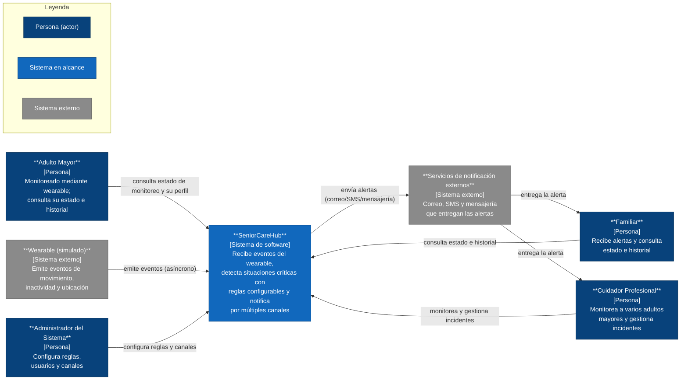
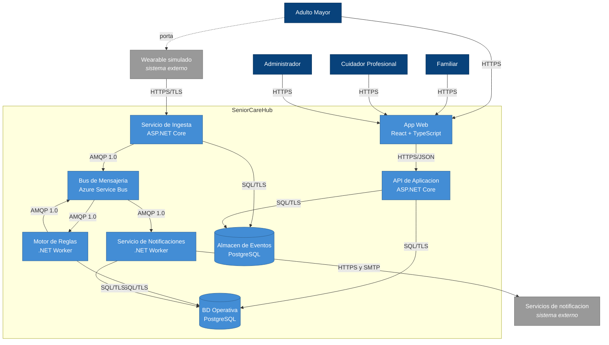

# SeniorCareHub
> Documento de Diseño de Software — PSWE-04  
> Universidad Cenfotec · Maestría Profesional en Ingeniería del Software

---

| Campo | Detalle |
|---|---|
| **Nombre del sistema** | SeniorCareHub – Plataforma Inteligente de Monitoreo y Asistencia para Adultos Mayores |
| **Grupo** | 3 |
| **Integrantes** | Roberto Obed Del Cid Winter — P000024239, Lisdiana Mercedes Rodriguez Alvarado — P000030183, Maria Isabel Vallejos Rodriguez — P000020526|
| **URL del repositorio** | https://github.com/pswe04-seniorcarehub/pswe04-senior-care-hub-c2-2026.git |
| **Docente** | Juan Mauricio Leandro Jimenez |
| **Cuatrimestre** | 2026 — II Cuatrimestre |
| **Versión del documento** | 0.2 — Avance 1(S07) |
| **Fecha de última actualización** | 2026-06-24 |

---

## Historial de versiones

| Versión | Fecha | Hito | Cambios principales | Autor(es) |
|---|---|---|---|---|
| 0.1 | 2026-05-26 | Propuesta (S03) | Creación del documento inicial | Roberto Obed Del Cid Winter, Lisdiana Mercedes Rodriguez Alvarado, Maria Isabel Vallejos Rodriguez |
| 0.2 | 2026-06-24 | Avance 1 (S07) | Desarrollo del contexto del sistema, alcance, usuarios, stakeholders, drivers arquitectónicos, escenarios de calidad y vista de contexto C4. | Roberto Obed Del Cid Winter, Lisdiana Mercedes Rodriguez Alvarado, Maria Isabel Vallejos Rodriguez |

---

## Tabla de contenidos

1. [Descripción del sistema y alcance](#1-descripción-del-sistema-y-alcance)
2. [Stakeholders](#2-stakeholders)
3. [Drivers arquitectónicos](#3-drivers-arquitectónicos)
4. [Requerimientos de calidad — Escenarios](#4-requerimientos-de-calidad--escenarios)
5. [Restricciones](#5-restricciones)
6. [Principios de diseño adoptados](#6-principios-de-diseño-adoptados)
7. [Vistas arquitectónicas](#7-vistas-arquitectónicas)
   - 7.1 [Vista de contexto](#71-vista-de-contexto)
   - 7.2 [Vista de contenedores](#72-vista-de-contenedores)
8. [Estilo arquitectónico](#8-estilo-arquitectónico)

---

# BLOQUE 1 — CONTEXTO Y PROBLEMA
*Hito: Propuesta (S03) y Avance 1 (S07)*

---

## 1. Descripción del sistema y alcance

### 1.1 Descripción general

Los adultos mayores que viven solos o requieren supervisión parcial pueden enfrentar situaciones de riesgo como caídas, períodos prolongados de inactividad o desorientación. En muchos casos, la detección tardía de estas situaciones limita la capacidad de respuesta de familiares y cuidadores, incrementando el riesgo de consecuencias graves para la salud y seguridad de la persona.

SeniorCareHub es una plataforma inteligente de monitoreo asistido orientada al cuidado de adultos mayores. Su propósito es apoyar a familiares y cuidadores mediante la identificación oportuna de situaciones de riesgo y la generación de alertas que permitan una respuesta rápida ante posibles emergencias. El principal desafío del sistema consiste en recibir de manera continua los eventos generados durante el monitoreo, evaluarlos mediante reglas configurables, distinguir eventos críticos de posibles falsas alarmas, clasificar su nivel de criticidad y generar alertas oportunas, confiables y resilientes, preservando la privacidad y la protección de los datos de las personas monitoreadas. De esta manera, SeniorCareHub contribuye a mejorar la seguridad y autonomía de los adultos mayores, facilitando una respuesta más rápida y efectiva por parte de familiares y cuidadores cuando ocurre una situación de riesgo.

Para cumplir este objetivo, el sistema debe operar de forma continua, procesando los eventos recibidos y generando alertas oportunas incluso durante picos de carga de trabajo o fallos parciales, sin comprometer la privacidad y protección de la información sensible de las personas monitoreadas. Esto permite reducir los tiempos de respuesta ante posibles emergencias y brindar un apoyo efectivo a familiares y cuidadores durante el proceso de monitoreo.

### 1.2 Contexto del negocio o dominio

SeniorCareHub se ubica dentro del dominio de monitoreo asistido para adultos mayores, un área orientada a mejorar la seguridad y calidad de vida de personas que viven solas o requieren supervisión parcial. En este contexto, familiares y cuidadores necesitan mantenerse informados sobre situaciones que puedan representar un riesgo para la integridad o bienestar de la persona monitoreada, como caídas, periodos prolongados de inactividad, desplazamientos fuera de áreas seguras u otros eventos que requieran atención.

En muchos casos, el monitoreo de adultos mayores depende de llamadas periódicas, visitas presenciales o mecanismos de supervisión limitados por parte de familiares y cuidadores. Estos procesos pueden resultar insuficientes para detectar oportunamente situaciones de emergencia, especialmente cuando no existe supervisión continua. El sistema busca apoyar este proceso mediante una plataforma inteligente capaz de recibir, analizar y evaluar eventos asociados al monitoreo de cada adulto mayor. En este contexto, el término inteligente se refiere a la capacidad de interpretar los eventos recibidos, aplicar reglas configurables y determinar cuándo una situación requiere atención. Esto permite adaptar los criterios de detección y clasificación de riesgos según las características y necesidades de cada persona monitoreada.

Para los fines de este proyecto, no se contempla el uso de dispositivos wearable reales. En su lugar, se utilizarán simulaciones que representen los eventos que dichos dispositivos podrían generar en un entorno operativo real. Entre los eventos considerados se incluyen caídas, periodos prolongados de inactividad, desplazamientos fuera de zonas seguras y pérdida de comunicación. Cada evento simulado incluirá información básica como identificación del usuario monitoreado, tipo de evento, fecha y hora de ocurrencia, nivel de criticidad estimado y, cuando corresponda, ubicación aproximada.

La naturaleza del dominio exige que los eventos críticos sean identificados y comunicados oportunamente, y que los mecanismos de notificación mantengan altos niveles de disponibilidad y confiabilidad para apoyar la atención de emergencias. Desde la perspectiva del dominio, el sistema debe manejar información personal y sensible relacionada con los usuarios monitoreados, incluyendo datos de actividad, estado general y posibles datos de ubicación. Por esta razón, la privacidad y la protección de la información constituyen consideraciones relevantes para el diseño de la solución. 

### 1.3 Alcance del sistema

**Dentro del alcance — el sistema HACE:**

- Recibir y procesar eventos simulados que representan la información generada por dispositivos wearable asociados a adultos mayores monitoreados.
- Detectar y clasificar situaciones de riesgo, como caídas, periodos prolongados de inactividad, desplazamientos fuera de áreas seguras o pérdida de comunicación con el dispositivo.
- Permitir configurar perfiles individuales de monitoreo, incluyendo reglas de detección, criterios de criticidad y mecanismos de notificación para cada adulto mayor.
- Generar y enviar alertas a familiares y cuidadores, así como notificaciones relevantes al adulto mayor cuando corresponda, a través de múltiples canales de comunicación.
- Aplicar reglas configurables para determinar la criticidad de los eventos y priorizar las alertas generadas.
- Permitir el monitoreo del estado de los adultos mayores mediante paneles de seguimiento e historial de eventos y alertas.
- Mantener un registro histórico de eventos, alertas y acciones relevantes para consulta y seguimiento.
- Gestionar usuarios, roles y permisos diferenciados para adultos mayores, familiares, cuidadores y administradores, garantizando que cada tipo de usuario acceda únicamente a la información y funcionalidades correspondientes a sus responsabilidades.
- Permitir registrar y dar seguimiento al estado de las alertas generadas, incluyendo su atención, confirmación o descarte en casos de posibles falsas alarmas.

**Fuera del alcance — el sistema NO HACE:**

- Realizar diagnósticos médicos, emitir recomendaciones clínicas o sustituir la valoración de profesionales de salud.
- Contactar directamente servicios de emergencia, ambulancias, hospitales o cuerpos de rescate. La responsabilidad del sistema se limita a la detección de eventos y generación de alertas para familiares y cuidadores.
- Desarrollar o administrar hardware físico real; los dispositivos wearable se consideran componentes externos al sistema.
- Integrarse con sistemas hospitalarios, expedientes clínicos electrónicos o plataformas médicas institucionales.
- Monitorear signos vitales médicos especializados ni interpretar información clínica compleja.
- Garantizar la respuesta o intervención de familiares, cuidadores o terceros una vez enviada una alerta. La responsabilidad del sistema se limita a la detección de eventos, clasificación de riesgos y generación de las notificaciones correspondientes.
- Garantizar que toda alerta generada corresponda a una emergencia real. El sistema clasifica y prioriza eventos según reglas configurables, pero la confirmación final depende de la revisión humana.
- Sustituir la supervisión humana o el cuidado presencial de los adultos mayores.

### 1.4 Usuarios y casos de uso principales

| Tipo de usuario | Casos de uso principales |
|---|---|
| Adulto Mayor | Consultar el estado de su monitoreo y del dispositivo wearable, visualizar historial de eventos y alertas asociadas a su perfil, recibir notificaciones relevantes relacionadas con su monitoreo |
| Familiar | Recibir alertas de emergencia en tiempo real, consultar el estado actual del adulto mayor y del dispositivo wearable, visualizar historial de eventos y alertas, configurar preferencias de notificación, confirmar o dar seguimiento a alertas recibidas |
| Cuidador Profesional | Monitorear múltiples adultos mayores, recibir, visualizar y priorizar alertas activas, consultar historial de eventos, registrar seguimiento de incidentes y posibles falsas alarmas, ajustar perfiles de monitoreo de adultos mayores bajo su supervisión |
| Administrador del Sistema | Administrar usuarios, roles y permisos, configurar reglas y parámetros generales de monitoreo, administrar canales de notificación, supervisar la operación del sistema, consultar métricas y eventos de la plataforma |

---

## 2. Stakeholders

El análisis de stakeholders identifica a las personas y entidades que influyen en SeniorCareHub o son afectadas por él. Para cada uno se precisa su tipo, sus intereses y expectativas, sus preocupaciones, y los drivers arquitectónicos que origina (sección 3), de modo que la caracterización sea concreta y trazable hacia las decisiones de diseño.

**Clasificación.** *Primario:* interactúa directamente con el sistema. *Secundario:* interesado o afectado, sin operarlo directamente. *Interno:* parte de la organización que opera o construye el sistema. *Externo:* ajeno a esa organización.

| Stakeholder | Tipo | Intereses y expectativas | Preocupaciones / restricciones | Drivers que origina (§3) |
|---|---|---|---|---|
| Adulto Mayor | Primario · externo (usuario final monitoreado) | Seguridad y atención oportuna ante una emergencia; conservar su autonomía e independencia; monitoreo continuo y poco intrusivo; control sobre su información personal y posibilidad de consultar su estado. | Privacidad de sus datos de ubicación y salud; falsas alarmas que generen molestias o intervenciones innecesarias; sensación de vigilancia constante. | QA-04, QA-01, QA-02, RF-01, RF-03, RF-05 |
| Familiar | Primario · externo (receptor de alertas) | Recibir alertas oportunas y confiables; conocer el estado y el historial del adulto mayor; tranquilidad de saber que será avisado ante un evento crítico. | Retrasos o pérdida de notificaciones; no enterarse a tiempo de una emergencia; recibir información poco clara. | RF-03, RF-04, QA-02, QA-03, QA-01 |
| Cuidador Profesional | Primario · externo (supervisor operativo) | Monitorear eficientemente a varios adultos mayores; gestionar incidentes y dar seguimiento; definir criterios de detección y criticidad por persona mediante perfiles. | Sobrecarga de alertas (fatiga de alarmas) y falsos positivos; perder eventos críticos entre muchos usuarios; dificultad para ajustar reglas. | RF-02, RF-04, RF-05, QA-02, QA-03, QA-05 |
| Administrador del Sistema | Primario · interno (operación de la plataforma) | Operación estable y disponible de la plataforma; gestionar reglas, perfiles, usuarios y canales de notificación; administrar la seguridad y los accesos. | Fallos operativos e indisponibilidad; complejidad para cambiar reglas o canales sin redesplegar; brechas de seguridad o accesos indebidos. | QA-01, QA-05, QA-04, RF-02, RF-05, REST-01 |
| Equipo de desarrollo y mantenimiento | Secundario · interno (construye y mantiene el sistema) | Una arquitectura clara y modificable que permita evolucionar reglas, perfiles y canales sin reescritura; facilidad de prueba y despliegue. | Deuda técnica y acoplamiento; complejidad para incorporar cambios sin afectar lo existente. | QA-05, RF-02, RF-05 |
| Autoridad de protección de datos (PRODHAB) | Secundario · externo (ente regulador) | Cumplimiento de la Ley 8968 sobre el tratamiento de datos personales sensibles de personas vulnerables. | Protección, minimización y trazabilidad de los datos; uso indebido de información sensible. | QA-04, REST-02 |

---

## 3. Drivers arquitectónicos

Los drivers son los factores que más moldean la arquitectura de SeniorCareHub. Se clasifican en tres categorías: requerimientos funcionales con impacto estructural, atributos de calidad prioritarios y restricciones no negociables. Cada driver referencia al stakeholder que lo origina (sección 2). Las justificaciones se centran en *por qué* cada elemento condiciona la arquitectura, sin comprometer todavía una tecnología ni un patrón de solución (eso corresponde a las vistas y decisiones posteriores).

### 3.1 Requerimientos funcionales clave

| ID | Requerimiento | Stakeholder | Por qué es un driver (impacto arquitectónico) |
|---|---|---|---|
| RF-01 | El sistema recibe un flujo continuo de eventos (movimiento, inactividad, ubicación) desde el wearable de cada adulto mayor. | Adulto Mayor, Familiar, Cuidador Profesional | El ingreso continuo y permanente de eventos obliga a que la arquitectura acepte y conserve la entrada con independencia del ritmo al que se procesa, tolerando variaciones de carga y fallos momentáneos sin perder eventos. Esto separa la responsabilidad de recibir los datos de la de analizarlos y convierte la ingesta en una preocupación estructural propia, además de exigir que la arquitectura no quede atada al dispositivo concreto que los emite. |
| RF-02 | El sistema determina si un evento es crítico aplicando reglas configurables (umbrales de inactividad, zonas, etc.) que el administrador modifica sin intervención del equipo de desarrollo. | Administrador del Sistema, Cuidador Profesional | Que las reglas cambien sin tocar el código obliga a que el comportamiento de detección no esté fijo, sino determinado por configuración que la arquitectura debe poder leer y aplicar en tiempo de ejecución. Esto separa la política (qué se considera crítico) del mecanismo (cómo se evalúa) y condiciona dónde reside y cómo se gobierna esa configuración dentro de la estructura. |
| RF-03 | Ante un evento crítico de un adulto mayor, el sistema notifica a sus familiares y cuidadores a través de múltiples canales externos (correo, SMS, mensajería). | Adulto Mayor, Familiar, Cuidador Profesional | Notificar por varios canales que pueden cambiar (agregarse o quitarse) y que dependen de servicios externos no controlados obliga a que la lógica de detección no quede acoplada a un canal concreto y a que la arquitectura aísle esas dependencias para que sus fallos o cambios no se propaguen al núcleo. La entrega de la alerta se vuelve una preocupación estructural, separada de la decisión de cuándo alertar. |
| RF-04 | Cuidadores y familiares consultan estado e historial en el dashboard; un mismo cuidador supervisa a varios adultos mayores. | Cuidador Profesional, Familiar | La relación muchos-a-muchos (un cuidador con varios adultos mayores; un adulto mayor con varios familiares) condiciona el modelo de datos, el acceso a la información histórica y la autorización basada en la relación entre actores (quién puede ver a quién). |
| RF-05 | El sistema permite definir y administrar perfiles de monitoreo individuales para cada adulto mayor, incluyendo criterios de detección, niveles de criticidad y destinatarios de las notificaciones. | Administrador del Sistema, Cuidador Profesional | Que cada adulto mayor tenga su propia configuración (criterios, criticidad y destinatarios) impide que la detección y la notificación se comporten de forma única y global: la arquitectura debe sostener comportamiento parametrizado por sujeto, que los caminos de detección y notificación leen y aplican. Esto condiciona el modelo de datos (relación entre perfiles, adultos mayores y destinatarios) y exige que la configuración sea una preocupación de primer nivel, desacoplada de la lógica para poder cambiar sin reescritura. |

### 3.2 Atributos de calidad prioritarios

| ID | Atributo | Importancia | Stakeholder | Justificación (meta medible y porqué) |
|---|---|---|---|---|
| QA-01 | Disponibilidad | Alta | Adulto Mayor, Familiar, Cuidador, Administrador | **Meta:** pipeline crítico (ingesta → detección → notificación) disponible ≥ 99.5 % mensual (≈ ≤ 3.6 h de caída/mes). Si el sistema está caído, no llegan alertas, no se puede monitorear ni consultar el estado; la seguridad del adulto mayor depende de que el monitoreo no se interrumpa. |
| QA-02 | Rendimiento (latencia de alerta) | Alta | Adulto Mayor, Familiar, Cuidador | **Meta:** desde la recepción de un evento crítico hasta el despacho de la notificación ≤ 5 s en el percentil 95, bajo carga normal. Una alerta tardía pierde su valor; la latencia afecta a todos los implicados en recibir la alerta y actuar a tiempo. |
| QA-03 | Tolerancia a fallos / Resiliencia | Alta | Adulto Mayor, Familiar, Cuidador, Administrador | **Meta:** 0 alertas críticas perdidas; entrega "al menos una vez" con reintentos; ante la caída de un canal externo o de un componente no crítico, el sistema sigue operando y notificando (degradación sin pérdida). Perder una alerta crítica es el peor fallo posible. |
| QA-04 | Seguridad y privacidad | Alta | Adulto Mayor, Familiar, Cuidador, Administrador | **Meta:** 100 % de los datos sensibles (ubicación, identidad) cifrados en tránsito y en reposo; acceso por rol y por relación; alineado a la Ley 8968 (CR). Se maneja ubicación y estado de personas vulnerables: todos los actores tienen interés en su protección y existe marco regulatorio aplicable. |
| QA-05 | Modificabilidad | Alta | Administrador, Cuidador | **Meta:** cambiar un umbral, un perfil de monitoreo o un canal de notificación no requiere recompilar ni redesplegar el núcleo; el comportamiento de detección y notificación se ajusta mediante configuración. Las reglas, los perfiles (RF-02, RF-05) y los canales son lo que más cambiará en el tiempo; el diseño debe absorber ese cambio sin reescritura. |

**Selección — por qué estos cinco:** se priorizan los atributos críticos para la operación del sistema y presentes en el alcance: disponibilidad, rendimiento (latencia de alerta), tolerancia a fallos/resiliencia, seguridad/privacidad y modificabilidad (clave por las reglas y perfiles configurables, ligada a RF-02 y RF-05). La **exactitud de la detección / control de falsas alarmas** no se trata como atributo prioritario independiente, sino como parte del diseño de las reglas de detección, y se refleja como una tensión con el rendimiento (ver abajo). Se excluye la **escalabilidad** del top-5 porque el proyecto es de diseño con una base de usuarios acotada; queda como punto de extensión habilitado por la independencia entre ingesta y procesamiento (RF-01), sin meta de escala fija. Se excluye la **usabilidad** porque, aunque es relevante para el dashboard, no impone decisiones estructurales mayores.

**Tensiones entre atributos** (insumo directo para los escenarios de calidad de la sección 4):

- **Rendimiento ↔ Tolerancia a fallos:** entregar la alerta lo más rápido posible vs. garantizar que no se pierda; las confirmaciones y los reintentos que dan robustez agregan latencia.
- **Exactitud de la detección (control de falsas alarmas) ↔ Rendimiento:** confirmar un evento antes de alertar reduce los falsos positivos pero agrega retraso; es el equilibrio entre no generar falsas alarmas y avisar a tiempo.
- **Modificabilidad ↔ Rendimiento:** la flexibilidad de evaluar reglas configurables y parametrizadas en tiempo de ejecución compite con la velocidad de procesamiento frente a una lógica fija.
- **Disponibilidad ↔ Seguridad:** operar de forma continua vs. los controles, validaciones y ventanas de mantenimiento que añaden latencia o indisponibilidad.

> La tensión Disponibilidad ↔ Consistencia (CAP) se retoma más adelante, en la etapa de diseño del almacenamiento distribuido, donde corresponde tomar esa decisión.

### 3.3 Restricciones que actúan como drivers

| ID | Restricción | Tipo | Impacto en el diseño |
|---|---|---|---|
| REST-01 | La notificación depende de servicios de terceros (correo, SMS, mensajería) fuera del control del equipo. | Técnica | La arquitectura debe aislar estas dependencias externas para que su indisponibilidad, latencia o cambios no se propaguen al núcleo, y mantener la entrega de alertas resiliente pese a que esos servicios no son gobernables por el sistema. Es la cara de "restricción" de RF-03 y sustenta la meta de QA-03. |
| REST-02 | Cumplimiento de la Ley 8968 de protección de datos personales (Costa Rica), por manejar ubicación e identidad de personas vulnerables. | Regulatoria | Obliga a tratar la seguridad y la privacidad como una preocupación transversal: protección de los datos sensibles en tránsito y en reposo, minimización, acceso por rol y por relación, y trazabilidad de los accesos. Sustenta la meta de QA-04. |

*Referencia normativa (para la sección de Referencias del documento):* Asamblea Legislativa de la República de Costa Rica, "Ley N.° 8968: Protección de la Persona frente al Tratamiento de sus Datos Personales," *La Gaceta*, n.° 170, San José, Costa Rica, 5 de setiembre de 2011.

---

# BLOQUE 2 — REQUERIMIENTOS DE CALIDAD
*Hito: Avance 1 (S07)*

---

## 4. Requerimientos de calidad — Escenarios

Un escenario de calidad es una descripción concreta y medible de cómo el sistema debe responder ante un estímulo específico. El formato ISO/IEEE de 6 elementos es muy utilizado para representar estos escenarios ya que muestra como se desenvuelve el sistema ante diferentes situaciones.

Para los fines de este proyecto se identificaron 5 atributos de calidad y sus respectivas tensiones cuando corresponden.

### Escenario QS-01 — Disponibilidad

| Elemento | Descripción |
|-----------|-------------|
| **Fuente del estímulo** | Familiar o cuidador |
| **Estímulo** | Eventos continuos de monitoreo y generación de alertas|
| **Entorno** | Operación continua durante un mes de funcionamiento normal |
| **Artefacto** | Plataforma SeniorCareHub (pipeline de monitoreo y dashboard)|
| **Respuesta** | El sistema permite acceder al estado y al historial sin interrupciones significativas|
| **Medida de respuesta** | El pipeline crítico de monitoreo y consulta mantiene una disponibilidad mensual ≥ 99.5 %, equivalente a un tiempo máximo de indisponibilidad de 3.6 horas por mes |

**Tensión con:** QS-04 (Seguridad y privacidad), porque mecanismos de autenticación, auditoría y mantenimiento pueden introducir indisponibilidad temporal.

### Escenario QS-02 — Rendimiento

| Elemento | Descripción |
|-----------|-------------|
| **Fuente del estímulo** | Wearable simulado asociado a un adulto mayor |
| **Estímulo** | Emite un evento de caída o inactividad que cumple los criterios configurados para ser evaluado como crítico |
| **Entorno** | Operación normal con hasta 1 000 adultos mayores monitoreados, una carga sostenida de 20 eventos por segundo y picos de hasta 100 eventos por segundo durante 5 minutos, los proveedores externos se encuentran disponibles |
| **Artefacto** | Servicio de Ingesta, Bus de Mensajería, Motor de Reglas y Servicio de Notificaciones |
| **Respuesta** | El sistema valida y conserva el evento, evalúa las reglas del perfil, genera la alerta y despacha la primera notificación al canal de mayor prioridad |
| **Medida de respuesta** | El tiempo entre la aceptación durable del evento y la aceptación de la solicitud por el primer proveedor de notificación es ≤ 5 segundos en el percentil 95 y ≤ 8 segundos en el percentil 99 |

**Tensión con:** QS-03 (Resiliencia), debido a que reintentos y mecanismos de recuperación incrementan la latencia. También tensiona con QS-05 (Modificabilidad), porque reglas más flexibles pueden aumentar el tiempo de procesamiento y QS-05, porque la evaluación dinámica de reglas puede requerir más procesamiento que una lógica fija.

### Escenario QS-03 — Tolerancia a fallos / Resiliencia

| Elemento | Descripción |
|-----------|-------------|
| **Fuente del estímulo** | Proveedor externo de notificaciones o fallo de una instancia interna |
| **Estímulo** | El proveedor principal de SMS deja de responder o una instancia del Servicio de Notificaciones se reinicia durante el procesamiento |
| **Entorno** | Operación con eventos críticos en tránsito, el perfil tiene al menos un canal alternativo configurado y el sistema procesa la carga de referencia |
| **Artefacto** | Bus de Mensajería, Motor de Reglas, Servicio de Notificaciones y almacenes durables |
| **Respuesta** | El sistema conserva la alerta, reintenta el procesamiento de manera idempotente, utiliza un canal alternativo cuando esté disponible y registra el fallo y el resultado de cada intento |
| **Medida de respuesta** | Durante una prueba de inyección de fallos con al menos 1000 eventos críticos aceptados, el 100% debe quedar asociado a un estado durable y trazable: Delivered, PendingRetry, FallbackInProgress o DeadLetter. Deben existir 0 alertas sin correspondencia entre eventId, alertId y sus intentos de notificación. El primer intento por un canal alternativo debe comenzar en menos de 10 segundos en el percentil 95 |

**Tensión con:** QS-02 (Rendimiento), porque los mecanismos de recuperación y reintentos agregan tiempo adicional.

### Escenario QS-04 — Seguridad y privacidad

| Elemento | Descripción |
|-----------|-------------|
| **Fuente del estímulo** | Usuario autenticado sin relación autorizada con el adulto mayor, usuario con un rol insuficiente o cliente con credenciales inválidas |
| **Estímulo** | Intenta consultar o modificar ubicación, estado, historial, perfil de monitoreo o alertas de un adulto mayor para el cual no posee autorización |
| **Entorno** | Operación normal |
| **Artefacto** | API de Aplicación, subsistema de autenticación y autorización y bitácora de auditoría |
| **Respuesta** | El sistema bloquea el acceso, se registra el intento y mantiene protegidos los datos sensibles |
| **Medida de respuesta** | El 100 % de los casos incluidos en la suite de pruebas de autorización recibe una respuesta HTTP 401 o 403, según corresponda. Cada intento genera un registro consultable en menos de 5 segundos que contiene fecha y hora, identificador del actor, recurso objetivo, acción solicitada, decisión de autorización, motivo, dirección de origen y correlationId, sin almacenar el contenido sensible consultado |

**Tensión con:** QS-01 (Disponibilidad) y QS-02 (Rendimiento), porque mecanismos de seguridad, auditoría y mantenimiento pueden impactar la continuidad del servicio.

### Escenario QS-05 — Modificabilidad

| Elemento | Descripción |
|-----------|-------------|
| **Fuente del estímulo** | Administrador del sistema o cuidador autorizado |
| **Estímulo** | Modifica los parámetros de una regla previamente soportada, como el tiempo máximo de inactividad, el radio de una zona segura, el nivel de criticidad, la ventana de confirmación o los canales y destinatarios habilitados |
| **Entorno** | Operación normal con usuarios y dispositivos simulados activos |
| **Artefacto** | API de Aplicación, configuración de perfiles, BD Operativa y Motor de Reglas |
| **Respuesta** | El sistema valida la configuración, crea una nueva versión del perfil, registra quién realizó el cambio y hace que los eventos posteriores sean evaluados utilizando la versión actualizada |
| **Medida de respuesta** | La nueva configuración está disponible para evaluación en menos de 10 minutos, sin recompilar ni redesplegar el Motor de Reglas y sin interrumpir la recepción de eventos. El siguiente evento procesado para ese perfil permite verificar mediante auditoría qué versión de la regla fue aplicada |

**Tensión con:** QS-02 (Rendimiento), debido a que una mayor flexibilidad y configurabilidad puede incrementar el tiempo requerido para evaluar eventos y determinar su criticidad y QS-04 (Seguridad y privacidad), porque el versionado y la auditoría agregan almacenamiento y controles.

---

## 5. Restricciones

| ID | Restricción | Tipo | Origen | Impacto en el diseño |
|---|---|---|---|---|
| REST-01 | La entrega de alertas depende de servicios externos de notificación (correo electrónico, SMS y mensajería) que están fuera del control del sistema. | Técnica            | Dominio del problema y proveedores externos | La arquitectura debe aislar estas dependencias y tolerar fallos, indisponibilidad o cambios en los proveedores sin comprometer la generación y gestión de alertas. |
| REST-02 | El sistema debe cumplir con la Ley N.° 8968 de Protección de la Persona frente al Tratamiento de sus Datos Personales de Costa Rica.                | Regulatoria        | Marco legal costarricense                   | Obliga a proteger datos sensibles como identidad, ubicación y estado de monitoreo mediante mecanismos de control de acceso, auditoría y protección de datos.       |
| REST-03 | Para los fines del proyecto se utilizarán eventos simulados en lugar de dispositivos wearable reales.                                               | Proyecto           | Alcance definido para el proyecto académico | El diseño debe desacoplar la plataforma de dispositivos específicos y permitir que la fuente de eventos sea simulada sin afectar el resto de la arquitectura.      |
| REST-04 | El alcance del proyecto está orientado al diseño arquitectónico de la solución y no a la implementación completa de un sistema productivo.          | Negocio / Proyecto | Curso PSWE-04                               | Las decisiones se enfocan en arquitectura, atributos de calidad, componentes e integración, sin requerir el desarrollo completo de todas las funcionalidades.      |

---

## 6. Principios de diseño adoptados

| Principio | Justificación para este sistema |
|------------|--------------------------------|
| Separación de responsabilidades (Separation of Concerns) | La ingestión de eventos, el motor de reglas, las notificaciones y el dashboard representan responsabilidades distintas que deben evolucionar y fallar de manera independiente. Esto facilita la mantenibilidad y limita el impacto de cambios futuros. |
| Diseño para el cambio (Open-Closed Principle) | Las reglas de detección, perfiles de monitoreo y canales de notificación pueden cambiar con el tiempo. El sistema debe permitir incorporar nuevas reglas o proveedores sin modificar el núcleo del procesamiento. |
| Defensa en profundidad (Defense in Depth) | SeniorCareHub maneja información sensible relacionada con ubicación y estado de personas adultas mayores. Por ello, la seguridad debe implementarse mediante múltiples capas de protección, incluyendo autenticación, autorización, cifrado y auditoría. |
| Diseño para resiliencia (Fail Gracefully) | La indisponibilidad de un proveedor externo de notificaciones no debe impedir el funcionamiento del sistema. El diseño debe tolerar fallos parciales y continuar operando mediante degradación controlada y recuperación ante errores. |
| KISS (Keep It Simple) | El sistema debe mantener una arquitectura comprensible y evitar complejidad innecesaria. Las decisiones arquitectónicas se orientan a satisfacer los atributos de calidad prioritarios sin introducir mecanismos que no respondan a necesidades reales del dominio. |
| Principio de menor privilegio (Principle of Least Privilege) | Cada actor debe acceder únicamente a la información y funcionalidades necesarias para desempeñar sus responsabilidades. Esto reduce riesgos de exposición de datos y fortalece la privacidad de los usuarios monitoreados. |
| Inversión / Aislamiento de dependencias externas (Dependency Inversion) | El núcleo de detección y notificación no depende de implementaciones concretas de sistemas externos. El wearable y los proveedores de notificación (correo, SMS, mensajería) se ubican detrás de abstracciones, de modo que un dispositivo o proveedor pueda sustituirse sin modificar la lógica del sistema. |

---

# BLOQUE 3 — VISTAS ARQUITECTÓNICAS

## 7. Vistas arquitectónicas

### 7.1 Vista de contexto

La vista de contexto (C4 · Nivel 1) ubica a SeniorCareHub como un único sistema dentro de su entorno, mostrando los actores que interactúan con él y los sistemas externos de los que depende, junto con las relaciones etiquetadas entre ellos.

*Figura 1 — Vista de contexto (C4 · Nivel 1) de SeniorCareHub*

**Actores:**

- **Adulto Mayor** — persona monitoreada mediante un wearable; consulta su estado de monitoreo, su perfil e historial.
- **Familiar** — recibe alertas y consulta el estado e historial del adulto mayor.
- **Cuidador Profesional** — monitorea a varios adultos mayores y gestiona incidentes.
- **Administrador del Sistema** — configura reglas, perfiles, usuarios y canales de notificación.

**Sistemas externos:**

- **Wearable (simulado)** — emite de forma continua los eventos de movimiento, inactividad y ubicación del adulto mayor hacia el sistema.
- **Servicios de notificación externos** — proveedores de correo, SMS y mensajería que entregan las alertas a familiares y cuidadores.

**Flujo principal:** el wearable emite eventos hacia SeniorCareHub; el sistema los procesa, detecta situaciones críticas según las reglas configuradas y despacha las alertas a través de los servicios de notificación externos, que las entregan a familiares y cuidadores. En paralelo, el adulto mayor, el familiar y el cuidador consultan el estado e historial directamente en el sistema, y el administrador gestiona reglas, perfiles y canales.

> El diagrama anterior lo renderiza GitHub a partir del bloque Mermaid embebido. La versión formal en notación e iconografía C4 (C4-PlantUML) está disponible en `diagramas/c4-contexto.puml`.

### 7.2 Vista de contenedores

Esta vista abre la caja negra de SeniorCareHub presentada en §7.1 y muestra las unidades desplegables que la componen, la tecnología de cada una y los protocolos de comunicación entre ellas. Los actores y los sistemas externos son exactamente los mismos de la vista de contexto: no se introduce ningún elemento externo nuevo.

> **Leyenda.** Azul oscuro: actores. Gris: sistemas externos fuera del alcance del equipo.
> Azul claro: contenedores de SeniorCareHub; los cilindros son almacenes de datos.
> Cada relación indica el protocolo; el detalle de qué transporta cada una se encuentra
> en la tabla 7.2.2.
>
> Fuente editable en notación e iconografía C4 formal: `diagramas/c4-contenedores.puml`.

#### 7.2.1 Contenedores

| # | Contenedor | Tecnología | Responsabilidad |
|---|---|---|---|
| 1 | App Web (dashboard) | SPA React + TypeScript sobre Azure Static Web Apps | Presentar el estado y el historial del adulto mayor, y ofrecer la gestión de reglas de detección, perfiles de monitoreo y canales de notificación. |
| 2 | API de Aplicación | ASP.NET Core Web API sobre Azure App Service | Autenticar al usuario, aplicar autorización por rol, exponer las consultas de estado e historial y las operaciones de configuración. Única puerta de entrada de los usuarios al sistema. |
| 3 | Servicio de Ingesta | ASP.NET Core sobre Azure App Service | Autenticar el dispositivo emisor, validar la estructura del evento, persistirlo en el almacén de eventos y publicarlo en el bus. No evalúa reglas. |
| 4 | Bus de Mensajería | Azure Service Bus, tier Standard (topics + subscriptions) | Transportar y persistir de forma durable los eventos crudos y las alertas confirmadas. Provee reintentos, cola de mensajes muertos, detección de duplicados y sesiones ordenadas por adulto mayor. |
| 5 | Motor de Reglas | .NET Worker Service sobre Azure Container Apps | Consumir eventos crudos, evaluar las reglas de detección configurables, aplicar la ventana de confirmación y la deduplicación, y publicar la alerta confirmada. |
| 6 | Servicio de Notificaciones | .NET Worker Service sobre Azure Container Apps | Consumir alertas confirmadas, resolver destinatarios y canales según el perfil, invocar a los proveedores externos mediante adaptadores y registrar el acuse de entrega. |
| 7 | BD Operativa | Azure Database for PostgreSQL Flexible Server | Almacenar usuarios, perfiles de monitoreo, reglas, alertas y acuses. Es la fuente de verdad del sistema y soporta la bitácora de auditoría exigida por REST-02. |
| 8 | Almacén de Eventos | Azure Database for PostgreSQL, particionado por tiempo | Conservar el historial de eventos recibidos del wearable para consulta, análisis posterior y evidencia ante disputas sobre una alerta. |

#### 7.2.2 Relaciones y protocolos

| Origen | Destino | Protocolo | Descripción |
|---|---|---|---|
| Wearable simulado | Servicio de Ingesta | HTTPS/JSON sobre TLS | Emite eventos de movimiento, inactividad y ubicación. |
| Adulto Mayor | App Web | HTTPS | Consulta su propio estado e historial desde el portal. |
| Familiar / Cuidador / Administrador | App Web | HTTPS | Acceden al dashboard desde el navegador. |
| App Web | API de Aplicación | HTTPS/JSON | Consultas y operaciones de configuración. |
| Servicio de Ingesta | Bus de Mensajería | AMQP 1.0 sobre TLS | Publica el evento crudo en el tópico correspondiente. |
| Bus de Mensajería | Motor de Reglas | AMQP 1.0 sobre TLS | Entrega el evento crudo con sesión por adulto mayor. |
| Motor de Reglas | Bus de Mensajería | AMQP 1.0 sobre TLS | Publica la alerta confirmada. |
| Bus de Mensajería | Servicio de Notificaciones | AMQP 1.0 sobre TLS | Entrega la alerta confirmada para su despacho. |
| Servicio de Notificaciones | Servicios de notificación externos | HTTPS/REST y SMTP | Despacha la notificación por el canal correspondiente. |
| API de Aplicación / Motor de Reglas / Servicio de Notificaciones | BD Operativa | PostgreSQL wire protocol sobre TLS | Lectura y escritura de configuración, alertas y acuses. |
| Servicio de Ingesta / API de Aplicación | Almacén de Eventos | PostgreSQL wire protocol sobre TLS | Persistencia y consulta del historial de eventos. |

#### 7.2.3 Consistencia con la vista de contexto

Los cuatro actores (Adulto Mayor, Familiar, Cuidador Profesional y Administrador) y los dos sistemas externos (Wearable simulado y Servicios de notificación externos) son los mismos declarados en §7.1, sin altas ni bajas. Las relaciones que en la vista de contexto entraban o salían de la caja única de SeniorCareHub se refinan aquí hacia el contenedor específico que las atiende: la emisión de eventos del wearable aterriza en el Servicio de Ingesta, el acceso de los tres actores humanos entra por la App Web, y la salida hacia los proveedores de notificación parte del Servicio de Notificaciones. El Adulto Mayor conserva la doble relación con el sistema definida en §7.1: una indirecta, mediada por el wearable que genera los eventos, y una directa con la App Web cuando consulta su propio estado e historial.

---

## 8. Estilo arquitectónico

### 8.1 Estilo seleccionado

El estilo arquitectónico principal de SeniorCareHub es **orientado a eventos, en su variante publicación-suscripción con intermediario durable** (*publish-subscribe with durable broker*). Este estilo gobierna el camino crítico del sistema: ingesta del evento del wearable, detección de la situación mediante reglas y despacho de la notificación.

El estilo principal se complementa con dos estilos secundarios de menor alcance:

- **Por capas**, aplicado dentro de cada contenedor, para separar presentación, lógica de aplicación, dominio y acceso a datos.
- **Puertos y adaptadores**, aplicado en la frontera con los proveedores externos de notificación, para aislar al sistema de la variabilidad de sus interfaces y de su disponibilidad (REST-01).

### 8.2 Justificación frente a los drivers y escenarios de calidad

El estilo responde de forma directa a los atributos de calidad definidos en §3.2 y a los escenarios formalizados en §4.

| Driver | Cómo lo atiende el estilo | Escenario |
|---|---|---|
| **QA-03 · Confiabilidad: cero alertas perdidas** | El intermediario persiste el evento antes de que exista un consumidor listo, y el consumidor confirma su recepción (*acknowledgement*) solo después de completar el procesamiento. Si el Motor de Reglas falla a mitad de una evaluación, el evento no se descarta: se reentrega. La no pérdida deja de depender de que un proceso permanezca vivo y pasa a ser una propiedad garantizada por la infraestructura de mensajería. | QS-03 |
| **QA-01 · Disponibilidad ≥ 99.5 %** | El desacople temporal entre productores y consumidores permite que el Servicio de Ingesta siga aceptando eventos aunque el Motor de Reglas o el Servicio de Notificaciones estén caídos o saturados. La disponibilidad del sistema deja de ser el producto de la disponibilidad de todos los componentes encadenados. | QS-01 |
| **QA-02 · Latencia de alerta ≤ 5 s (p95)** | La propagación es por empuje (*push*) y no por sondeo periódico, de modo que el evento avanza en cuanto está disponible. El salto adicional por el intermediario introduce un costo del orden de decenas de milisegundos, holgadamente contenido dentro del presupuesto de 5 segundos. | QS-02 |
| **QA-04 · Seguridad y privacidad (Ley N.° 8968)** | El estilo *tensiona* este driver más que favorecerlo; ver §8.4. Se mitiga con minimización del contenido de los eventos, segregación de tópicos por sensibilidad y cifrado en tránsito y en reposo. | QS-04 |
| **QA-05 · Modificabilidad** | Las reglas de detección se tratan como datos residentes en la BD Operativa y no como código distribuido entre componentes. Además, incorporar un consumidor nuevo —por ejemplo, un servicio de analítica o un registro de auditoría independiente— consiste en suscribirlo a un tópico existente, sin modificar al productor ni redesplegarlo. | QS-05 |
| **REST-01 · Dependencia de proveedores externos** | La indisponibilidad de un proveedor de notificación queda contenida en el Servicio de Notificaciones: la alerta permanece en el tópico y se reintenta, en lugar de propagar el fallo hacia atrás hasta la ingesta. | — |

Adicionalmente, el estilo da lugar natural a la resolución de la tensión **Exactitud ↔ Latencia** identificada en §3: la ventana de confirmación y la deduplicación que reducen las falsas alarmas se implementan como un consumidor con estado ubicado entre la detección y la notificación, sin acoplar esa lógica ni al emisor del evento ni al despachador de la alerta.

### 8.3 Alternativas evaluadas y rechazadas

#### Alternativa A — Monolito por capas con procesamiento sincrónico

Un único contenedor desplegable donde la recepción del evento, la evaluación de reglas y el envío de la notificación ocurren dentro de la misma llamada.

**A favor:** costo operativo sensiblemente menor, un solo artefacto que desplegar y monitorear; depuración directa mediante una traza de ejecución única; y una sola frontera de seguridad, lo que resulta más favorable para QA-04 que la solución adoptada. En condiciones normales presenta además la menor latencia posible, al no existir saltos intermedios.

**Por qué se rechaza:** el fallo de cualquier eslabón se propaga hacia atrás hasta la ingesta. Si el proveedor externo de notificación no responde (REST-01) o el evaluador de reglas lanza una excepción, el evento se pierde sin que exista un lugar donde reintentarlo, lo que incumple **QA-03**. La disponibilidad total, además, queda acotada por la del componente más débil de la cadena, lo que compromete **QA-01**. El trade-off aceptado al descartarla es explícito: se sacrifica simplicidad operativa y unidad de la frontera de seguridad a cambio de garantía de no pérdida y de disponibilidad.

#### Alternativa B — Servicios independientes con comunicación REST sincrónica punto a punto

La misma descomposición en servicios de la solución adoptada, pero comunicados mediante llamadas HTTP directas entre sí, sin intermediario.

**A favor:** conserva la desplegabilidad independiente y buena parte de la modificabilidad de **QA-05**; el flujo de una alerta es más fácil de seguir porque la traza es una cadena de llamadas identificable; y no introduce un componente de infraestructura adicional que operar.

**Por qué se rechaza:** encadenar llamadas sincrónicas multiplica las probabilidades individuales de disponibilidad, de modo que el conjunto es menos disponible que cualquiera de sus partes, en contra de **QA-01**. Más grave para este dominio: exige que el receptor esté disponible en el instante exacto en que ocurre la alerta, y los reintentos residen en la memoria del proceso llamador, por lo que un reinicio durante el reintento pierde la alerta de forma definitiva —el mismo incumplimiento de **QA-03** que en la Alternativa A, ahora con mayor complejidad de despliegue.

### 8.4 Consecuencias asumidas

**Positivas.** Garantía de no pérdida sostenida por la infraestructura y no por el código de aplicación; aislamiento de fallos entre etapas del camino crítico; capacidad de absorber ráfagas de eventos sin degradar la ingesta; y extensión del sistema por suscripción de consumidores nuevos sin modificar a los existentes.

**Negativas.** Se documentan de forma explícita porque condicionan el diseño detallado posterior:

1. **Mayor complejidad operativa y de despliegue.** Se incorpora un componente de infraestructura adicional que debe aprovisionarse, configurarse y monitorearse.
2. **Consistencia eventual.** Existe una ventana durante la cual un evento ya ocurrió pero todavía no se refleja en lo que el dashboard muestra al familiar o al cuidador.
3. **Depuración distribuida.** Seguir el recorrido de una alerta requiere correlacionar registros de varios contenedores, lo que obliga a propagar un identificador de correlación a lo largo de todo el flujo.
4. **Entrega *at-least-once*.** El intermediario garantiza que el mensaje se entrega al menos una vez, no exactamente una vez. Los consumidores deben ser idempotentes y la deduplicación es obligatoria, no opcional.
5. **Tensión con QA-04.** La circulación del dato personal a través de tópicos amplía la superficie donde ese dato reside respecto de un diseño monolítico. Se mitiga mediante minimización —el evento transporta identificadores y no datos clínicos—, segregación de tópicos según sensibilidad, y cifrado en tránsito y en reposo.

### 8.5 Trazabilidad hacia las decisiones registradas

La elección del estilo y la selección del producto concreto de mensajería se registran como decisiones formales en la carpeta `/decisiones`, con el detalle de contexto, alternativas y consecuencias correspondiente a cada una.

---

*Documento generado bajo el template estándar PSWE-04 — Universidad Cenfotec — Maestría Profesional en Ingeniería del Software*
