# SeniorCareHub
> Documento de Diseño de Software — PSWE-04  
> Universidad Cenfotec · Maestría Profesional en Ingeniería del Software

---

| Campo | Detalle |
|---|---|
| **Nombre del sistema** | SeniorCareHub – Plataforma Inteligente de Monitoreo y Asistencia para Adultos Mayores |
| **Grupo** | 3 |
| **Integrantes** | Roberto Obed Del Cid Winter — P000024239, Lisdiana Mercedes Rodriguez Alvarado — P000030183, Maria Isabel Vallejos Rodriguez — P000020526|
| **URL del repositorio** | https://github.com/pswe04-seniorcarehub/pswe04-senior-care-hub-c2-2026.git |
| **Docente** | Juan Mauricio Leandro Jimenez |
| **Cuatrimestre** | 2026 — II Cuatrimestre |
| **Versión del documento** | 0.3 — Avance 2(S11) |
| **Fecha de última actualización** | 2026-07-26 |

---

## Historial de versiones

| Versión | Fecha | Hito | Cambios principales | Autor(es) |
|---|---|---|---|---|
| 0.1 | 2026-05-26 | Propuesta (S03) | Creación del documento inicial | Roberto Obed Del Cid Winter, Lisdiana Mercedes Rodriguez Alvarado, Maria Isabel Vallejos Rodriguez |
| 0.2 | 2026-06-24 | Avance 1 (S07) | Desarrollo del contexto del sistema, alcance, usuarios, stakeholders, drivers arquitectónicos, escenarios de calidad y vista de contexto C4. | Roberto Obed Del Cid Winter, Lisdiana Mercedes Rodriguez Alvarado, Maria Isabel Vallejos Rodriguez |
| 0.3 | 2026-07-26 | Avance 2 (S11) | Incorporación de la vista de contenedores, estilo arquitectónico, análisis de alternativas, trade-offs, ADRs y primer diseño detallado de componentes. | Roberto Obed Del Cid Winter, Lisdiana Mercedes Rodriguez Alvarado, Maria Isabel Vallejos Rodriguez |

---

## Tabla de contenidos

1. [Descripción del sistema y alcance](#1-descripción-del-sistema-y-alcance)
2. [Stakeholders](#2-stakeholders)
3. [Drivers arquitectónicos](#3-drivers-arquitectónicos)
4. [Requerimientos de calidad — Escenarios](#4-requerimientos-de-calidad--escenarios)
5. [Restricciones](#5-restricciones)
6. [Principios de diseño adoptados](#6-principios-de-diseño-adoptados)
7. [Vistas arquitectónicas](#7-vistas-arquitectónicas)
   - 7.1 [Vista de contexto](#71-vista-de-contexto)
   - 7.2 [Vista de contenedores](#72-vista-de-contenedores)
   - 7.3 [Vista de comportamiento](#73-vista-de-comportamiento)
   - 7.4 [Vista de despliegue](#74-vista-de-despliegue)
   - 7.5 [Vista de concurrencia](#75-vista-de-concurrencia)
   - 7.6 [Evolución de las vistas arquitectónicas](#76-evolución-de-las-vistas-arquitectónicas)
   - 7.7 [Vistas de componentes](#77-vistas-de-componentes)
8. [Estilo arquitectónico](#8-estilo-arquitectónico)
9. [Registro de decisiones — ADRs](#9-registro-de-decisiones--adrs)
10. [Diseño detallado de componentes](#10-diseño-detallado-de-componentes)   
14. [Asuntos clave de diseño](#14-asuntos-clave-de-diseño)
   - 14.1 [Sistemas distribuidos y computación en la nube](#141-sistemas-distribuidos-y-computación-en-la-nube)
   - 14.2 [Sistemas concurrentes y de tiempo real](#142-sistemas-concurrentes-y-de-tiempo-real)
   - 14.3 [Sistemas IoT y computación en el borde](#143-sistemas-iot-y-computación-en-el-borde)
15. [Tendencias y evolución](#15-tendencias-y-evolución)
---

# BLOQUE 1 — CONTEXTO Y PROBLEMA
*Hito: Propuesta (S03) y Avance 1 (S07)*

---

## 1. Descripción del sistema y alcance

### 1.1 Descripción general

Los adultos mayores que viven solos o requieren supervisión parcial pueden enfrentar situaciones de riesgo como caídas, períodos prolongados de inactividad o desorientación. En muchos casos, la detección tardía de estas situaciones limita la capacidad de respuesta de familiares y cuidadores, incrementando el riesgo de consecuencias graves para la salud y seguridad de la persona.

SeniorCareHub es una plataforma inteligente de monitoreo asistido orientada al cuidado de adultos mayores. Su propósito es apoyar a familiares y cuidadores mediante la identificación oportuna de situaciones de riesgo y la generación de alertas que permitan una respuesta rápida ante posibles emergencias. El principal desafío del sistema consiste en recibir de manera continua los eventos generados durante el monitoreo, evaluarlos mediante reglas configurables, distinguir eventos críticos de posibles falsas alarmas, clasificar su nivel de criticidad y generar alertas oportunas, confiables y resilientes, preservando la privacidad y la protección de los datos de las personas monitoreadas. De esta manera, SeniorCareHub contribuye a mejorar la seguridad y autonomía de los adultos mayores, facilitando una respuesta más rápida y efectiva por parte de familiares y cuidadores cuando ocurre una situación de riesgo.

Para cumplir este objetivo, el sistema debe operar de forma continua, procesando los eventos recibidos y generando alertas oportunas incluso durante picos de carga de trabajo o fallos parciales, sin comprometer la privacidad y protección de la información sensible de las personas monitoreadas. Esto permite reducir los tiempos de respuesta ante posibles emergencias y brindar un apoyo efectivo a familiares y cuidadores durante el proceso de monitoreo.


### 1.2 Contexto del negocio o dominio

SeniorCareHub se ubica dentro del dominio de monitoreo asistido para adultos mayores, un área orientada a mejorar la seguridad y calidad de vida de personas que viven solas o requieren supervisión parcial. En este contexto, familiares y cuidadores necesitan mantenerse informados sobre situaciones que puedan representar un riesgo para la integridad o bienestar de la persona monitoreada, como caídas, periodos prolongados de inactividad, desplazamientos fuera de áreas seguras u otros eventos que requieran atención.

En muchos casos, el monitoreo de adultos mayores depende de llamadas periódicas, visitas presenciales o mecanismos de supervisión limitados por parte de familiares y cuidadores. Estos procesos pueden resultar insuficientes para detectar oportunamente situaciones de emergencia, especialmente cuando no existe supervisión continua. El sistema busca apoyar este proceso mediante una plataforma inteligente capaz de recibir, analizar y evaluar eventos asociados al monitoreo de cada adulto mayor. En este contexto, el término inteligente se refiere a la capacidad de interpretar los eventos recibidos, aplicar reglas configurables y determinar cuándo una situación requiere atención. Esto permite adaptar los criterios de detección y clasificación de riesgos según las características y necesidades de cada persona monitoreada.

Para los fines de este proyecto, no se contempla el uso de dispositivos wearable reales. En su lugar, se utilizarán simulaciones que representen los eventos que dichos dispositivos podrían generar en un entorno operativo real. Entre los eventos considerados se incluyen caídas, periodos prolongados de inactividad, desplazamientos fuera de zonas seguras y pérdida de comunicación. Cada evento simulado incluirá información básica como identificación del usuario monitoreado, tipo de evento, fecha y hora de ocurrencia, nivel de criticidad estimado y, cuando corresponda, ubicación aproximada.

La naturaleza del dominio exige que los eventos críticos sean identificados y comunicados oportunamente, y que los mecanismos de notificación mantengan altos niveles de disponibilidad y confiabilidad para apoyar la atención de emergencias. Desde la perspectiva del dominio, el sistema debe manejar información personal y sensible relacionada con los usuarios monitoreados, incluyendo datos de actividad, estado general y posibles datos de ubicación. Por esta razón, la privacidad y la protección de la información constituyen consideraciones relevantes para el diseño de la solución. 

### 1.3 Alcance del sistema

**Dentro del alcance — el sistema HACE:**

- Recibir y procesar eventos simulados que representan la información generada por dispositivos wearable asociados a adultos mayores monitoreados.
- Detectar y clasificar situaciones de riesgo, como caídas, periodos prolongados de inactividad, desplazamientos fuera de áreas seguras o pérdida de comunicación con el dispositivo.
- Permitir configurar perfiles individuales de monitoreo, incluyendo reglas de detección, criterios de criticidad y mecanismos de notificación para cada adulto mayor.
- Generar y enviar alertas a familiares y cuidadores, así como notificaciones relevantes al adulto mayor cuando corresponda, a través de múltiples canales de comunicación.
- Aplicar reglas configurables para determinar la criticidad de los eventos y priorizar las alertas generadas.
- Permitir el monitoreo del estado de los adultos mayores mediante paneles de seguimiento e historial de eventos y alertas.
- Mantener un registro histórico de eventos, alertas y acciones relevantes para consulta y seguimiento.
- Gestionar usuarios, roles y permisos diferenciados para adultos mayores, familiares, cuidadores y administradores, garantizando que cada tipo de usuario acceda únicamente a la información y funcionalidades correspondientes a sus responsabilidades.
- Permitir registrar y dar seguimiento al estado de las alertas generadas, incluyendo su atención, confirmación o descarte en casos de posibles falsas alarmas.

**Fuera del alcance — el sistema NO HACE:**

- Realizar diagnósticos médicos, emitir recomendaciones clínicas o sustituir la valoración de profesionales de salud.
- Contactar directamente servicios de emergencia, ambulancias, hospitales o cuerpos de rescate. La responsabilidad del sistema se limita a la detección de eventos y generación de alertas para familiares y cuidadores.
- Desarrollar o administrar hardware físico real; los dispositivos wearable se consideran componentes externos al sistema.
- Integrarse con sistemas hospitalarios, expedientes clínicos electrónicos o plataformas médicas institucionales.
- Monitorear signos vitales médicos especializados ni interpretar información clínica compleja.
- Garantizar la respuesta o intervención de familiares, cuidadores o terceros una vez enviada una alerta. La responsabilidad del sistema se limita a la detección de eventos, clasificación de riesgos y generación de las notificaciones correspondientes.
- Garantizar que toda alerta generada corresponda a una emergencia real. El sistema clasifica y prioriza eventos según reglas configurables, pero la confirmación final depende de la revisión humana.
- Sustituir la supervisión humana o el cuidado presencial de los adultos mayores.

### 1.4 Usuarios y casos de uso principales

| Tipo de usuario | Casos de uso principales |
|---|---|
| Adulto Mayor | Consultar el estado de su monitoreo y del dispositivo wearable, visualizar historial de eventos y alertas asociadas a su perfil, recibir notificaciones relevantes relacionadas con su monitoreo |
| Familiar | Recibir alertas de emergencia en tiempo real, consultar el estado actual del adulto mayor y del dispositivo wearable, visualizar historial de eventos y alertas, configurar preferencias de notificación, confirmar o dar seguimiento a alertas recibidas |
| Cuidador Profesional | Monitorear múltiples adultos mayores, recibir, visualizar y priorizar alertas activas, consultar historial de eventos, registrar seguimiento de incidentes y posibles falsas alarmas, ajustar perfiles de monitoreo de adultos mayores bajo su supervisión |
| Administrador del Sistema | Administrar usuarios, roles y permisos, configurar reglas y parámetros generales de monitoreo, administrar canales de notificación, supervisar la operación del sistema, consultar métricas y eventos de la plataforma |

---

## 2. Stakeholders

El análisis de stakeholders identifica a las personas y entidades que influyen en SeniorCareHub o son afectadas por él. Para cada uno se precisa su tipo, sus intereses y expectativas, sus preocupaciones, y los drivers arquitectónicos que origina (sección 3), de modo que la caracterización sea concreta y trazable hacia las decisiones de diseño.

**Clasificación.** *Primario:* interactúa directamente con el sistema. *Secundario:* interesado o afectado, sin operarlo directamente. *Interno:* parte de la organización que opera o construye el sistema. *Externo:* ajeno a esa organización.

| Stakeholder | Tipo | Intereses y expectativas | Preocupaciones / restricciones | Drivers que origina (§3) |
|---|---|---|---|---|
| Adulto Mayor | Primario · externo (usuario final monitoreado) | Seguridad y atención oportuna ante una emergencia; conservar su autonomía e independencia; monitoreo continuo y poco intrusivo; control sobre su información personal y posibilidad de consultar su estado. | Privacidad de sus datos de ubicación y salud; falsas alarmas que generen molestias o intervenciones innecesarias; sensación de vigilancia constante. | QA-04, QA-01, QA-02, RF-01, RF-03, RF-05 |
| Familiar | Primario · externo (receptor de alertas) | Recibir alertas oportunas y confiables; conocer el estado y el historial del adulto mayor; tranquilidad de saber que será avisado ante un evento crítico. | Retrasos o pérdida de notificaciones; no enterarse a tiempo de una emergencia; recibir información poco clara. | RF-03, RF-04, QA-02, QA-03, QA-01 |
| Cuidador Profesional | Primario · externo (supervisor operativo) | Monitorear eficientemente a varios adultos mayores; gestionar incidentes y dar seguimiento; definir criterios de detección y criticidad por persona mediante perfiles. | Sobrecarga de alertas (fatiga de alarmas) y falsos positivos; perder eventos críticos entre muchos usuarios; dificultad para ajustar reglas. | RF-02, RF-04, RF-05, QA-02, QA-03, QA-05 |
| Administrador del Sistema | Primario · interno (operación de la plataforma) | Operación estable y disponible de la plataforma; gestionar reglas, perfiles, usuarios y canales de notificación; administrar la seguridad y los accesos. | Fallos operativos e indisponibilidad; complejidad para cambiar reglas o canales sin redesplegar; brechas de seguridad o accesos indebidos. | QA-01, QA-05, QA-04, RF-02, RF-05, REST-01 |
| Equipo de desarrollo y mantenimiento | Secundario · interno (construye y mantiene el sistema) | Una arquitectura clara y modificable que permita evolucionar reglas, perfiles y canales sin reescritura; facilidad de prueba y despliegue. | Deuda técnica y acoplamiento; complejidad para incorporar cambios sin afectar lo existente. | QA-05, RF-02, RF-05 |
| Autoridad de protección de datos (PRODHAB) | Secundario · externo (ente regulador) | Cumplimiento de la Ley 8968 sobre el tratamiento de datos personales sensibles de personas vulnerables. | Protección, minimización y trazabilidad de los datos; uso indebido de información sensible. | QA-04, REST-02 |

---

## 3. Drivers arquitectónicos

Los drivers son los factores que más moldean la arquitectura de SeniorCareHub. Se clasifican en tres categorías: requerimientos funcionales con impacto estructural, atributos de calidad prioritarios y restricciones no negociables. Cada driver referencia al stakeholder que lo origina (sección 2). Las justificaciones se centran en *por qué* cada elemento condiciona la arquitectura, sin comprometer todavía una tecnología ni un patrón de solución (eso corresponde a las vistas y decisiones posteriores).

### 3.1 Requerimientos funcionales clave

| ID | Requerimiento | Stakeholder | Por qué es un driver (impacto arquitectónico) |
|---|---|---|---|
| RF-01 | El sistema recibe un flujo continuo de eventos (movimiento, inactividad, ubicación) desde el wearable de cada adulto mayor. | Adulto Mayor, Familiar, Cuidador Profesional | El ingreso continuo y permanente de eventos obliga a que la arquitectura acepte y conserve la entrada con independencia del ritmo al que se procesa, tolerando variaciones de carga y fallos momentáneos sin perder eventos. Esto separa la responsabilidad de recibir los datos de la de analizarlos y convierte la ingesta en una preocupación estructural propia, además de exigir que la arquitectura no quede atada al dispositivo concreto que los emite. |
| RF-02 | El sistema determina si un evento es crítico aplicando reglas configurables (umbrales de inactividad, zonas, etc.) que el administrador modifica sin intervención del equipo de desarrollo. | Administrador del Sistema, Cuidador Profesional | Que las reglas cambien sin tocar el código obliga a que el comportamiento de detección no esté fijo, sino determinado por configuración que la arquitectura debe poder leer y aplicar en tiempo de ejecución. Esto separa la política (qué se considera crítico) del mecanismo (cómo se evalúa) y condiciona dónde reside y cómo se gobierna esa configuración dentro de la estructura. |
| RF-03 | Ante un evento crítico de un adulto mayor, el sistema notifica a sus familiares y cuidadores a través de múltiples canales externos (correo, SMS, mensajería). | Adulto Mayor, Familiar, Cuidador Profesional | Notificar por varios canales que pueden cambiar (agregarse o quitarse) y que dependen de servicios externos no controlados obliga a que la lógica de detección no quede acoplada a un canal concreto y a que la arquitectura aísle esas dependencias para que sus fallos o cambios no se propaguen al núcleo. La entrega de la alerta se vuelve una preocupación estructural, separada de la decisión de cuándo alertar. |
| RF-04 | Cuidadores y familiares consultan estado e historial en el dashboard; un mismo cuidador supervisa a varios adultos mayores. | Cuidador Profesional, Familiar | La relación muchos-a-muchos (un cuidador con varios adultos mayores; un adulto mayor con varios familiares) condiciona el modelo de datos, el acceso a la información histórica y la autorización basada en la relación entre actores (quién puede ver a quién). |
| RF-05 | El sistema permite definir y administrar perfiles de monitoreo individuales para cada adulto mayor, incluyendo criterios de detección, niveles de criticidad y destinatarios de las notificaciones. | Administrador del Sistema, Cuidador Profesional | Que cada adulto mayor tenga su propia configuración (criterios, criticidad y destinatarios) impide que la detección y la notificación se comporten de forma única y global: la arquitectura debe sostener comportamiento parametrizado por sujeto, que los caminos de detección y notificación leen y aplican. Esto condiciona el modelo de datos (relación entre perfiles, adultos mayores y destinatarios) y exige que la configuración sea una preocupación de primer nivel, desacoplada de la lógica para poder cambiar sin reescritura. |

### 3.2 Atributos de calidad prioritarios

| ID | Atributo | Importancia | Stakeholder | Justificación (meta medible y porqué) |
|---|---|---|---|---|
| QA-01 | Disponibilidad | Alta | Adulto Mayor, Familiar, Cuidador, Administrador | **Meta:** pipeline crítico (ingesta → detección → notificación) disponible ≥ 99.5 % mensual (≈ ≤ 3.6 h de caída/mes). Si el sistema está caído, no llegan alertas, no se puede monitorear ni consultar el estado; la seguridad del adulto mayor depende de que el monitoreo no se interrumpa. |
| QA-02 | Rendimiento (latencia de alerta) | Alta | Adulto Mayor, Familiar, Cuidador | **Meta:** desde la recepción de un evento crítico hasta el despacho de la notificación ≤ 5 s en el percentil 95, bajo carga normal. Una alerta tardía pierde su valor; la latencia afecta a todos los implicados en recibir la alerta y actuar a tiempo. |
| QA-03 | Tolerancia a fallos / Resiliencia | Alta | Adulto Mayor, Familiar, Cuidador, Administrador | **Meta:** 0 alertas críticas perdidas; entrega "al menos una vez" con reintentos; ante la caída de un canal externo o de un componente no crítico, el sistema sigue operando y notificando (degradación sin pérdida). Perder una alerta crítica es el peor fallo posible. |
| QA-04 | Seguridad y privacidad | Alta | Adulto Mayor, Familiar, Cuidador, Administrador | **Meta:** 100 % de los datos sensibles (ubicación, identidad) cifrados en tránsito y en reposo; acceso por rol y por relación; alineado a la Ley 8968 (CR). Se maneja ubicación y estado de personas vulnerables: todos los actores tienen interés en su protección y existe marco regulatorio aplicable. |
| QA-05 | Modificabilidad | Alta | Administrador, Cuidador | **Meta:** cambiar un umbral, un perfil de monitoreo o un canal de notificación no requiere recompilar ni redesplegar el núcleo; el comportamiento de detección y notificación se ajusta mediante configuración. Las reglas, los perfiles (RF-02, RF-05) y los canales son lo que más cambiará en el tiempo; el diseño debe absorber ese cambio sin reescritura. |

**Selección — por qué estos cinco:** se priorizan los atributos críticos para la operación del sistema y presentes en el alcance: disponibilidad, rendimiento (latencia de alerta), tolerancia a fallos/resiliencia, seguridad/privacidad y modificabilidad (clave por las reglas y perfiles configurables, ligada a RF-02 y RF-05). La **exactitud de la detección / control de falsas alarmas** no se trata como atributo prioritario independiente, sino como parte del diseño de las reglas de detección, y se refleja como una tensión con el rendimiento (ver abajo). Se excluye la **escalabilidad** del top-5 porque el proyecto es de diseño con una base de usuarios acotada; queda como punto de extensión habilitado por la independencia entre ingesta y procesamiento (RF-01), sin meta de escala fija. Se excluye la **usabilidad** porque, aunque es relevante para el dashboard, no impone decisiones estructurales mayores.

**Tensiones entre atributos** (insumo directo para los escenarios de calidad de la sección 4):

- **Rendimiento ↔ Tolerancia a fallos:** entregar la alerta lo más rápido posible vs. garantizar que no se pierda; las confirmaciones y los reintentos que dan robustez agregan latencia.
- **Exactitud de la detección (control de falsas alarmas) ↔ Rendimiento:** confirmar un evento antes de alertar reduce los falsos positivos pero agrega retraso; es el equilibrio entre no generar falsas alarmas y avisar a tiempo.
- **Modificabilidad ↔ Rendimiento:** la flexibilidad de evaluar reglas configurables y parametrizadas en tiempo de ejecución compite con la velocidad de procesamiento frente a una lógica fija.
- **Disponibilidad ↔ Seguridad:** operar de forma continua vs. los controles, validaciones y ventanas de mantenimiento que añaden latencia o indisponibilidad.

> La tensión Disponibilidad ↔ Consistencia (CAP) se retoma más adelante, en la etapa de diseño del almacenamiento distribuido, donde corresponde tomar esa decisión.

### 3.3 Restricciones que actúan como drivers

| ID | Restricción | Tipo | Impacto en el diseño |
|---|---|---|---|
| REST-01 | La notificación depende de servicios de terceros (correo, SMS, mensajería) fuera del control del equipo. | Técnica | La arquitectura debe aislar estas dependencias externas para que su indisponibilidad, latencia o cambios no se propaguen al núcleo, y mantener la entrega de alertas resiliente pese a que esos servicios no son gobernables por el sistema. Es la cara de "restricción" de RF-03 y sustenta la meta de QA-03. |
| REST-02 | Cumplimiento de la Ley 8968 de protección de datos personales (Costa Rica), por manejar ubicación e identidad de personas vulnerables. | Regulatoria | Obliga a tratar la seguridad y la privacidad como una preocupación transversal: protección de los datos sensibles en tránsito y en reposo, minimización, acceso por rol y por relación, y trazabilidad de los accesos. Sustenta la meta de QA-04. |

*Referencia normativa (para la sección de Referencias del documento):* Asamblea Legislativa de la República de Costa Rica, "Ley N.° 8968: Protección de la Persona frente al Tratamiento de sus Datos Personales," *La Gaceta*, n.° 170, San José, Costa Rica, 5 de setiembre de 2011.

---

# BLOQUE 2 — REQUERIMIENTOS DE CALIDAD
*Hito: Avance 1 (S07)*

---

## 4. Requerimientos de calidad — Escenarios

Un escenario de calidad es una descripción concreta y medible de cómo el sistema debe responder ante un estímulo específico. El formato ISO/IEEE de 6 elementos es muy utilizado para representar estos escenarios ya que muestra como se desenvuelve el sistema ante diferentes situaciones.

Para los fines de este proyecto se identificaron 5 atributos de calidad y sus respectivas tensiones cuando corresponden.

### Escenario QS-01 — Disponibilidad

| Elemento | Descripción |
|-----------|-------------|
| **Fuente del estímulo** | Familiar o cuidador |
| **Estímulo** | Eventos continuos de monitoreo y generación de alertas|
| **Entorno** | Operación continua durante un mes de funcionamiento normal |
| **Artefacto** | Plataforma SeniorCareHub (pipeline de monitoreo y dashboard)|
| **Respuesta** | El sistema permite acceder al estado y al historial sin interrupciones significativas|
| **Medida de respuesta** | El pipeline crítico de monitoreo y consulta mantiene una disponibilidad mensual ≥ 99.5 %, equivalente a un tiempo máximo de indisponibilidad de 3.6 horas por mes |

**Tensión con:** QS-04 (Seguridad y privacidad), porque mecanismos de autenticación, auditoría y mantenimiento pueden introducir indisponibilidad temporal.

### Escenario QS-02 — Rendimiento

| Elemento | Descripción |
|-----------|-------------|
| **Fuente del estímulo** | Wearable simulado asociado a un adulto mayor |
| **Estímulo** | Emite un evento de caída o inactividad que cumple los criterios configurados para ser evaluado como crítico |
| **Entorno** | Operación normal con hasta 1 000 adultos mayores monitoreados, una carga sostenida de 20 eventos por segundo y picos de hasta 100 eventos por segundo durante 5 minutos, los proveedores externos se encuentran disponibles |
| **Artefacto** | Servicio de Ingesta, Bus de Mensajería, Motor de Reglas y Servicio de Notificaciones |
| **Respuesta** | El sistema valida y conserva el evento, evalúa las reglas del perfil, genera la alerta y despacha la primera notificación al canal de mayor prioridad |
| **Medida de respuesta** | El tiempo entre la aceptación durable del evento y la aceptación de la solicitud por el primer proveedor de notificación es ≤ 5 segundos en el percentil 95 y ≤ 8 segundos en el percentil 99 |

**Tensión con:** QS-03 (Resiliencia), debido a que reintentos y mecanismos de recuperación incrementan la latencia. También tensiona con QS-05 (Modificabilidad), porque reglas más flexibles pueden aumentar el tiempo de procesamiento y QS-05, porque la evaluación dinámica de reglas puede requerir más procesamiento que una lógica fija.

### Escenario QS-03 — Tolerancia a fallos / Resiliencia

| Elemento | Descripción |
|-----------|-------------|
| **Fuente del estímulo** | Proveedor externo de notificaciones o fallo de una instancia interna |
| **Estímulo** | El proveedor principal de SMS deja de responder o una instancia del Servicio de Notificaciones se reinicia durante el procesamiento |
| **Entorno** | Operación con eventos críticos en tránsito, el perfil tiene al menos un canal alternativo configurado y el sistema procesa la carga de referencia |
| **Artefacto** | Bus de Mensajería, Motor de Reglas, Servicio de Notificaciones y almacenes durables |
| **Respuesta** | El sistema conserva la alerta, reintenta el procesamiento de manera idempotente, utiliza un canal alternativo cuando esté disponible y registra el fallo y el resultado de cada intento |
| **Medida de respuesta** | Durante una prueba de inyección de fallos con al menos 1000 eventos críticos aceptados, el 100% debe quedar asociado a un estado durable y trazable: Delivered, PendingRetry, FallbackInProgress o DeadLetter. Deben existir 0 alertas sin correspondencia entre eventId, alertId y sus intentos de notificación. El primer intento por un canal alternativo debe comenzar en menos de 10 segundos en el percentil 95 |

**Tensión con:** QS-02 (Rendimiento), porque los mecanismos de recuperación y reintentos agregan tiempo adicional.

### Escenario QS-04 — Seguridad y privacidad

| Elemento | Descripción |
|-----------|-------------|
| **Fuente del estímulo** | Usuario autenticado sin relación autorizada con el adulto mayor, usuario con un rol insuficiente o cliente con credenciales inválidas |
| **Estímulo** | Intenta consultar o modificar ubicación, estado, historial, perfil de monitoreo o alertas de un adulto mayor para el cual no posee autorización |
| **Entorno** | Operación normal |
| **Artefacto** | API de Aplicación, subsistema de autenticación y autorización y bitácora de auditoría |
| **Respuesta** | El sistema bloquea el acceso, se registra el intento y mantiene protegidos los datos sensibles |
| **Medida de respuesta** | El 100 % de los casos incluidos en la suite de pruebas de autorización recibe una respuesta HTTP 401 o 403, según corresponda. Cada intento genera un registro consultable en menos de 5 segundos que contiene fecha y hora, identificador del actor, recurso objetivo, acción solicitada, decisión de autorización, motivo, dirección de origen y correlationId, sin almacenar el contenido sensible consultado |

**Tensión con:** QS-01 (Disponibilidad) y QS-02 (Rendimiento), porque mecanismos de seguridad, auditoría y mantenimiento pueden impactar la continuidad del servicio.

### Escenario QS-05 — Modificabilidad

| Elemento | Descripción |
|-----------|-------------|
| **Fuente del estímulo** | Administrador del sistema o cuidador autorizado |
| **Estímulo** | Modifica los parámetros de una regla previamente soportada, como el tiempo máximo de inactividad, el radio de una zona segura, el nivel de criticidad, la ventana de confirmación o los canales y destinatarios habilitados |
| **Entorno** | Operación normal con usuarios y dispositivos simulados activos |
| **Artefacto** | API de Aplicación, configuración de perfiles, BD Operativa y Motor de Reglas |
| **Respuesta** | El sistema valida la configuración, crea una nueva versión del perfil, registra quién realizó el cambio y hace que los eventos posteriores sean evaluados utilizando la versión actualizada |
| **Medida de respuesta** | La nueva configuración está disponible para evaluación en menos de 10 minutos, sin recompilar ni redesplegar el Motor de Reglas y sin interrumpir la recepción de eventos. El siguiente evento procesado para ese perfil permite verificar mediante auditoría qué versión de la regla fue aplicada |

**Tensión con:** QS-02 (Rendimiento), debido a que una mayor flexibilidad y configurabilidad puede incrementar el tiempo requerido para evaluar eventos y determinar su criticidad y QS-04 (Seguridad y privacidad), porque el versionado y la auditoría agregan almacenamiento y controles.

---

## 5. Restricciones

| ID | Restricción | Tipo | Origen | Impacto en el diseño |
|---|---|---|---|---|
| REST-01 | La entrega de alertas depende de servicios externos de notificación (correo electrónico, SMS y mensajería) que están fuera del control del sistema. | Técnica            | Dominio del problema y proveedores externos | La arquitectura debe aislar estas dependencias y tolerar fallos, indisponibilidad o cambios en los proveedores sin comprometer la generación y gestión de alertas. |
| REST-02 | El sistema debe cumplir con la Ley N.° 8968 de Protección de la Persona frente al Tratamiento de sus Datos Personales de Costa Rica.                | Regulatoria        | Marco legal costarricense                   | Obliga a proteger datos sensibles como identidad, ubicación y estado de monitoreo mediante mecanismos de control de acceso, auditoría y protección de datos.       |
| REST-03 | Para los fines del proyecto se utilizarán eventos simulados en lugar de dispositivos wearable reales.                                               | Proyecto           | Alcance definido para el proyecto académico | El diseño debe desacoplar la plataforma de dispositivos específicos y permitir que la fuente de eventos sea simulada sin afectar el resto de la arquitectura.      |
| REST-04 | El alcance del proyecto está orientado al diseño arquitectónico de la solución y no a la implementación completa de un sistema productivo.          | Negocio / Proyecto | Curso PSWE-04                               | Las decisiones se enfocan en arquitectura, atributos de calidad, componentes e integración, sin requerir el desarrollo completo de todas las funcionalidades.      |

---

## 6. Principios de diseño adoptados

| Principio | Justificación para este sistema |
|------------|--------------------------------|
| Separación de responsabilidades (Separation of Concerns) | La ingestión de eventos, el motor de reglas, las notificaciones y el dashboard representan responsabilidades distintas que deben evolucionar y fallar de manera independiente. Esto facilita la mantenibilidad y limita el impacto de cambios futuros. |
| Diseño para el cambio (Open-Closed Principle) | Las reglas de detección, perfiles de monitoreo y canales de notificación pueden cambiar con el tiempo. El sistema debe permitir incorporar nuevas reglas o proveedores sin modificar el núcleo del procesamiento. |
| Defensa en profundidad (Defense in Depth) | SeniorCareHub maneja información sensible relacionada con ubicación y estado de personas adultas mayores. Por ello, la seguridad debe implementarse mediante múltiples capas de protección, incluyendo autenticación, autorización, cifrado y auditoría. |
| Diseño para resiliencia (Fail Gracefully) | La indisponibilidad de un proveedor externo de notificaciones no debe impedir el funcionamiento del sistema. El diseño debe tolerar fallos parciales y continuar operando mediante degradación controlada y recuperación ante errores. |
| KISS (Keep It Simple) | El sistema debe mantener una arquitectura comprensible y evitar complejidad innecesaria. Las decisiones arquitectónicas se orientan a satisfacer los atributos de calidad prioritarios sin introducir mecanismos que no respondan a necesidades reales del dominio. |
| Principio de menor privilegio (Principle of Least Privilege) | Cada actor debe acceder únicamente a la información y funcionalidades necesarias para desempeñar sus responsabilidades. Esto reduce riesgos de exposición de datos y fortalece la privacidad de los usuarios monitoreados. |
| Inversión / Aislamiento de dependencias externas (Dependency Inversion) | El núcleo de detección y notificación no depende de implementaciones concretas de sistemas externos. El wearable y los proveedores de notificación (correo, SMS, mensajería) se ubican detrás de abstracciones, de modo que un dispositivo o proveedor pueda sustituirse sin modificar la lógica del sistema. |

---

# BLOQUE 3 — VISTAS ARQUITECTÓNICAS

## 7. Vistas arquitectónicas

### 7.1 Vista de contexto

La vista de contexto (C4 · Nivel 1) ubica a SeniorCareHub como un único sistema dentro de su entorno, mostrando los actores que interactúan con él y los sistemas externos de los que depende, junto con las relaciones etiquetadas entre ellos.

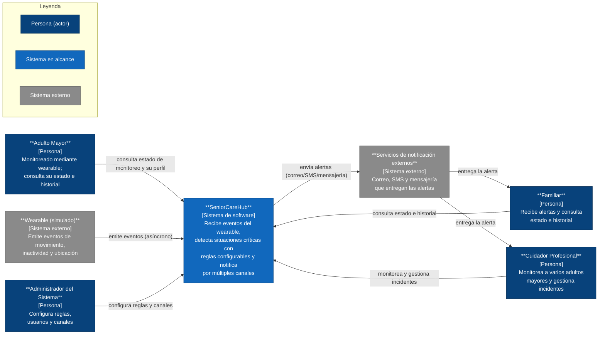

*Figura 1 — Vista de contexto (C4 · Nivel 1) de SeniorCareHub*

**Actores:**

- **Adulto Mayor** — persona monitoreada mediante un wearable; consulta su estado de monitoreo, su perfil e historial.
- **Familiar** — recibe alertas y consulta el estado e historial del adulto mayor.
- **Cuidador Profesional** — monitorea a varios adultos mayores y gestiona incidentes.
- **Administrador del Sistema** — configura reglas, perfiles, usuarios y canales de notificación.

**Sistemas externos:**

- **Wearable (simulado)** — emite de forma continua los eventos de movimiento, inactividad y ubicación del adulto mayor hacia el sistema.
- **Servicios de notificación externos** — proveedores de correo, SMS y mensajería que entregan las alertas a familiares y cuidadores.

**Flujo principal:** el wearable emite eventos hacia SeniorCareHub; el sistema los procesa, detecta situaciones críticas según las reglas configuradas y despacha las alertas a través de los servicios de notificación externos, que las entregan a familiares y cuidadores. En paralelo, el adulto mayor, el familiar y el cuidador consultan el estado e historial directamente en el sistema, y el administrador gestiona reglas, perfiles y canales.

> El diagrama anterior lo renderiza GitHub a partir del bloque Mermaid embebido. La versión formal en notación e iconografía C4 (C4-PlantUML) está disponible en `diagramas/c4-contexto.puml`.

### 7.2 Vista de contenedores

Esta vista abre la caja negra de SeniorCareHub presentada en §7.1 y muestra las unidades desplegables que la componen, la tecnología de cada una y los protocolos de comunicación entre ellas. Los actores y los sistemas externos son exactamente los mismos de la vista de contexto: no se introduce ningún elemento externo nuevo.

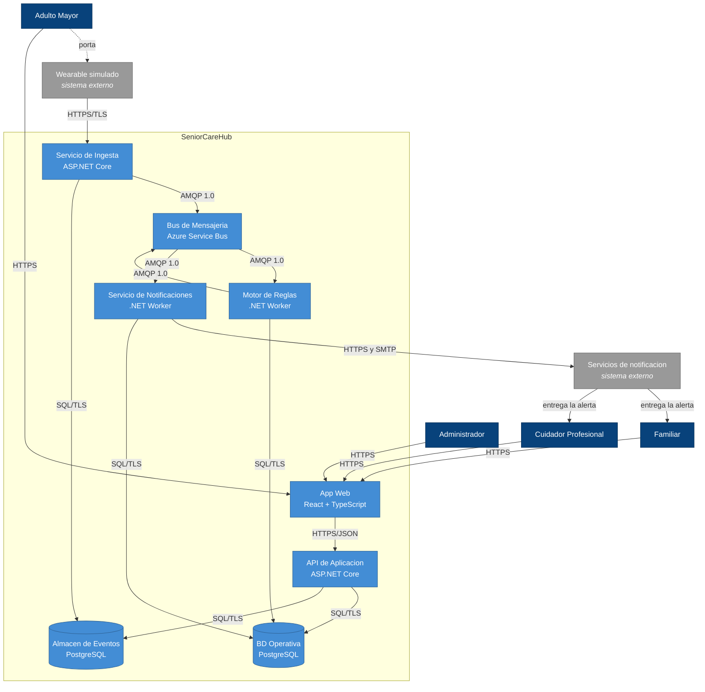

*Figura 2 — Vista de contenedores (C4 · Nivel 2) de SeniorCareHub*

> **Leyenda.** Azul oscuro: actores. Gris: sistemas externos fuera del alcance del equipo.
> Azul claro: contenedores de SeniorCareHub; los cilindros son almacenes de datos.
> Cada relación indica el protocolo; el detalle de qué transporta cada una se encuentra
> en la tabla 7.2.2.
>
> Fuente editable en notación e iconografía C4 formal: `diagramas/c4-contenedores.puml`.

#### 7.2.1 Contenedores

| # | Contenedor | Tecnología | Responsabilidad |
|---|---|---|---|
| 1 | App Web (dashboard) | SPA React + TypeScript sobre Azure Static Web Apps | Presentar el estado y el historial del adulto mayor, y ofrecer la gestión de reglas de detección, perfiles de monitoreo y canales de notificación. |
| 2 | API de Aplicación | ASP.NET Core Web API sobre Azure App Service | Autenticar al usuario, aplicar autorización por rol, exponer las consultas de estado e historial y las operaciones de configuración. Única puerta de entrada de los usuarios al sistema. |
| 3 | Servicio de Ingesta | ASP.NET Core sobre Azure App Service | Autenticar el dispositivo emisor, validar la estructura del evento, persistirlo en el almacén de eventos y publicarlo en el bus. No evalúa reglas. |
| 4 | Bus de Mensajería | Azure Service Bus, tier Standard (topics + subscriptions) | Transportar y persistir de forma durable los eventos crudos y las alertas confirmadas. Provee reintentos, cola de mensajes muertos, detección de duplicados y sesiones ordenadas por adulto mayor. |
| 5 | Motor de Reglas | .NET Worker Service sobre Azure Container Apps | Consumir eventos crudos, evaluar las reglas de detección configurables, aplicar la ventana de confirmación y la deduplicación, y publicar la alerta confirmada. |
| 6 | Servicio de Notificaciones | .NET Worker Service sobre Azure Container Apps | Consumir alertas confirmadas, resolver destinatarios y canales según el perfil, invocar a los proveedores externos mediante adaptadores y registrar el acuse de entrega. |
| 7 | BD Operativa | Azure Database for PostgreSQL Flexible Server | Almacenar usuarios, perfiles de monitoreo, reglas, alertas y acuses. Es la fuente de verdad del sistema y soporta la bitácora de auditoría exigida por REST-02. |
| 8 | Almacén de Eventos | Azure Database for PostgreSQL, particionado por tiempo | Conservar el historial de eventos recibidos del wearable para consulta, análisis posterior y evidencia ante disputas sobre una alerta. |

#### 7.2.2 Relaciones y protocolos

| Origen | Destino | Protocolo | Descripción |
|---|---|---|---|
| Wearable simulado | Servicio de Ingesta | HTTPS/JSON sobre TLS | Emite eventos de movimiento, inactividad y ubicación. |
| Adulto Mayor | App Web | HTTPS | Consulta su propio estado e historial desde el portal. |
| Familiar / Cuidador / Administrador | App Web | HTTPS | Acceden al dashboard desde el navegador. |
| App Web | API de Aplicación | HTTPS/JSON | Consultas y operaciones de configuración. |
| Servicio de Ingesta | Bus de Mensajería | AMQP 1.0 sobre TLS | Publica el evento crudo en el tópico correspondiente. |
| Bus de Mensajería | Motor de Reglas | AMQP 1.0 sobre TLS | Entrega el evento crudo con sesión por adulto mayor. |
| Motor de Reglas | Bus de Mensajería | AMQP 1.0 sobre TLS | Publica la alerta confirmada. |
| Bus de Mensajería | Servicio de Notificaciones | AMQP 1.0 sobre TLS | Entrega la alerta confirmada para su despacho. |
| Servicio de Notificaciones | Servicios de notificación externos | HTTPS/REST y SMTP | Despacha la notificación por el canal correspondiente. |
| Servicios de notificación externos | Familiar / Cuidador Profesional | SMS, correo y mensajería | Entregan la alerta al destinatario final, tal como se representó en §7.1. |
| API de Aplicación / Motor de Reglas / Servicio de Notificaciones | BD Operativa | PostgreSQL wire protocol sobre TLS | Lectura y escritura de configuración, alertas y acuses. |
| Servicio de Ingesta / API de Aplicación | Almacén de Eventos | PostgreSQL wire protocol sobre TLS | Persistencia y consulta del historial de eventos. |

#### 7.2.3 Consistencia con la vista de contexto

Los cuatro actores (Adulto Mayor, Familiar, Cuidador Profesional y Administrador) y los dos sistemas externos (Wearable simulado y Servicios de notificación externos) son los mismos declarados en §7.1, sin altas ni bajas. Las relaciones que en la vista de contexto entraban o salían de la caja única de SeniorCareHub se refinan aquí hacia el contenedor específico que las atiende: la emisión de eventos del wearable aterriza en el Servicio de Ingesta, el acceso de los cuatro actores humanos entra por la App Web, y la salida hacia los proveedores de notificación parte del Servicio de Notificaciones, que a su vez entregan la alerta al Familiar y al Cuidador Profesional tal como se representó en §7.1. El Adulto Mayor conserva la doble relación con el sistema definida en §7.1: una indirecta, mediada por el wearable que genera los eventos, y una directa con la App Web cuando consulta su propio estado e historial.

### 7.3 Vista de comportamiento

Esta vista describe cómo colaboran en el tiempo los contenedores definidos en §7.2 para producir los comportamientos que el sistema debe garantizar. Se documentan tres flujos representativos, seleccionados porque cada uno ejercita un escenario de calidad distinto de §4 y porque juntos recorren el camino crítico completo, su modo de fallo principal y su capacidad de cambio en operación.

Los diagramas de esta sección operan a nivel de contenedores: muestran qué unidad desplegable participa y en qué orden, sin detallar la estructura interna de cada una. El comportamiento interno de los componentes se documenta en §10.

#### 7.3.1 Flujo 1 — Detección y notificación de un evento crítico

Corresponde al camino principal del sistema y ejercita el escenario QS-02, cuya meta es que la primera notificación se emita en cinco segundos o menos en el percentil 95.

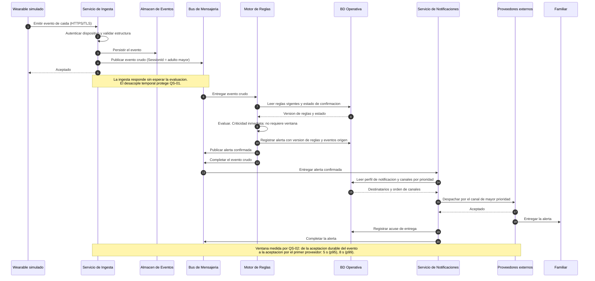

*Figura 3 — Secuencia de sistema: detección y notificación de un evento crítico*

El orden de las operaciones de la ingesta no es casual: la aceptación se emite únicamente después de persistir y publicar el evento, de modo que una falla intermedia deja al emisor sin confirmación y este reintenta; el duplicado resultante lo absorbe la deduplicación de ADR-003.

#### 7.3.2 Flujo 2 — Fallo del proveedor de notificación

Ejercita el escenario QS-03: ante la indisponibilidad de un proveedor, ninguna alerta crítica se pierde y el primer intento por un canal alterno comienza en menos de diez segundos en el percentil 95. Es el flujo que justifica el estilo adoptado en §8.

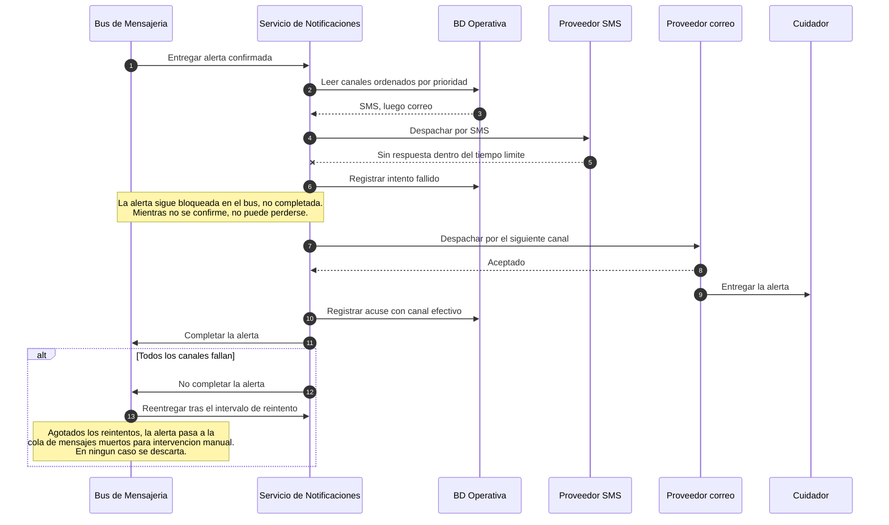

*Figura 4 — Secuencia de sistema: fallo del proveedor y entrega por canal alterno*

#### 7.3.3 Flujo 3 — Cambio de una regla de detección en operación

Ejercita el escenario QS-05: una regla nueva o modificada entra en vigencia en menos de diez minutos y sin detener el sistema. Demuestra la modificabilidad declarada como QA-05 y materializa la decisión de ADR-002.

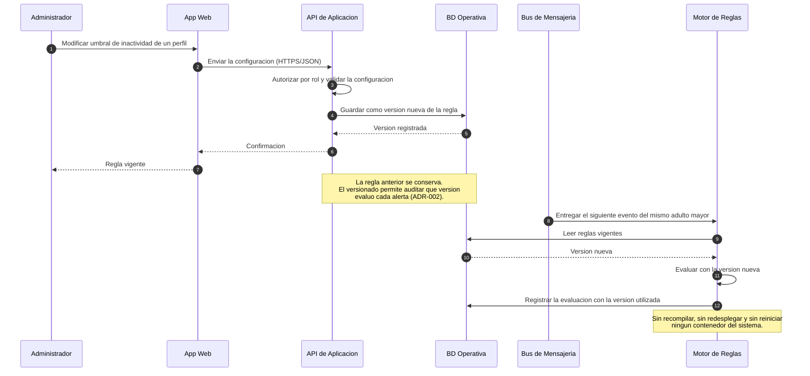

*Figura 5 — Secuencia de sistema: cambio de una regla de detección sin interrupción*

> Fuente editable de los tres flujos: `diagramas/comportamiento.puml`.

#### 7.3.4 Trazabilidad hacia los escenarios de calidad

| Flujo | Escenario | Qué demuestra | Contenedores involucrados |
|---|---|---|---|
| Detección y notificación de evento crítico | QS-02 | El camino completo se recorre dentro del presupuesto de latencia, con respuesta inmediata de la ingesta | Ingesta, Bus, Motor de Reglas, Notificaciones, ambas bases |
| Fallo del proveedor de notificación | QS-03 | La alerta permanece bajo custodia del bus hasta confirmarse la entrega; el fallo de un canal no la destruye | Bus, Notificaciones, BD Operativa |
| Cambio de regla en operación | QS-05 | La configuración se modifica en caliente y la evaluación siguiente ya utiliza la versión nueva | App Web, API, BD Operativa, Motor de Reglas |

Los tres flujos comparten una propiedad que conviene hacer explícita: en ningún momento un contenedor invoca sincrónicamente a otro dentro del camino crítico. Toda transición entre etapas ocurre a través del bus, lo que constituye la evidencia de comportamiento del estilo adoptado en §8 y de la decisión registrada en ADR-001.

#### 7.3.5 Consistencia con las vistas anteriores

Los participantes de los tres diagramas son exclusivamente contenedores declarados en §7.2 y actores o sistemas externos declarados en §7.1. No se introduce ningún elemento nuevo. Las relaciones ejercitadas —ingesta hacia el bus, bus hacia el motor, motor hacia el bus, bus hacia notificaciones, y notificaciones hacia los proveedores externos— son las mismas de la tabla de relaciones de §7.2.2, recorridas ahora en orden temporal.

### 7.4 Vista de despliegue

Esta vista muestra la infraestructura sobre la que se ejecutan los contenedores definidos en §7.2, la correspondencia entre cada contenedor y su nodo de ejecución, y las decisiones de dimensionamiento que responden a los atributos de calidad del sistema.

Todos los recursos gestionados se agrupan en un único grupo de recursos, `rg-seniorcarehub`, desplegado en la región **East US 2** por ser la de menor latencia de red hacia Costa Rica entre las regiones con disponibilidad completa de los servicios utilizados. La agrupación en un solo grupo de recursos permite además aprovisionar y eliminar el entorno completo como una unidad, lo que resulta conveniente para un despliegue de duración acotada.

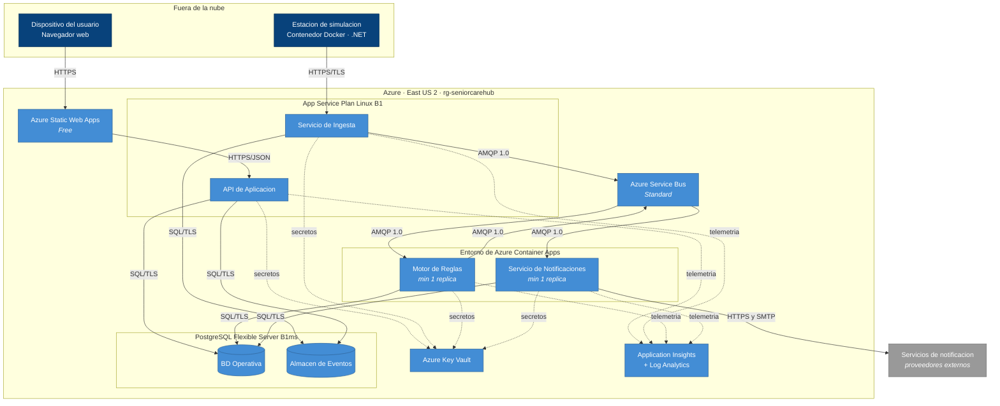

*Figura 6 — Vista de despliegue de SeniorCareHub sobre Microsoft Azure*

> **Leyenda.** Azul oscuro: nodos fuera de la nube. Azul claro: recursos gestionados de Azure. Gris: proveedores externos. Las líneas continuas representan el flujo funcional; las punteadas, dependencias transversales de telemetría y gestión de secretos.
>
> Fuente editable en notación e iconografía C4 formal: `diagramas/c4-despliegue.puml`.

#### 7.4.1 Nodos de despliegue

| Nodo | Servicio y dimensionamiento | Contenedores alojados (§7.2) | Justificación |
|---|---|---|---|
| Dispositivo del usuario | Navegador web | App Web (ejecución) | La SPA se descarga y ejecuta en el cliente; no requiere cómputo en la nube. |
| Estación de simulación | Contenedor Docker con aplicación .NET | Simulador de wearable (sistema externo) | Sustituye al dispositivo físico. Se ejecuta fuera de la nube para representar fielmente a un emisor externo al sistema. |
| Azure Static Web Apps | Nivel Free | App Web (distribución) | Distribuye los archivos estáticos con certificado TLS gestionado. El nivel gratuito es suficiente porque no ejecuta lógica de servidor. |
| App Service Plan Linux | B1 (1 vCPU, 1.75 GB) | API de Aplicación, Servicio de Ingesta | Ambos son servicios web con carga moderada y exposición HTTP directa. Comparten plan para contener el costo. |
| Entorno de Azure Container Apps | Consumo, mínimo 1 réplica por aplicación | Motor de Reglas, Servicio de Notificaciones | Procesos consumidores de larga duración, sin exposición pública, con escalado independiente por profundidad de cola. |
| Azure Service Bus | Namespace tier Standard | Bus de Mensajería | El tier Standard es el mínimo que ofrece tópicos con suscripciones múltiples, sesiones ordenadas y detección de duplicados. |
| PostgreSQL Flexible Server | B1ms, almacenamiento 32 GB | BD Operativa, Almacén de Eventos | Un mismo servidor aloja ambas bases lógicas. El volumen previsto no justifica dos servidores independientes. |
| Azure Key Vault | Estándar | — | Custodia cadenas de conexión y credenciales de proveedores externos. |
| Application Insights y Log Analytics | Pago por ingesta | — | Recibe trazas correlacionadas de los cuatro servicios y sostiene la depuración distribuida exigida por el estilo (§8.4). |

#### 7.4.2 Decisiones de despliegue y sus trade-offs

**Réplica mínima permanente en Container Apps.** Azure Container Apps permite reducir a cero réplicas y no facturar cómputo en reposo. Se descarta esa configuración para el Motor de Reglas y el Servicio de Notificaciones porque el arranque en frío introduce una demora de varios segundos que consumiría el presupuesto completo de QS-02, cuya meta es de 5 segundos en el percentil 95. Se acepta el costo de mantener una réplica activa de forma permanente a cambio de latencia predecible. El escalado hacia arriba sí es automático, gobernado por la profundidad de la suscripción del bus.

**Plan de App Service compartido entre API e Ingesta.** Ambos servicios web comparten un mismo plan B1, lo que reduce el costo respecto de dos planes independientes. La contrapartida es que comparten CPU y memoria: una ráfaga sostenida de eventos entrantes podría degradar el tiempo de respuesta de las consultas del dashboard. Se acepta el riesgo porque los perfiles de carga previstos son moderados, y la mitigación está identificada: separar la ingesta a un plan propio, cambio que no afecta a ningún otro contenedor por tratarse de servicios ya desacoplados.

**Identidades administradas en lugar de credenciales en configuración.** El acceso de los servicios a Service Bus, PostgreSQL y Key Vault se realiza mediante identidades administradas de Microsoft Entra ID, de modo que ninguna credencial persiste en archivos de configuración ni en variables de entorno del despliegue. Esta decisión responde directamente a QA-04 y a la obligación de resguardo de datos personales de REST-02, y reduce la superficie expuesta ante una filtración de configuración.

**Instancia única sin redundancia de zona.** Los servicios se despliegan en una sola zona de disponibilidad. La redundancia de zona multiplicaría el costo de PostgreSQL y del namespace de mensajería, y la meta comprometida en QS-01 es de 99.5 % mensual, equivalente a poco menos de 3.6 horas de indisponibilidad, alcanzable con la configuración descrita. El dimensionamiento se realizó contra la meta declarada y no por encima de ella; elevar el objetivo de disponibilidad exigiría revisar esta decisión antes que cualquier otra.

#### 7.4.3 Consistencia con la vista de contenedores

Los ocho contenedores de §7.2 tienen exactamente un nodo de ejecución asignado y no se introduce ningún contenedor nuevo. La App Web aparece dos veces con roles distintos —distribuida desde Static Web Apps y ejecutada en el navegador del usuario—, lo que corresponde a la naturaleza de una aplicación de página única. El Bus de Mensajería se materializa en el namespace de Service Bus, y las dos bases de datos comparten servidor sin dejar de ser almacenes lógicamente separados, tal como se representó en §7.2. Los proveedores externos de notificación conservan su condición de sistemas fuera del alcance del equipo, coherente con §7.1. Key Vault y Application Insights no corresponden a contenedores del nivel 2: son servicios de plataforma transversales que sostienen decisiones ya documentadas en §8.4 sobre observabilidad y gestión de secretos.

### 7.5 Vista de concurrencia

Esta vista describe qué unidades de ejecución operan simultáneamente en SeniorCareHub, qué recursos comparten, dónde aparece contención y qué mecanismos garantizan que el procesamiento concurrente no comprometa la corrección de las alertas.

El sistema es concurrente por naturaleza: múltiples adultos mayores emiten eventos al mismo tiempo, y cada etapa del pipeline definido en §8 escala de forma independiente. El desafío central no es el volumen, sino el orden: la etapa de confirmación descrita en ADR-003 mantiene estado temporal por persona monitoreada, y evaluar dos eventos de un mismo adulto mayor en paralelo produciría alertas duplicadas o, peor, la pérdida de una confirmación válida.

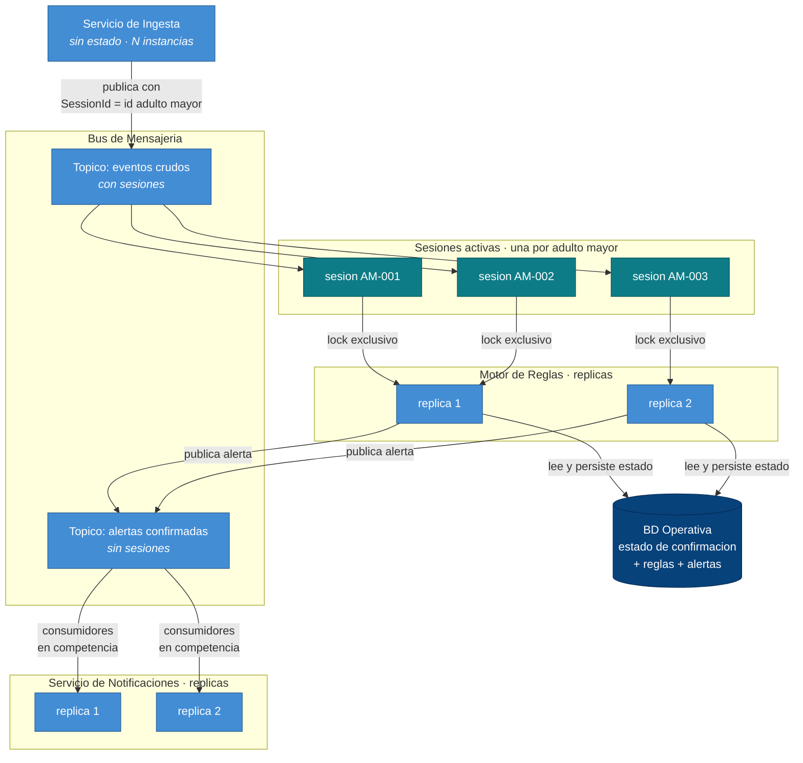

*Figura 7 — Vista de concurrencia: particionamiento por sesión y consumidores en competencia*

> **Leyenda.** Azul claro: unidades de ejecución concurrentes. Verde azulado: sesiones lógicas del bus, una por adulto mayor. Azul oscuro: estado compartido persistente.
>
> Fuente editable en formato de secuencia PlantUML: `diagramas/concurrencia.puml`.

#### 7.5.1 Unidades de concurrencia

| Unidad | Multiplicidad | Disparador | Estado que mantiene | Aislamiento |
|---|---|---|---|---|
| Servicio de Ingesta | N instancias tras el balanceador del App Service | Petición HTTP del wearable | Ninguno | No requiere: es un servicio sin estado. |
| Motor de Reglas | N réplicas, escaladas por profundidad de la suscripción | Mensaje disponible en la suscripción con sesión | Ventana de confirmación por adulto mayor | Sesión con bloqueo exclusivo: una sesión es atendida por una sola réplica a la vez. |
| Servicio de Notificaciones | N réplicas | Alerta confirmada disponible | Ninguno entre mensajes | Consumidores en competencia sin orden garantizado, porque el despacho de dos alertas distintas es independiente. |
| API de Aplicación | N instancias | Petición HTTP del usuario | Ninguno | Transacciones de base de datos para lecturas y escrituras de configuración. |

#### 7.5.2 Recursos compartidos y puntos de contención

| Recurso compartido | Quién lo accede concurrentemente | Riesgo | Mecanismo de control |
|---|---|---|---|
| Estado de la ventana de confirmación | Réplicas del Motor de Reglas | Dos eventos del mismo adulto mayor evaluados en paralelo generan alertas duplicadas o pierden una confirmación | Particionamiento por sesión: el bloqueo exclusivo de sesión garantiza que solo una réplica evalúe a esa persona en un momento dado |
| Configuración de reglas y perfiles | Motor de Reglas (lectura), API (escritura) | Una evaluación en curso podría usar una regla a medio actualizar | Versionado de reglas según ADR-002: cada evaluación fija la versión al inicio y la registra en la alerta |
| BD Operativa | Motor de Reglas, Servicio de Notificaciones, API | Agotamiento del pool de conexiones al escalar réplicas | Dimensionamiento del pool por réplica contra el límite de conexiones del servidor B1ms |
| Registro de acuses de entrega | Réplicas del Servicio de Notificaciones | Doble envío ante reentrega del mismo mensaje | Clave de idempotencia por alerta y canal: el segundo intento detecta el acuse ya registrado y no reenvía |

#### 7.5.3 Decisiones de sincronización

**Particionamiento por sesión en lugar de bloqueos explícitos.** La ordenación se resuelve en la infraestructura de mensajería y no en el código: el Servicio de Ingesta publica cada evento con el identificador del adulto mayor como identificador de sesión, y el bus garantiza que los mensajes de una misma sesión se entreguen en orden a un único consumidor con bloqueo exclusivo. El Motor de Reglas nunca necesita bloqueos ni semáforos sobre el estado de confirmación, porque no existe acceso concurrente a la partición que atiende. El trade-off es que el paralelismo máximo efectivo queda acotado por el número de adultos mayores con eventos activos: agregar réplicas más allá de esa cifra no incrementa el rendimiento. Para el volumen previsto es una restricción holgada.

**El estado de confirmación se persiste, no reside solo en memoria.** ADR-003 dejó abierta la recuperación del estado temporal tras un reinicio. Se decide persistir el estado de cada ventana de confirmación en la BD Operativa, con el identificador del adulto mayor como clave, y actualizarlo en la misma transacción en que se registra la evaluación. Al tomar una sesión, la réplica lee el estado vigente antes de evaluar. De este modo, si una réplica termina de forma abrupta, el bus libera el bloqueo y otra réplica retoma la sesión desde el último estado confirmado, en lugar de comenzar la ventana desde cero y arriesgar la pérdida de una alerta —lo que comprometería QS-03. El costo es una escritura adicional por evaluación, admisible dentro del presupuesto de latencia de QS-02.

**Duración del bloqueo dimensionada por encima del tiempo de evaluación.** El bus mantiene el mensaje bloqueado durante un intervalo acotado mientras el consumidor lo procesa. Si la evaluación excediera ese intervalo, el mensaje se reentregaría y produciría una evaluación duplicada. Se establece que la duración del bloqueo debe superar con margen el tiempo de evaluación observado en el percentil 99, y que el consumidor renueve el bloqueo en operaciones prolongadas. Esta es una condición de configuración que debe verificarse durante las pruebas y no una propiedad garantizada por el diseño.

**Idempotencia como requisito transversal.** Por la semántica de entrega al menos una vez documentada en §8.4, todo consumidor debe tolerar recibir el mismo mensaje más de una vez. En el Motor de Reglas esto se resuelve con la deduplicación por adulto mayor, tipo de evento y período establecida en ADR-003; en el Servicio de Notificaciones, con la clave de idempotencia por alerta y canal. Ningún consumidor puede asumir procesamiento exactamente una vez.

**Ausencia de orden en el despacho de notificaciones.** El tópico de alertas confirmadas no utiliza sesiones. Dos alertas de personas distintas, o incluso dos alertas sucesivas de la misma persona, pueden despacharse en paralelo y en cualquier orden, porque cada notificación es independiente y lleva su propia referencia a los eventos que la originaron. Renunciar al orden en esta etapa maximiza el paralelismo justo donde la latencia importa, sin afectar la corrección.

#### 7.5.4 Consistencia con las vistas anteriores

Las unidades de concurrencia descritas corresponden exactamente a los contenedores de §7.2 y a los nodos de ejecución de §7.4: las réplicas del Motor de Reglas y del Servicio de Notificaciones son las instancias del entorno de Container Apps, y las instancias de la API y la Ingesta son las del App Service Plan compartido. Las sesiones no constituyen un contenedor adicional, sino una característica del Bus de Mensajería ya declarada en la tabla de contenedores de §7.2.1 y justificada en §8.

### 7.6 Evolución de las vistas arquitectónicas

Las vistas de este capítulo no se produjeron de una sola vez: se construyeron y corrigieron a lo largo de los tres hitos del proyecto. Esta sección documenta qué cambió en cada una, por qué cambió y dónde queda la evidencia en el historial del repositorio, de modo que la arquitectura presentada pueda leerse como el resultado de un proceso de revisión y no como una versión final sin trazabilidad.

#### 7.6.1 Resumen por hito

| Hito | Vistas incorporadas | Vistas modificadas |
|---|---|---|
| Avance 1 (S07) | 7.1 Vista de contexto | — |
| Avance 2 (S11) | 7.2 Vista de contenedores | 7.2 (tres correcciones posteriores a la revisión interna) |
| Entrega final (S14) | 7.3 Comportamiento, 7.4 Despliegue, 7.5 Concurrencia, 7.7 Componentes de dos subsistemas | — |

#### 7.6.2 Vista de contexto: estabilidad deliberada

La vista de contexto no ha sufrido modificaciones sustantivas desde el Avance 1. Sus cuatro actores —Adulto Mayor, Familiar, Cuidador Profesional y Administrador— y sus dos sistemas externos —el wearable simulado y los servicios de notificación— se mantienen sin altas ni bajas.

Esta estabilidad no es casual y conviene interpretarla correctamente: indica que la frontera del sistema y su relación con el entorno quedaron bien delimitadas desde el primer hito. Los cambios posteriores ocurrieron todos en niveles de mayor detalle, que es donde se esperaba que ocurrieran. Un vaivén en la vista de contexto habría señalado, en cambio, un problema de alcance no resuelto.

#### 7.6.3 Vista de contenedores: tres correcciones de consistencia

La vista de contenedores se incorporó en el Avance 2 y recibió tres modificaciones antes de la entrega final. Las tres se originaron en revisiones internas del equipo, no en observaciones del docente, y las tres corrigen inconsistencias con el nivel superior.

| Cambio | Motivo | Evidencia |
|---|---|---|
| Se agregó la relación directa entre el Adulto Mayor y la App Web, y se rediseñó el diagrama para mejorar su legibilidad | La revisión de una integrante detectó que la vista de contexto incluía al Adulto Mayor como usuario del portal de consultas, mientras que la vista de contenedores lo representaba únicamente como portador del wearable | `63fdd2d` |
| Se agregaron las relaciones de entrega de la alerta desde los servicios de notificación hacia el Familiar y el Cuidador Profesional | La vista de contexto mostraba la entrega final al destinatario, pero en la vista de contenedores el flujo terminaba en los proveedores externos y nunca alcanzaba a las personas | `cee2141` |
| Se agregó el pie de la Figura 2 | La numeración de figuras del documento saltaba de la 1 a la 3 porque el diagrama de contenedores carecía de rótulo | `06c6e4b` |

El patrón común de las dos primeras es significativo: en ambos casos el nivel de contenedores había omitido una relación que el nivel de contexto sí declaraba. La revisión cruzada entre niveles resultó ser el mecanismo que las detectó, y por eso cada vista de este capítulo cierra con una subsección explícita de consistencia con las anteriores.

#### 7.6.4 Vistas incorporadas en la entrega final

Las vistas agregadas en este hito no modifican las anteriores: las complementan en dimensiones que hasta el Avance 2 no estaban documentadas.

La **vista de comportamiento** (§7.3) recorre en el tiempo las mismas relaciones ya declaradas en la tabla de §7.2.2, sin introducir participantes nuevos. La **vista de despliegue** (§7.4) asigna un nodo de ejecución a cada contenedor existente, sin crear contenedores adicionales. La **vista de concurrencia** (§7.5) describe cómo se multiplican en ejecución esos mismos contenedores y cómo se coordinan al compartir estado. La **vista de componentes** (§7.7) abre dos de los contenedores existentes y agrupa, con su misma nomenclatura, las clases cuyo diseño detallado se documenta en §10.

Una de ellas, además, cerró una decisión que había quedado abierta: ADR-003 señalaba como consecuencia negativa que era necesario definir cómo recuperar el estado temporal de la ventana de confirmación tras un reinicio. La §7.5.3 resuelve ese punto al establecer que el estado se persiste en la BD Operativa dentro de la misma transacción de la evaluación, lo que permite que otra réplica retome una sesión interrumpida sin reiniciar la ventana.

#### 7.6.5 Cambios evaluados y descartados

Documentar lo que no cambió, y por qué, forma parte del registro de evolución.

**Incorporar Microsoft Entra ID como sistema externo.** Al elaborar la vista de despliegue se evaluó representar al proveedor de identidad como un elemento explícito de las vistas. Se descartó porque habría introducido en un nivel inferior un sistema externo ausente de la vista de contexto del Avance 1, generando precisamente el tipo de inconsistencia entre niveles que las revisiones anteriores habían corregido. El mecanismo de identidades administradas se documenta en el texto de §7.4.2, donde su justificación es visible sin alterar la frontera del sistema.

**Desagregar los proveedores de notificación por canal.** Se consideró representar por separado los proveedores de correo, SMS y mensajería. Se mantuvo la agrupación en un único sistema externo por coherencia con la vista de contexto, y porque la diferenciación por canal es una cuestión de configuración resuelta mediante adaptadores según ADR-004, no una distinción de frontera arquitectónica.

**Materializar un contenedor de Gestión de Alertas.** ADR-001 identificaba inicialmente la gestión de alertas como una responsabilidad separada dentro del pipeline. Se optó por alojarla en el Motor de Reglas en lugar de crear un contenedor propio, dado que su ciclo de vida y sus datos están estrechamente ligados a la evaluación que origina la alerta. La redacción del ADR se ajustó en consecuencia para mantener la coherencia con esta vista.

### 7.7 Vistas de componentes

Estas vistas abren dos de los contenedores declarados en §7.2 y muestran los componentes que los constituyen: qué piezas existen dentro de cada uno, qué responsabilidad tiene cada pieza y cómo colaboran. Se documentan los dos subsistemas con mayor densidad de decisiones registradas: el **Motor de Reglas** (ADR-002 y ADR-003) y el **Servicio de Notificaciones** (ADR-004).

El nivel de detalle es el intermedio de la jerarquía C4: los componentes de estas vistas agrupan las clases e interfaces cuyo diseño detallado —firmas, contratos, análisis de robustez y secuencias— se documenta en §10.1 y §10.2. La nomenclatura es la misma en ambos capítulos, de modo que cada caja de estas vistas puede rastrearse hasta sus clases en el diseño detallado.

#### 7.7.1 Componentes del Motor de Reglas

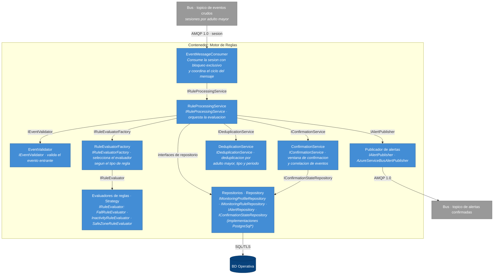

*Figura 8 — Vista de componentes (C4 · Nivel 3): Motor de Reglas*

La estructura materializa las decisiones registradas: los tres evaluadores concretos tras la interfaz `IRuleEvaluator`, seleccionados por `RuleEvaluatorFactory`, son la realización del conjunto controlado de tipos de reglas de ADR-002; `ConfirmationService` y `DeduplicationService` son la etapa de confirmación de ADR-003; y la separación entre interfaces de repositorio e implementaciones `PostgreSql*` mantiene la lógica de evaluación independiente de la tecnología de persistencia. `EventMessageConsumer` es el único componente que conoce el bus: el resto del contenedor ignora de dónde provienen los eventos, lo que permite probarlo sin infraestructura de mensajería.

#### 7.7.2 Componentes del Servicio de Notificaciones

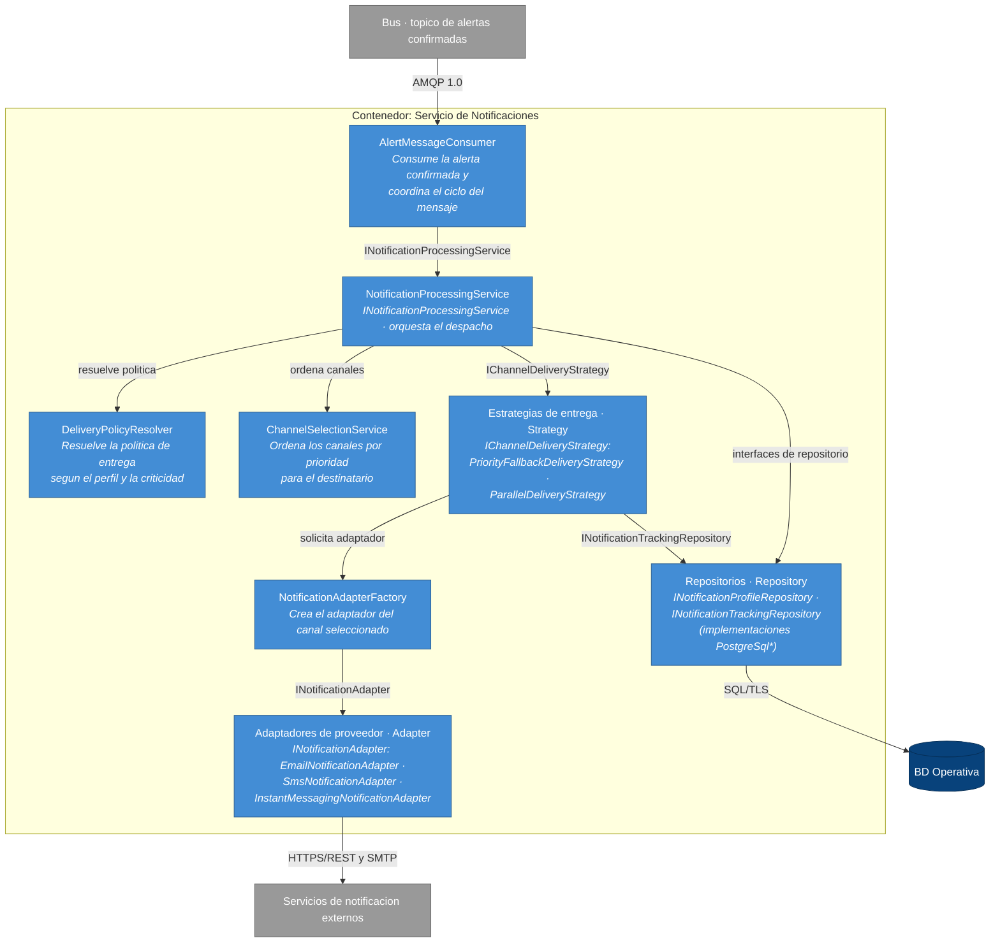

*Figura 9 — Vista de componentes (C4 · Nivel 3): Servicio de Notificaciones*

> Fuente editable de ambas vistas en notación C4 formal: `diagramas/c4-componentes.puml`.

La cadena de despacho materializa ADR-004 de extremo a extremo: `DeliveryPolicyResolver` y `ChannelSelectionService` deciden el qué y el en qué orden; la estrategia de entrega —`PriorityFallbackDeliveryStrategy` para el escalamiento por canal alterno del flujo de §7.3.2, o `ParallelDeliveryStrategy` cuando la política exige todos los canales a la vez— decide el cómo; y los adaptadores concretos tras `INotificationAdapter` aíslan cada proveedor externo, de modo que incorporar un canal nuevo consiste en agregar un adaptador sin tocar la orquestación. `INotificationTrackingRepository` registra cada intento y su resultado, sosteniendo tanto la clave de idempotencia de §7.5.2 como la bitácora de auditoría.

#### 7.7.3 Consistencia con las vistas y el diseño detallado

**Hacia arriba (§7.2):** cada vista abre exactamente un contenedor declarado en la vista de contenedores, y sus dependencias externas —los tópicos del bus, la BD Operativa y los proveedores— son las mismas relaciones que la tabla de §7.2.2 asigna a esos contenedores, sin agregar ni omitir ninguna. Los componentes no cruzan la frontera de su contenedor: la única comunicación entre el Motor de Reglas y el Servicio de Notificaciones sigue siendo el tópico de alertas confirmadas, coherente con la propiedad de §7.3.4 de que ningún contenedor invoca sincrónicamente a otro.

**Hacia abajo (§10):** los componentes de estas vistas agrupan las clases, interfaces y enumeraciones del diseño detallado con su misma nomenclatura. Las cajas compuestas agrupan familias completas: los evaluadores concretos bajo `IRuleEvaluator`, los adaptadores bajo `INotificationAdapter`, y las implementaciones `PostgreSql*` bajo sus interfaces de repositorio. Los contratos de §10.1.2 y §10.2.2 corresponden a las flechas de estas vistas: cada relación entre componentes está respaldada por una interfaz con firma documentada. Las entidades (`MonitoringEvent`, `Alert`, `Notification`, entre otras) y las enumeraciones no se representan como componentes porque no son unidades de comportamiento sino datos que circulan entre ellas; su detalle corresponde al nivel de clases.

---

# BLOQUE 4 — DECISIONES ARQUITECTÓNICAS
*Hito: Avance 2 (S11)*

---

## 8. Estilo arquitectónico

### 8.1 Estilo seleccionado

El estilo arquitectónico principal de SeniorCareHub es **orientado a eventos, en su variante publicación-suscripción con intermediario durable** (*publish-subscribe with durable broker*). Este estilo gobierna el camino crítico del sistema: ingesta del evento del wearable, detección de la situación mediante reglas y despacho de la notificación.

El estilo principal se complementa con dos estilos secundarios de menor alcance:

- **Por capas**, aplicado dentro de cada contenedor, para separar presentación, lógica de aplicación, dominio y acceso a datos.
- **Puertos y adaptadores**, aplicado en la frontera con los proveedores externos de notificación, para aislar al sistema de la variabilidad de sus interfaces y de su disponibilidad (REST-01).

### 8.2 Justificación frente a los drivers y escenarios de calidad

El estilo responde de forma directa a los atributos de calidad definidos en §3.2 y a los escenarios formalizados en §4.

| Driver | Cómo lo atiende el estilo | Escenario |
|---|---|---|
| **QA-03 · Confiabilidad: cero alertas perdidas** | El intermediario persiste el evento antes de que exista un consumidor listo, y el consumidor confirma su recepción (*acknowledgement*) solo después de completar el procesamiento. Si el Motor de Reglas falla a mitad de una evaluación, el evento no se descarta: se reentrega. La no pérdida deja de depender de que un proceso permanezca vivo y pasa a ser una propiedad garantizada por la infraestructura de mensajería. | QS-03 |
| **QA-01 · Disponibilidad ≥ 99.5 %** | El desacople temporal entre productores y consumidores permite que el Servicio de Ingesta siga aceptando eventos aunque el Motor de Reglas o el Servicio de Notificaciones estén caídos o saturados. La disponibilidad del sistema deja de ser el producto de la disponibilidad de todos los componentes encadenados. | QS-01 |
| **QA-02 · Latencia de alerta ≤ 5 s (p95)** | La propagación es por empuje (*push*) y no por sondeo periódico, de modo que el evento avanza en cuanto está disponible. El salto adicional por el intermediario introduce un costo del orden de decenas de milisegundos, holgadamente contenido dentro del presupuesto de 5 segundos. | QS-02 |
| **QA-04 · Seguridad y privacidad (Ley N.° 8968)** | El estilo *tensiona* este driver más que favorecerlo; ver §8.4. Se mitiga con minimización del contenido de los eventos, segregación de tópicos por sensibilidad y cifrado en tránsito y en reposo. | QS-04 |
| **QA-05 · Modificabilidad** | Las reglas de detección se tratan como datos residentes en la BD Operativa y no como código distribuido entre componentes. Además, incorporar un consumidor nuevo —por ejemplo, un servicio de analítica o un registro de auditoría independiente— consiste en suscribirlo a un tópico existente, sin modificar al productor ni redesplegarlo. | QS-05 |
| **REST-01 · Dependencia de proveedores externos** | La indisponibilidad de un proveedor de notificación queda contenida en el Servicio de Notificaciones: la alerta permanece en el tópico y se reintenta, en lugar de propagar el fallo hacia atrás hasta la ingesta. | — |

Adicionalmente, el estilo da lugar natural a la resolución de la tensión **Exactitud ↔ Latencia** identificada en §3: la ventana de confirmación y la deduplicación que reducen las falsas alarmas se implementan como un consumidor con estado ubicado entre la detección y la notificación, sin acoplar esa lógica ni al emisor del evento ni al despachador de la alerta.

### 8.3 Alternativas evaluadas y rechazadas

#### Alternativa A — Monolito por capas con procesamiento sincrónico

Un único contenedor desplegable donde la recepción del evento, la evaluación de reglas y el envío de la notificación ocurren dentro de la misma llamada.

**A favor:** costo operativo sensiblemente menor, un solo artefacto que desplegar y monitorear; depuración directa mediante una traza de ejecución única; y una sola frontera de seguridad, lo que resulta más favorable para QA-04 que la solución adoptada. En condiciones normales presenta además la menor latencia posible, al no existir saltos intermedios.

**Por qué se rechaza:** el fallo de cualquier eslabón se propaga hacia atrás hasta la ingesta. Si el proveedor externo de notificación no responde (REST-01) o el evaluador de reglas lanza una excepción, el evento se pierde sin que exista un lugar donde reintentarlo, lo que incumple **QA-03**. La disponibilidad total, además, queda acotada por la del componente más débil de la cadena, lo que compromete **QA-01**. El trade-off aceptado al descartarla es explícito: se sacrifica simplicidad operativa y unidad de la frontera de seguridad a cambio de garantía de no pérdida y de disponibilidad.

#### Alternativa B — Servicios independientes con comunicación REST sincrónica punto a punto

La misma descomposición en servicios de la solución adoptada, pero comunicados mediante llamadas HTTP directas entre sí, sin intermediario.

**A favor:** conserva la desplegabilidad independiente y buena parte de la modificabilidad de **QA-05**; el flujo de una alerta es más fácil de seguir porque la traza es una cadena de llamadas identificable; y no introduce un componente de infraestructura adicional que operar.

**Por qué se rechaza:** encadenar llamadas sincrónicas multiplica las probabilidades individuales de disponibilidad, de modo que el conjunto es menos disponible que cualquiera de sus partes, en contra de **QA-01**. Más grave para este dominio: exige que el receptor esté disponible en el instante exacto en que ocurre la alerta, y los reintentos residen en la memoria del proceso llamador, por lo que un reinicio durante el reintento pierde la alerta de forma definitiva —el mismo incumplimiento de **QA-03** que en la Alternativa A, ahora con mayor complejidad de despliegue.

### 8.4 Consecuencias asumidas

**Positivas.** Garantía de no pérdida sostenida por la infraestructura y no por el código de aplicación; aislamiento de fallos entre etapas del camino crítico; capacidad de absorber ráfagas de eventos sin degradar la ingesta; y extensión del sistema por suscripción de consumidores nuevos sin modificar a los existentes.

**Negativas.** Se documentan de forma explícita porque condicionan el diseño detallado posterior:

1. **Mayor complejidad operativa y de despliegue.** Se incorpora un componente de infraestructura adicional que debe aprovisionarse, configurarse y monitorearse.
2. **Consistencia eventual.** Existe una ventana durante la cual un evento ya ocurrió pero todavía no se refleja en lo que el dashboard muestra al familiar o al cuidador.
3. **Depuración distribuida.** Seguir el recorrido de una alerta requiere correlacionar registros de varios contenedores, lo que obliga a propagar un identificador de correlación a lo largo de todo el flujo.
4. **Entrega *at-least-once*.** El intermediario garantiza que el mensaje se entrega al menos una vez, no exactamente una vez. Los consumidores deben ser idempotentes y la deduplicación es obligatoria, no opcional.
5. **Tensión con QA-04.** La circulación del dato personal a través de tópicos amplía la superficie donde ese dato reside respecto de un diseño monolítico. Se mitiga mediante minimización —el evento transporta identificadores y no datos clínicos—, segregación de tópicos según sensibilidad, y cifrado en tránsito y en reposo.

### 8.5 Trazabilidad hacia las decisiones registradas

La elección del estilo arquitectónico se registra como decisión formal en ADR-001 (sección 9), con el detalle de contexto, alternativas evaluadas y consecuencias. La selección del producto concreto que materializa ese estilo es una decisión de tecnología subordinada al estilo, y no al revés: el diseño se sostiene sobre cualquier intermediario durable con entrega garantizada, cola de mensajes muertos y suscripción múltiple. La tecnología elegida y sus características se detallan en la vista de contenedores (sección 7.2.1).

---

## 9. Registro de decisiones — ADRs
Las siguientes decisiones documentan los aspectos arquitectónicos que tienen mayor impacto sobre el cumplimiento de los drivers funcionales, atributos de calidad y restricciones identificados en las secciones 3 y 4.

Cada ADR indica explícitamente los drivers que origina la decisión y los escenarios de calidad que permiten validarla. De esta forma, las decisiones arquitectónicas no se presentan como elecciones tecnológicas aisladas, sino como respuestas concretas a los requerimientos prioritarios de SeniorCareHub.

### Resumen de decisiones
Se documentaron cuatro decisiones arquitectónicas significativas que afectan la estructura del pipeline crítico de SeniorCareHub, la configurabilidad del motor de reglas, el manejo de falsas alarmas, la confiabilidad de entrega de eventos y el desacoplamiento del envío de notificaciones. Cada ADR detalla el contexto, la decisión tomada, las alternativas evaluadas y sus consecuencias.

| ADR | Título | Estado | Drivers atendidos |
|---|---|---|---|
| [ADR-001](/decisiones/ADR-001-separar-ingesta-evaluacion-alertas-notificaciones.md) | Separar ingesta, evaluación, alertas y notificaciones mediante eventos | Aceptada | RF-01, RF-03, QA-01, QA-02, QA-03, REST-01 |
| [ADR-002](/decisiones/ADR-002-motor-reglas-configurable-perfiles-versionados.md) | Implementar un motor de reglas configurable y perfiles versionados | Aceptada | RF-02, RF-05, QA-02, QA-05 |
| [ADR-003](/decisiones/ADR-003-gestion-falsas-alarmas-correlacion-confirmacion.md) | Gestionar falsas alarmas mediante correlación, confirmación y deduplicación | Aceptada | RF-02, RF-05, QA-02, QA-03 |
| [ADR-004](/decisiones/ADR-004-notificaciones-canales-configurables-adaptadores.md) | Desacoplar las notificaciones mediante canales configurables y adaptadores | Aceptada | RF-03, RF-05, QA-02, QA-05, REST-01 |

---

### ADR-001: Separar ingesta, evaluación, alertas y notificaciones mediante eventos

| Campo | Detalle |
|---|---|
| **Estado** | Aceptada |
| **Fecha** | 2026-07-25 |
 **Última revisión** | 2026-08-10 |
| **Autores** | Roberto Obed Del Cid Winter, Lisdiana Mercedes Rodriguez Alvarado, Maria Isabel Vallejos Rodriguez |
| **Drivers atendidos** | RF-01, RF-03, QA-01, QA-02, QA-03, REST-01 |
| **Escenarios relacionados** | QS-01, QS-02, QS-03 |

#### Contexto

SeniorCareHub debe recibir continuamente eventos simulados de monitoreo, evaluarlos mediante reglas configurables, generar alertas cuando se confirma una situación crítica y despacharlas mediante proveedores externos.

Estas actividades presentan características y ritmos distintos. La recepción de eventos debe continuar aunque el motor de reglas se encuentre temporalmente saturado, y la evaluación de eventos no debe detenerse por la indisponibilidad de un proveedor de SMS o correo electrónico.

Una cadena de llamadas sincrónicas entre recepción, evaluación y notificación provocaría que el fallo de un componente se propagara al resto del pipeline. Además, obligaría a que todos los componentes estuvieran disponibles al mismo tiempo para poder procesar un evento.
Esto tensionaría QA-01 y permitiría que un reinicio o fallo temporal provocara pérdida de trabajo, contrario a QA-03.

#### Decisión

Se decide dividir el pipeline crítico en tres responsabilidades principales:

- **Servicio de Ingesta**, responsable de validar y aceptar eventos.
- **Motor de Reglas**, responsable de evaluar los eventos y determinar si deben generar una alerta, responsable de registrar la alerta y controlar su estado.
- **Servicio de Notificaciones**, responsable de seleccionar canales, invocar proveedores y registrar los intentos de entrega.

La comunicación entre estas etapas se realizará de manera asíncrona mediante un intermediario de mensajería durable basado en publicación y suscripción.

El productor no dependerá de que el consumidor se encuentre disponible en el instante en que se publica el evento. Los mensajes permanecerán almacenados hasta que puedan ser procesados o trasladados a una cola de mensajes fallidos.

#### Alternativas consideradas

| Alternativa | Ventajas | Desventajas | Motivo de descarte |
|---|---|---|---|
| Monolito con procesamiento sincrónico | Menor complejidad operativa y menor latencia interna | Un fallo en reglas o notificaciones afecta la recepción; los reintentos dependen del proceso | No satisface adecuadamente QA-01 y QA-03 |
| Servicios separados mediante REST sincrónico | Permite desplegar servicios independientes | Acoplamiento temporal, propagación de fallos y necesidad de que todos los servicios estén disponibles | Mantiene los principales riesgos de pérdida e indisponibilidad |
| Procesamiento orientado a eventos | Desacoplamiento temporal, aislamiento de fallos y almacenamiento durable | Mayor complejidad de despliegue, consistencia eventual y depuración distribuida | **Alternativa seleccionada** |

#### Consecuencias

**Positivas**
- La ingesta puede continuar aunque el Motor de Reglas o el Servicio de Notificaciones estén temporalmente indisponibles.
- Los eventos pueden conservarse y reprocesarse.
- Los componentes pueden desplegarse y escalarse de forma independiente.
- La integración con nuevos consumidores no requiere modificar al productor original.
- Los fallos de proveedores externos quedan aislados del procesamiento central.

**Negativas**
- Se introduce infraestructura adicional de mensajería.
- El sistema opera con consistencia eventual.
- Es necesario propagar identificadores de correlación entre componentes.
- La observabilidad y depuración requieren correlacionar registros distribuidos.
- Los consumidores deben manejar mensajes duplicados.

#### Evidencia y validación

- §7.2 — Vista de contenedores.
- §7.3.1 — Flujo de evento crítico.
- §7.3.2 — Fallo de proveedor y fallback.
- §7.5 — Vista de concurrencia.
- §10.1 — Motor de Reglas.
- §10.2 — Servicio de Notificaciones.
- §10.3 — Servicio de Ingesta.
- ADR-005 — aceptación durable mediante Transactional Outbox.

- **Prueba prevista:** detener temporalmente el Motor de Reglas mientras el Servicio de Ingesta continúa recibiendo eventos.
- **Resultado esperado:** los eventos permanecen disponibles en el intermediario y son procesados cuando el consumidor se recupera.

#### Revisión requerida si

- La latencia adicional del intermediario impide cumplir QS-02.
- La operación del sistema no puede asumir la complejidad de una plataforma distribuida.
- El volumen real de eventos resulta suficientemente pequeño y tolerante a fallos como para justificar una arquitectura más simple.


---

### ADR-002: Implementar un motor de reglas configurable y perfiles versionados

| Campo | Detalle |
|---|---|
| **Estado** | Aceptada |
| **Fecha** | 2026-07-25 |
 **Última revisión** | 2026-08-10 |
| **Autores** | Equipo Grupo 3 |
| **Drivers atendidos** | RF-02, RF-05, QA-02, QA-05 |
| **Escenarios relacionados** | QS-02, QS-05 |

#### Contexto

Los criterios que determinan si un evento representa una situación crítica varían entre adultos mayores. Por ejemplo, el tiempo máximo de inactividad, las zonas consideradas seguras, la criticidad de una caída y los destinatarios de una alerta pueden depender del perfil individual.

Estas reglas deben poder modificarse durante la operación normal sin recompilar ni redesplegar el Motor de Reglas. Sin embargo, permitir reglas completamente arbitrarias aumentaría considerablemente la complejidad, los riesgos de seguridad y la dificultad para garantizar la latencia de procesamiento.

#### Decisión

Se decide implementar un Motor de Reglas que combine:

- Un conjunto controlado de tipos de reglas soportadas.
- Parámetros configurables almacenados en la BD Operativa.
- Perfiles de monitoreo individuales.
- Versionado de reglas y perfiles.
- Validación previa de las configuraciones.
- Evaluadores especializados detrás de una interfaz común.
- Registro de la versión utilizada en cada evaluación.

Los cambios sin redespliegue se limitarán a parámetros y combinaciones de reglas conocidas por el motor, tales como:

- Tiempo máximo de inactividad.
- Radio de una zona segura.
- Ventana de confirmación.
- Nivel de criticidad.
- Número de eventos requeridos para confirmar una condición.
- Canales y destinatarios asociados.

La incorporación de un nuevo tipo de regla o algoritmo requerirá implementación, pruebas y despliegue de un nuevo evaluador.

#### Alternativas consideradas

| Alternativa | Ventajas | Desventajas | Motivo de descarte |
|---|---|---|---|
| Reglas codificadas directamente | Simplicidad y alto rendimiento | Cada cambio requiere modificar código y redesplegar | Incumple QA-05 |
| Motor de reglas completamente dinámico o DSL arbitrario | Máxima flexibilidad | Mayor complejidad, riesgos de seguridad y dificultad de validación | Sobredimensionado para el alcance |
| Tipos de reglas controlados con parámetros configurables | Equilibrio entre modificabilidad, control y rendimiento | Los nuevos algoritmos requieren despliegue | **Alternativa seleccionada** |

#### Consecuencias

**Positivas**
- Los administradores pueden modificar parámetros sin intervención del equipo de desarrollo.
- Cada adulto mayor puede tener un perfil distinto.
- Las evaluaciones quedan asociadas a una versión concreta.
- La validación de configuraciones reduce errores operativos.
- Los evaluadores pueden extenderse sin modificar la ingesta ni las notificaciones.

**Negativas**
- Debe mantenerse compatibilidad con versiones anteriores de reglas.
- El Motor de Reglas necesita mecanismos de caché o actualización de configuración.
- Las reglas inválidas deben rechazarse antes de entrar en operación.
- La flexibilidad introduce un costo adicional de evaluación.

#### Evidencia y validación
- §7.3.3 — Cambio de regla en operación.
- §7.5.2–§7.5.3 — Versionado y estado de confirmación.
- §10.1 — Motor de Reglas.
- §10.2 — Servicio de Notificaciones.
- §10.4 — Gestión de Configuración de Perfiles.
- `ProfileConfigurationVersion`.
- `ProfileConfigurationValidator`.
- `SaveAndActivateAsync`.
- `ConfigurationAuditEntry`.
- **Componente detallado principal:** Motor de Reglas y Generación de Alertas.
- **Patrón previsto:** Strategy para seleccionar el evaluador correspondiente al tipo de regla.
- **Prueba prevista:** modificar el umbral de inactividad durante la operación y enviar eventos antes y después del cambio.
- **Resultado esperado:** los eventos posteriores utilizan la nueva versión sin redesplegar el servicio.

#### Revisión requerida si

- Los usuarios necesitan expresar reglas arbitrarias no cubiertas por los evaluadores disponibles.
- El número de tipos de regla crece hasta hacer difícil mantener evaluadores independientes.
- La evaluación dinámica impide cumplir la latencia de QS-02.

---
### ADR-003: Gestionar falsas alarmas mediante correlación, confirmación y deduplicación

| Campo | Detalle |
|---|---|
| **Estado** | Aceptada |
| **Fecha** | 2026-07-25 |
| **Última revisión** | 2026-08-10 |
| **Autores** | Equipo Grupo 3 |
| **Drivers atendidos** | RF-02, RF-05, QA-02, QA-03 |
| **Escenarios relacionados** | QS-02, QS-03, QS-05 |

#### Contexto

Generar una alerta por cada evento recibido podría producir notificaciones duplicadas o falsas alarmas. Por ejemplo, múltiples eventos de movimiento pueden representar una misma caída, y una pérdida temporal de comunicación puede recuperarse antes de requerir intervención.

No obstante, esperar demasiado tiempo para confirmar una condición reduce las falsas alarmas, pero incrementa la latencia de las alertas verdaderamente críticas.

#### Decisión

Se decide incorporar en el Motor de Reglas una etapa de confirmación configurable que considere:

- Correlación de eventos relacionados.
- Ventanas temporales de confirmación.
- Deduplicación por adulto mayor, tipo de evento y período.
- Estado persistente de confirmación mediante `ConfirmationState`.
- Niveles de confianza o criticidad.
- Políticas diferenciadas según el tipo de evento.
- Registro de la `ProfileVersion` utilizada.

Los eventos de criticidad inmediata podrán generar una alerta sin esperar una ventana adicional cuando la regla configurada así lo determine. Los eventos ambiguos podrán requerir confirmación mediante eventos posteriores o el cumplimiento de una duración mínima.

`ConfirmationState` se persiste en la BD Operativa. El estado se identifica por el adulto mayor, la regla y la versión de configuración aplicable. Ante un reinicio, la réplica que retoma el procesamiento recupera el último estado confirmado desde la base de datos.

Una alerta confirmada deberá incluir una referencia a los eventos que la originaron y a la versión de reglas utilizada.

#### Alternativas consideradas

| Alternativa | Ventajas | Desventajas | Motivo de descarte |
|---|---|---|---|
| Alertar por cada evento individual | Mínima latencia y lógica sencilla | Fatiga de alarmas, duplicados y falsas alertas | No atiende adecuadamente el problema central |
| Confirmación manual antes de notificar | Reduce alertas incorrectas | Requiere supervisión humana permanente y puede retrasar emergencias | No satisface QS-02 |
| Correlación y confirmación configurable | Equilibra latencia y reducción de falsas alarmas | Requiere estado temporal y aumenta complejidad | **Alternativa seleccionada** |

#### Consecuencias

**Positivas**
- Disminuye la generación de notificaciones duplicadas.
- Permite adaptar la confirmación a la criticidad del evento.
- Mejora la trazabilidad entre eventos y alertas.
- Reduce el riesgo de fatiga de alarmas para cuidadores y familiares.

**Negativas**
- La persistencia de `ConfirmationState` agrega lecturas/escrituras al camino crítico.
- Mantener estado temporal incrementa la complejidad del Motor de Reglas.
- Una ventana de confirmación excesiva puede retrasar alertas reales.
- Es necesario definir cómo recuperar el estado después de un reinicio.
- Se requieren métricas para evaluar falsos positivos y falsos negativos.

#### Evidencia y validación

- §7.5 — Vista de concurrencia.
- §7.5.3 — Persistencia y recuperación de `ConfirmationState`.
- §10.1.2 — `IConfirmationService` e `IConfirmationStateRepository`.
- §10.1.4 — Flujo principal y error de persistencia.
- §13.1 — Validación de QS-02 y QS-03.
- **Componente:** Motor de Reglas y Generación de Alertas.
- **Flujo de comportamiento:** correlación de eventos y confirmación de alerta.
- **Prueba prevista:** simular eventos duplicados, pérdida breve de comunicación y una caída confirmada.
- **Resultado esperado:** los duplicados producen una única alerta; el evento transitorio no genera una alerta crítica; la caída confirmada respeta la meta de latencia.

#### Revisión requerida si

- Las ventanas de confirmación provocan incumplimientos repetidos de QS-02.
- El dominio requiere modelos probabilísticos o aprendizaje automático para reducir falsas alarmas.
- Las métricas muestran que las reglas configurables no alcanzan la exactitud necesaria.

---
### ADR-004: Desacoplar las notificaciones mediante canales configurables y adaptadores

| Campo | Detalle |
|---|---|
| **Estado** | Propuesta |
| **Fecha** | 2026-07-25 |
| **Última revisión** | 2026-08-10 |
| **Autores** | Equipo Grupo 3 |
| **Drivers atendidos** | RF-03, RF-05, QA-02, QA-05, REST-01 |
| **Escenarios relacionados** | QS-02, QS-05 |

#### Contexto

SeniorCareHub debe notificar a familiares y cuidadores mediante distintos canales, como SMS, correo electrónico o mensajería. Los proveedores pueden cambiar, utilizar contratos diferentes o no estar disponibles en todos los entornos.

Acoplar el Motor de Reglas directamente a un proveedor dificultaría incorporar nuevos canales y haría que los cambios de integración afectaran la lógica de detección.

#### Decisión

Se decide implementar un Servicio de Notificaciones independiente que:

- Reciba alertas confirmadas.
- Consulte el perfil de notificación.
- Resuelva destinatarios y canales.
- Ordene los canales según prioridad.
- Seleccione un adaptador compatible con cada canal.
- Registre cada intento y resultado de entrega.
- Permita incorporar nuevos adaptadores sin modificar el Motor de Reglas.

Cada proveedor externo se ubicará detrás de una interfaz interna estable. La selección de canales y proveedores se determinará mediante configuración.

#### Alternativas consideradas

| Alternativa | Ventajas | Desventajas | Motivo de descarte |
|---|---|---|---|
| Integrar proveedores dentro del Motor de Reglas | Menos componentes | Alto acoplamiento y propagación de fallos | Contradice RF-03 y QA-05 |
| Un servicio independiente por proveedor | Máximo aislamiento | Mayor costo operativo y duplicación de lógica | Complejidad innecesaria para el alcance |
| Servicio multicanal con adaptadores | Aislamiento, reutilización y extensibilidad | El servicio concentra coordinación de varios canales | **Alternativa seleccionada** |

#### Consecuencias

**Positivas**
- Los cambios de proveedor no afectan la detección de eventos.
- Pueden agregarse nuevos canales mediante adaptadores.
- Las preferencias se administran por perfil.
- La lógica común de seguimiento y auditoría se mantiene centralizada.

**Negativas**
- El Servicio de Notificaciones puede convertirse en un componente complejo.
- Deben normalizarse respuestas diferentes de proveedores.
- Los proveedores pueden tener límites y semánticas de entrega distintas.
- La configuración de prioridad debe validarse.

#### Evidencia y validación

- **Patrones previstos:** Adapter para proveedores y Strategy para selección de canal.
- **Prueba prevista:** incorporar un proveedor simulado nuevo sin modificar el Motor de Reglas.
- **Resultado esperado:** el nuevo adaptador puede seleccionarse mediante configuración.

#### Revisión requerida si

- La cantidad de canales o el volumen de notificaciones requiere separar cada canal en un servicio independiente.
- Un proveedor exige un modelo de integración incompatible con la interfaz común.
- Se requiere enviar simultáneamente por todos los canales en lugar de utilizar prioridad.

---

# BLOQUE 5 — DISEÑO DETALLADO
*Hito: Entrega final (S14)*

---

## 10. Diseño detallado de componentes

### Componente 1 — Motor de reglas

**Responsabilidad:** Analizar los eventos recibidos desde el Bus de Mensajería, evaluarlos de acuerdo con las reglas configurables y el perfil de monitoreo del adulto mayor asociado, determinar si representan una situación de riesgo, establecer su nivel de criticidad y generar una alerta cuando corresponda, aplicando mecanismos de confirmación, deduplicación e idempotencia para evitar falsas alarmas y el procesamiento repetido de un mismo evento.

**Trazabilidad:** Soporta los casos de uso definidos en la Sección 1.4 relacionados con Monitorear múltiples adultos mayores, Recibir alertas de emergencia en tiempo real, Ajustar perfiles de monitoreo y Configurar reglas y parámetros generales de monitoreo. Asimismo, implementa los requerimientos funcionales RF-01 (Recepción y procesamiento de eventos), RF-02 (Evaluación mediante reglas configurables) y RF-05 (Aplicación de perfiles de monitoreo individuales). En la Vista de estructura interna presentada en la Sección 7.2, corresponde al Contenedor 5 – Motor de Reglas, responsable de consumir eventos desde el Bus de Mensajería, evaluarlos según las reglas y perfiles configurados, generar alertas y publicarlas nuevamente en el Bus de Mensajería.

#### 10.1.1 Diagrama de clases de diseño

El siguiente diagrama presenta el diseño interno del componente Motor de Reglas. Se muestran las principales clases, interfaces y relaciones de colaboración que lo conforman, así como la aplicación de los patrones de diseño Strategy, Factory, Repository y Adapter para desacoplar las responsabilidades del componente y facilitar su extensibilidad y mantenimiento.

El diseño se organiza alrededor de `RuleProcessingService`, responsable de coordinar el flujo completo de procesamiento. El procesamiento inicia en `EventMessageConsumer`, que recibe los eventos desde el Bus de Mensajería y delega su procesamiento mediante la interfaz `IRuleProcessingService`. A partir de este punto, `RuleProcessingService` coordina la validación del evento, la recuperación del perfil de monitoreo y de las reglas activas correspondientes a la versión del perfil, la evaluación mediante estrategias especializadas, la aplicación de los mecanismos de confirmación y deduplicación, la persistencia del estado temporal cuando la regla lo requiere, la generación y almacenamiento de la alerta, y finalmente su publicación mediante el mecanismo de mensajería configurado.


*Figura 10 — Diagrama de clases de diseño: Motor de Reglas*
> **Imagen en tamaño completo:** [`clases-componente1.png`](../diagramas/clases-componente1.png) · **Fuente editable:** [`clases-componente1.mmd`](../diagramas/clases-componente1.mmd)

#### 10.1.2 Contratos de interfaz

El punto de entrada técnico del componente corresponde a EventMessageConsumer.HandleAsync(message): Task, invocado por el Bus de Mensajería para iniciar el procesamiento de cada evento recibido. Este consumidor delega el procesamiento al servicio principal del componente mediante ProcessAsync(event: MonitoringEvent): Task<ProcessingResult>. Adicionalmente, se documentan los contratos de las principales interfaces internas de colaboración del componente, ya que definen las responsabilidades, precondiciones, garantías y condiciones de error entre los elementos que participan en el flujo de procesamiento. Estas operaciones no representan endpoints externos del sistema, sino contratos internos entre los colaboradores del Motor de Reglas.

| Método / Endpoint | Precondición | Postcondición | Excepciones |
|---|---|---|---|
| `EventMessageConsumer.`<br>`HandleAsync`<br>`(message): Task` | El parámetro `message` no debe ser nulo. | El mensaje ha sido recibido, transformado en un `MonitoringEvent` y su procesamiento ha sido delegado mediante `IRuleProcessingService`. Si el procesamiento concluye satisfactoriamente, el mensaje se confirma al Bus. En caso de una falla técnica que impida completar el procesamiento de forma segura, el mensaje no se confirma y queda disponible para su reentrega conforme a la política de mensajería. | Puede producir una excepción cuando el mensaje no puede ser interpretado o transformado en un `MonitoringEvent`, cuando se cancela la operación o cuando ocurre una falla técnica inesperada durante el procesamiento o la comunicación con el Bus. |
| `IRuleProcessingService.`<br>`ProcessAsync`<br>`(event: MonitoringEvent): `<br>`Task<ProcessingResult>`| El parámetro `event` no debe ser nulo. | El evento ha sido procesado, incluyendo las etapas aplicables de validación, recuperación del perfil asociado a `event.OlderAdultId` y `event.ProfileVersion` y las reglas activas aplicables. Las reglas se evalúan mediante la estrategia correspondiente, se aplican los mecanismos de confirmación y deduplicación y, cuando la situación de riesgo resulta confirmada y no duplicada, se genera, persiste y publica una `Alert`. Se devuelve un `ProcessingResult` que representa el estado final del procesamiento. Las condiciones esperadas, como evento inválido, perfil inexistente, ausencia de reglas aplicables, condición no confirmada o duplicado detectado, se representan mediante el resultado y no mediante excepciones. | Puede producir una excepción ante una falla técnica al consultar o persistir información, durante la publicación de la alerta, ante la cancelación de la operación o cuando una inconsistencia interna impida completar el procesamiento de forma segura. |
| `IEventValidator.`<br>`ValidateAsync`<br>`(event: MonitoringEvent):`<br>`Task<EventValidationResult>` | El parámetro `event` no debe ser nulo. | El evento ha sido evaluado para verificar que contiene la información mínima y válida requerida para continuar con el procesamiento. Se devuelve un `EventValidationResult` que indica si el evento es válido y, cuando corresponde, los errores de validación encontrados. | Puede producir una excepción ante una falla técnica inesperada durante la validación o ante la cancelación de la operación. Los eventos con información incompleta o inválida se representan mediante `EventValidationResult` y no mediante excepciones. |
| `IMonitoringProfileRepository.`<br>`GetByOlderAdultIdAsync`<br>`(olderAdultId: Guid,`<br>` profileVersion: int):`<br>`Task<MonitoringProfile?>` | El parámetro `olderAdultId` no debe ser nulo y `profileVersion` debe representar una versión válida. | Se consulta la fuente de datos y se devuelve el `MonitoringProfile` correspondiente al adulto mayor y a la versión especificada. Si no existe un perfil asociado, se devuelve null. | Puede producir una excepción ante una falla técnica durante el acceso al repositorio, la cancelación de la operación o una falla inesperada. La ausencia de la versión solicitada del perfil se representa mediante el valor de retorno y no se considera una condición excepcional. |
| `IMonitoringRuleRepository.`<br>`GetActiveRulesAsync`<br>`(profileId: Guid, `<br>`profileVersion: int,`<br>`eventType: EventType):`<br>` Task<MonitoringRuleCollection>` | Los parámetros `profileId` y `eventType` no deben ser nulos, y `profileVersion` debe representar una versión válida. | Se consulta la fuente de datos y se devuelve la colección de `MonitoringRule` activas y aplicables asociadas al perfil, la versión y el tipo de evento especificados. Si no existen reglas aplicables, se devuelve una colección vacía. | Puede producir una excepción ante una falla técnica durante el acceso al repositorio, la cancelación de la operación o una falla inesperada. La ausencia de reglas aplicables se representa mediante una colección vacía y no se considera una condición excepcional. |
| `IRuleEvaluatorFactory.`<br>`Create`<br>`(ruleType: RuleType):`<br>`IRuleEvaluator` | El parámetro `ruleType` debe corresponder a un valor válido de `RuleType`. | Se selecciona y devuelve una implementación de `IRuleEvaluator` compatible con el tipo de regla especificado. | Puede producir una excepción cuando no existe un evaluador compatible con el tipo de regla solicitado, cuando la configuración resulta ambigua porque más de un evaluador atiende el mismo tipo de regla o cuando ocurre una falla inesperada durante la selección.|
| `IRuleEvaluator.Supports`<br>`(ruleType: RuleType):bool` | El parámetro `ruleType` debe corresponder a un valor válido de `RuleType`. | Se devuelve `true` cuando el evaluador es compatible con el tipo de regla especificado; de lo contrario, se devuelve `false`. | Puede producir una excepción ante una falla inesperada durante la determinación de compatibilidad. |
| `IRuleEvaluator.Evaluate`<br>`(event: MonitoringEvent, `<br>`rule: MonitoringRule,`<br>`profile: MonitoringProfile):`<br>`RuleEvaluationResult` | Los parámetros `event`, `rule` y `profile` no deben ser nulos. | El evento ha sido evaluado mediante la estrategia correspondiente, aplicando la regla y el perfil de monitoreo proporcionados. Se devuelve un `RuleEvaluationResult` que indica si la condición definida por la regla se cumple y la razón del resultado. | Puede producir una excepción ante una falla técnica inesperada durante la evaluación. Cuando la condición definida por la regla no se cumple, el resultado de la evaluación se representa mediante `RuleEvaluationResult` y no mediante una excepción.|
| `IConfirmationService.`<br>`ConfirmAsync`<br>`(event: MonitoringEvent, `<br>`rule: MonitoringRule, `<br>`evaluation: RuleEvaluationResult):`<br>`Task<ConfirmationResult>` | Los parámetros `event`, `rule` y `evaluation` no deben ser nulos. | Se aplican los criterios de confirmación definidos por la regla y, cuando corresponde, se consulta y actualiza el estado temporal asociado al adulto mayor, la regla y la versión del perfil evaluada. Se devuelve un `ConfirmationResult` que indica si la situación de riesgo ha sido confirmada y, cuando corresponde, incluye la razón del resultado y las referencias a los eventos que participaron en la confirmación. | Puede producir una excepción ante una falla técnica durante la consulta o actualización del estado temporal, ante una falla inesperada durante el proceso de confirmación o ante la cancelación de la operación. Una situación de riesgo no confirmada, una ventana aún pendiente o una ventana vencida se representan mediante `ConfirmationResult` y no mediante excepciones. |
| `IConfirmationStateRepository.`<br>`GetAsync`<br>`(olderAdultId: Guid, ruleId: Guid, `<br>`profileVersion: int):`<br>`Task<ConfirmationState?>` | Los parámetros `olderAdultId` y `ruleId` deben ser identificadores válidos, y `profileVersion` debe representar una versión válida.| Se consulta la fuente de datos y se devuelve el `ConfirmationState` asociado al adulto mayor, la regla y la versión del perfil especificados. Si no existe un estado temporal pendiente, se devuelve `null`. | Puede producir una excepción ante una falla técnica durante el acceso al repositorio, ante la cancelación de la operación o ante una falla inesperada. La ausencia de un estado temporal pendiente se representa mediante `null` y no se considera una condición excepcional. |
| `IConfirmationStateRepository.`<br>`SaveAsync`<br>`(state: ConfirmationState):`<br>`Task` | El parámetro `state` no debe ser nulo. | El `ConfirmationState` se almacena o actualiza de forma durable y queda disponible para continuar la evaluación en eventos posteriores o después de un reinicio del componente. | Puede producir una excepción ante una falla técnica durante la persistencia del estado, ante la cancelación de la operación o ante una falla inesperada. |
| `IDeduplicationService.`<br>`IsDuplicateAsync`<br>`(eventId: Guid,`<br>`olderAdultId: Guid,`<br>`alertType: AlertType): Task<bool>` | Los parámetros `eventId`, `olderAdultId` deben ser identificadores válidos y `alertType` debe corresponder a un valor válido de `AlertType`. | Se verifica si el evento ya fue procesado o si existe una alerta activa equivalente para el mismo adulto mayor y tipo de alerta. Se devuelve `true` cuando se detecta un duplicado; en caso contrario, se devuelve `false`. | Puede producir una excepción ante una falla técnica durante la consulta de la información necesaria para determinar la existencia de un duplicado, ante la cancelación de la operación o ante una falla inesperada. La detección o ausencia de un duplicado se representa mediante el valor de retorno y no mediante excepciones. |
| `IAlertRepository.`<br>`ExistsBySourceEventIdAsync`<br>`(eventId: Guid): Task<bool>` | El parámetro `eventId` debe ser un identificador válido. | Se devuelve `true` cuando existe una `Alert` que incluye el identificador del evento especificado entre sus eventos de origen; de lo contrario, se devuelve `false`. | Puede producir una excepción ante una falla técnica durante la consulta al repositorio, ante la cancelación de la operación o ante una falla inesperada. La ausencia de una alerta asociada se representa mediante el valor `false` y no mediante una excepción. |
| `IAlertRepository.`<br>`ExistsActiveEquivalentAsync`<br>`(olderAdultId: Guid, `<br>`alertType: AlertType):`<br>`Task<bool>` | El parámetro `olderAdultId` debe ser un identificador válido y `alertType` debe corresponder a un valor válido de `AlertType`. | Se devuelve `true` cuando existe una `Alert` activa equivalente para el mismo adulto mayor y tipo de alerta, dentro del período de deduplicación aplicable; de lo contrario, se devuelve `false`. | Puede producir una excepción ante una falla técnica durante la consulta al repositorio, ante la cancelación de la operación o ante una falla inesperada. La ausencia de una alerta activa equivalente se representa mediante el valor `false` y no mediante una excepción. |
| `IAlertRepository.SaveAsync`<br>`(alert: Alert): Task` | El parámetro `alert` no debe ser nulo. | La `Alert` se almacena de forma durable y queda disponible para su consulta, deduplicación y publicación. | Puede producir una excepción ante una falla técnica durante la persistencia de la alerta, ante la cancelación de la operación o ante una falla inesperada.|
| `IAlertPublisher.PublishAsync`<br>`(alert: Alert): Task` | El parámetro `alert` no debe ser nulo. | La alerta se entrega al mecanismo de publicación configurado y se solicita su publicación hacia el Bus de Mensajería. | Puede producir una excepción ante una falla técnica durante la preparación o publicación de la alerta, ante la cancelación de la operación o ante una falla inesperada. |

#### 10.1.3 Análisis de robustez

El análisis de robustez permite verificar que el diseño del Motor de Reglas contempla los objetos necesarios para recibir información desde elementos externos, coordinar el procesamiento del evento y representar los datos utilizados durante la evaluación. La siguiente tabla clasifica los principales objetos que intervienen en el flujo de procesamiento de eventos como Boundary, Control o Entity. En este contexto, los repositorios se consideran objetos Boundary, ya que representan la interacción entre la lógica del componente y los mecanismos externos de persistencia.

| Objeto | Tipo | Responsabilidad |
|---|---|---|
| EventMessageConsumer          | Boundary | Recibir los mensajes provenientes del Bus de Mensajería, transformarlos en objetos `MonitoringEvent` y delegar su procesamiento mediante `IRuleProcessingService`.       |
| IAlertPublisher               | Boundary | Definir el contrato para publicar las alertas confirmadas mediante el mecanismo de mensajería configurado, independientemente de la tecnología concreta utilizada. |
| IMonitoringProfileRepository  | Boundary | Proporcionar acceso a la configuración del perfil de monitoreo correspondiente al adulto mayor y a la versión asociada al evento. |
| IMonitoringRuleRepository     | Boundary | Proporcionar acceso a las reglas activas aplicables al perfil, su versión y el tipo de evento recibido |
| IAlertRepository              | Boundary | Proporcionar acceso a las alertas existentes para apoyar la deduplicación y almacenar las alertas generadas por el componente. |
| IConfirmationStateRepository  | Boundary | Proporcionar acceso persistente al estado temporal utilizado para correlacionar eventos, mantener y actualizar las ventanas de confirmación y recuperar evaluaciones pendientes después de un reinicio. |
| RuleProcessingService         | Control  | Coordinar el flujo completo de procesamiento, incluyendo validación, recuperación del perfil y las reglas aplicables, evaluación, confirmación, deduplicación, generación, persistencia y publicación de alertas. |
| EventValidator                | Control  | Verificar que el evento recibido contenga la información mínima y válida requerida para continuar con el procesamiento. |
| RuleEvaluatorFactory          | Control  | Seleccionar la estrategia de evaluación correspondiente según el tipo de regla configurada. |
| FallRuleEvaluator             | Control  | Evaluar las reglas relacionadas con posibles caídas. |
| InactivityRuleEvaluator       | Control  | Evaluar las reglas asociadas con periodos de inactividad. |
| SafeZoneRuleEvaluator         | Control  | Evaluar si el adulto mayor se encuentra fuera de la zona segura configurada. |
| ConfirmationService           | Control  | Aplicar los criterios de confirmación definidos por la regla, consultar y actualizar el estado temporal cuando corresponda y determinar si la condición de riesgo ha sido confirmada. |
| DeduplicationService          | Control  | Verificar si el evento ya fue procesado o si existe una alerta equivalente para el mismo adulto mayor y tipo de alerta dentro del período de deduplicación aplicable, evitando alertas duplicadas. |
| IRuleEvaluator                | Control  | Definir el contrato común para evaluar un evento según una regla y devolver el resultado normalizado de la evaluación. |
| MonitoringEvent               | Entity   | Representar el evento de monitoreo recibido, incluyendo su identificador, tipo, fecha de ocurrencia, versión del perfil y adulto mayor asociado. |
| MonitoringProfile             | Entity   | Representar la configuración de monitoreo correspondiente al adulto mayor y a una versión específica del perfil. |
| MonitoringRule                | Entity   | Representar las reglas configurables y las condiciones utilizadas para evaluar los eventos de monitoreo. |
| Alert                         | Entity   | Representar una alerta generada por el componente, incluyendo la regla y la versión del perfil aplicadas, los eventos que originaron su confirmación y la información necesaria para su almacenamiento y publicación. |
| ConfirmationState             | Entity   | Representar el estado temporal persistente de una evaluación para un adulto mayor, una regla y una versión específica del perfil, incluyendo la ventana de confirmación, el último evento relacionado, los identificadores y la cantidad de eventos coincidentes, y el estado actual del proceso.  |

#### 10.1.4 Diagrama de secuencia — flujo principal

El siguiente diagrama de secuencia representa el flujo principal de la interacción entre los principales objetos del componente Motor de Reglas, desde la recepción del evento hasta la generación, almacenamiento y publicación de una alerta cuando se detecta una situación de riesgo. El componente obtiene la versión correspondiente del perfil de monitoreo y las reglas activas aplicables, evalúa el evento mediante la estrategia correspondiente y aplica los criterios de confirmación definidos. Cuando la regla lo requiere, consulta y actualiza el estado temporal de confirmación para correlacionar eventos relacionados y determinar si la condición de riesgo ha sido confirmada. Posteriormente, verifica que no exista un procesamiento duplicado y, cuando corresponde, genera la alerta a partir de la regla confirmada y de los eventos que participaron en la confirmación, la almacena y la publica en el Bus de Mensajería.


*Figura 11 — Secuencia: Procesamiento de un evento con generación de alerta*
> **Imagen en tamaño completo:** [`secuencia-comp1-principal.png`](../diagramas/secuencia-comp1-principal.png) · **Fuente editable:** [`secuencia-comp1-principal.mmd`](../diagramas/secuencia-comp1-principal.mmd)

El siguiente diagrama de secuencia representa un camino de error significativo en el que ocurre una falla técnica durante la persistencia del estado temporal de confirmación. El evento ha superado la validación, se han recuperado la versión correspondiente del perfil y las reglas aplicables, y la evaluación ha determinado que la condición requiere confirmación. Sin embargo, al intentar almacenar o actualizar el ConfirmationState, el repositorio produce una excepción. El procesamiento se detiene antes de verificar duplicados, generar, almacenar o publicar una alerta. Como el consumidor no confirma el mensaje al Bus de Mensajería, este permanece disponible para su reentrega mediante el mecanismo de reintentos de la infraestructura de mensajería.


*Figura 12 — Secuencia: Falla al persistir el estado temporal de confirmación*
> **Imagen en tamaño completo:** [`secuencia-comp1-error.png`](../diagramas/secuencia-comp1-error.png) · **Fuente editable:** [`secuencia-comp1-error.mmd`](../diagramas/secuencia-comp1-error.mmd)

---

### Componente 2 — Servicio de Notificaciones

**Responsabilidad:** Garantizar que las alertas confirmadas lleguen oportunamente a los familiares y cuidadores mediante los canales de comunicación configurados, gestionando la selección de destinatarios, la determinación de la política de entrega, la ejecución de la estrategia de notificación correspondiente, la comunicación con los proveedores externos y el registro del resultado de cada intento de notificación.

**Trazabilidad:** Soporta los casos de uso definidos en la Sección 1.4 relacionados con Recibir alertas de emergencia en tiempo real y Configurar preferencias de notificación. Asimismo, implementa los requerimientos funcionales RF-03 (Notificación de situaciones de riesgo) y RF-05 (Configuración y entrega de notificaciones). En la Vista de estructura interna presentada en la Sección 7.2, corresponde al Contenedor 6 – Servicio de Notificaciones, responsable de consumir las alertas confirmadas desde el Bus de Mensajería, resolver los destinatarios y canales de comunicación configurados, determinar la política de entrega aplicable según la severidad de la alerta y la configuración del perfil, ejecutar la estrategia de notificación correspondiente, enviarlas mediante los proveedores externos adecuados y registrar el resultado de cada intento de entrega.

#### 10.2.1 Diagrama de clases de diseño

El siguiente diagrama presenta el diseño interno del componente Servicio de Notificaciones. Se muestran las principales clases, interfaces y relaciones de colaboración que lo conforman, así como la aplicación de los patrones de diseño Strategy, Factory, Repository y Adapter para desacoplar las responsabilidades del componente, permitir la aplicación de diferentes políticas de entrega según el contexto de la alerta, facilitar la incorporación de nuevos canales y proveedores de notificación, y favorecer su mantenibilidad y extensibilidad.

El diseño se organiza alrededor de `NotificationProcessingService`, responsable de coordinar el flujo completo de procesamiento de una alerta confirmada. El procesamiento inicia en `AlertMessageConsumer`, que recibe las alertas desde el Bus de Mensajería y delega su procesamiento mediante la interfaz `INotificationProcessingService`. A partir de este punto, `NotificationProcessingService` coordina la recuperación de la configuración de notificación correspondiente a la versión del perfil asociada a la alerta, verifica el estado previo del procesamiento para garantizar la idempotencia, determina los destinatarios y canales aplicables mediante `ChannelSelectionService`, resuelve la estrategia de entrega más adecuada considerando la severidad de la alerta y la configuración del perfil mediante `DeliveryPolicyResolver`, delega la ejecución de los envíos a la estrategia correspondiente (`IChannelDeliveryStrategy`), la cual utiliza `NotificationAdapterFactory` para seleccionar los adaptadores apropiados y comunicarse con los proveedores externos. Finalmente, registra de forma durable el estado de cada notificación y sus intentos de entrega, y devuelve el resultado global del procesamiento al consumidor.


*Figura 13 — Diagrama de clases de diseño: Servicio de Notificaciones*
> **Imagen en tamaño completo:** [`clases-componente2.png`](../diagramas/clases-componente2.png) · **Fuente editable:** [`clases-componente2.mmd`](../diagramas/clases-componente2.mmd)

#### 10.2.2 Contratos de interfaz

| Método / Endpoint | Precondición | Postcondición | Excepciones |
|---|---|---|---|
| `AlertMessageConsumer.`<br>`HandleAsync`<br>`(message): Task` | `message` no debe ser nulo y debe contener una alerta confirmada serializada en el formato esperado, incluyendo los identificadores necesarios para su trazabilidad. El consumidor debe disponer de una implementación válida de `INotificationProcessingService`. | El mensaje se transforma en un objeto `Alert` y se delega su procesamiento mediante `ProcessAsync(alert)` en `INotificationProcessingService`. Si el resultado indica **ShouldAcknowledgeMessage = true**, el mensaje se confirma al Bus. Si indica **false**, el mensaje no se confirma, permitiendo su reentrega conforme a la política configurada. | Puede producir una excepción cuando el mensaje no puede deserializarse o mapearse a una alerta válida, cuando se cancela la operación o cuando ocurre una falla técnica inesperada durante el procesamiento o la comunicación con el Bus. |
| `INotificationProcessingService.`<br>`ProcessAsync`<br>`(alert: Alert): Task`<br>`<NotificationProcessingResult>` | `alert` no debe ser nula y debe contener identificadores válidos de alerta y adulto mayor, una versión de perfil positiva, un tipo y severidad reconocidos y la información mínima necesaria para construir la notificación. | Se consulta la configuración correspondiente a `alert.OlderAdultId` y `alert.ProfileVersion`; se procesa cada destinatario configurado; se determinan los canales aplicables mediante `ChannelSelectionService`; se resuelve la estrategia de entrega correspondiente considerando la severidad de la alerta y la configuración del perfil mediante `DeliveryPolicyResolver`; se ejecutan los envíos utilizando dicha estrategia; se evita repetir una entrega ya completada; se registran de forma durable las entidades `Notification` y `NotificationAttempt` que correspondan; y se devuelve un `NotificationProcessingResult` que indica el estado global de la ejecución, si el mensaje debe confirmarse al Bus y, cuando corresponda, la razón del resultado. Las condiciones esperadas, como perfil inexistente, configuración inválida, alerta ya procesada o necesidad de reintento, se representan mediante el resultado y no mediante excepciones. | Puede producir una excepción ante una falla técnica inesperada al consultar o persistir información, cuando no es posible garantizar el registro durable del resultado, cuando se cancela la operación o ante una inconsistencia interna que impida completar el procesamiento de forma segura. |
| `INotificationProfileRepository.`<br>`GetByOlderAdultIdAsync(`<br>`olderAdultId: Guid, `<br>`profileVersion: int):`<br>`Task<NotificationProfile?>` | `olderAdultId` debe ser un identificador válido y `profileVersion` debe ser mayor que cero. | Se consulta la fuente de datos y se devuelve la configuración de notificación asociada al adulto mayor y a la versión del perfil indicados, incluyendo los destinatarios, canales, prioridades, proveedores y la política de entrega configurada para el perfil. Si no existe una configuración correspondiente, se devuelve null; esta condición no se representa mediante una excepción. | Puede producir una excepción ante una falla técnica al consultar la fuente de datos, una inconsistencia al reconstruir la configuración almacenada o la cancelación de la operación. |
| `INotificationTrackingRepository.`<br>`GetByAlertAndRecipientAsync(`<br>`alertId: Guid,recipientId: Guid):`<br>`Task<Notification?>`| `alertId` y `recipientId` deben ser identificadores válidos. | Se consulta la fuente de datos y se devuelve la Notification previamente registrada para la combinación de alerta y destinatario, incluyendo su estado actual y la información necesaria para determinar si el procesamiento debe continuar. Si no existe un registro previo, se devuelve null; esta condición no se representa mediante una excepción. | Puede producir una excepción ante una falla técnica al consultar la fuente de datos, una inconsistencia al reconstruir la información persistida o la cancelación de la operación. |
| `ChannelSelectionService.`<br>`SelectApplicableChannels(`<br>`alert: Alert,`<br>`profile: NotificationProfile,`<br>`recipient: NotificationRecipient)`<br>`: NotificationChannelCollection` | `alert`, `profile` y `recipient` no deben ser nulos. El perfil debe corresponder al adulto mayor y a la versión asociada a la alerta. El destinatario debe corresponder a uno de los destinatarios definidos en `profile`. | Se devuelve una colección ordenada de configuraciones de canal aplicables para el destinatario, considerando el tipo y severidad de la alerta, la prioridad y el estado de los canales, los proveedores configurados, los datos de contacto disponibles y las restricciones definidas. La colección puede incluir múltiples configuraciones para un mismo tipo de canal cuando correspondan a distintos proveedores o niveles de prioridad. | Puede producir una excepción ante una configuración internamente inconsistente que impida evaluar los canales o ante una falla técnica inesperada durante la operación. |
| `DeliveryPolicyResolver.`<br>`ResolveStrategy(`<br>`alert: Alert,`<br>`profile: NotificationProfile)`<br>`: IChannelDeliveryStrategy` | `alert` y `profile` no deben ser nulos. El perfil debe corresponder al adulto mayor y a la versión indicada en la alerta. | Se devuelve una implementación de `IChannelDeliveryStrategy` compatible con la severidad de la alerta y la política de entrega configurada para el perfil. | Puede producir una excepción únicamente cuando existe una inconsistencia de configuración que impide determinar una estrategia válida o ante una falla técnica inesperada durante la resolución. |
| `NotificationAdapterFactory.`<br>`Create(`<br>`channelType: NotificationChannelType,`<br>`providerId: string)`<br>`: INotificationAdapter` | `channelType` debe corresponder a un valor válido de `NotificationChannelType` y `providerId` no debe ser nulo ni vacío. Debe existir un adaptador registrado capaz de atender la combinación indicada. | Se devuelve una implementación de `INotificationAdapter` compatible con el tipo de canal y el proveedor especificados. | Puede producir una excepción de configuración cuando no existe un adaptador compatible o cuando la configuración resulta ambigua porque más de un adaptador atiende la misma combinación. También puede producir una excepción ante una falla técnica inesperada durante la resolución de dependencias. |
| `IChannelDeliveryStrategy.`<br>`ExecuteAsync(`<br>`alert: Alert,`<br>`recipient: NotificationRecipient,`<br>`channels: NotificationChannelCollection)`<br>`: Task`<br>`<ChannelDeliveryResultCollection>` | `alert`, `recipient` y `channels` no deben ser nulos. La colección de canales debe contener únicamente configuraciones aplicables al destinatario y a la alerta. | Se ejecuta la política de entrega implementada por la estrategia utilizando los canales proporcionados y se devuelve un `ChannelDeliveryResultCollection` con el resultado normalizado de los intentos de entrega realizados por la estrategia. Los resultados esperados de los proveedores se representan mediante `ChannelDeliveryResultCollection` y no mediante excepciones. | Puede producir una excepción únicamente cuando ocurre una falla técnica inesperada que impide ejecutar la estrategia o completar el procesamiento. |
| `INotificationAdapter.`<br>`Supports(`<br>`channelType: NotificationChannelType,`<br>`providerId: string)`<br>`: bool` | `channelType` debe corresponder a un valor válido de `NotificationChannelType` y `providerId` no debe ser nulo ni vacío. | Se devuelve `true` cuando el adaptador puede atender la combinación de tipo de canal y proveedor especificados; en caso contrario, se devuelve `false`. | Puede producir una excepción únicamente ante una falla técnica inesperada al evaluar la configuración interna del adaptador. |
| `INotificationAdapter.`<br>`SendAsync(`<br>`alert: Alert,`<br>`recipient: NotificationRecipient,`<br>`channel: NotificationChannel)`<br>`: Task<AdapterSendResult>` | `alert`, `recipient` y `channel` no deben ser nulos. El adaptador debe ser compatible con el tipo de canal y el proveedor especificados en `channel`. El destinatario debe disponer de la información de contacto requerida para el canal seleccionado. | Se realiza el intento de envío mediante el proveedor externo y se devuelve un `AdapterSendResult` normalizado, incluyendo el estado de entrega y, cuando corresponda, el identificador externo y la información de la falla. Los resultados esperados del proveedor se representan mediante `AdapterSendResult` y no mediante excepciones. | Puede producir una excepción únicamente cuando ocurre una falla técnica inesperada que impide completar la comunicación con el proveedor o la ejecución del adaptador. |
| `INotificationTrackingRepository.`<br>`SaveAttemptAsync(`<br>`attempt: NotificationAttempt)`<br>`: Task` | `attempt` no debe ser nulo y debe estar asociado a una `Notification` y a un canal válidos. Debe incluir la fecha del intento, el proveedor utilizado, el estado de entrega y la información de correlación requerida. | Se registra de forma durable un nuevo `NotificationAttempt` asociado a la notificación, preservando el historial completo de intentos de entrega sin reemplazar los registros anteriores, independientemente de que el envío haya sido exitoso o fallido. | Puede producir una excepción ante una falla técnica durante la persistencia, una violación de integridad referencial, datos incompatibles con el modelo almacenado, la imposibilidad de garantizar la escritura durable o la cancelación de la operación. |
| `INotificationTrackingRepository.`<br>`SaveNotificationAsync(`<br>`notification: Notification):`<br>`Task` | `notification` no debe ser nula y debe contener una asociación válida con una alerta y un destinatario. Su estado debe representar un valor válido de `NotificationStatus`. | La entidad `Notification` se crea o actualiza de forma durable en la fuente de datos, preservando el estado actual del proceso de notificación, sus fechas relevantes y la información necesaria para su seguimiento. | Puede producir una excepción ante una falla técnica durante la persistencia, una violación de restricciones de integridad de los datos, la imposibilidad de garantizar la escritura durable o la cancelación de la operación. |

#### 10.2.3 Análisis de robustez

| Objeto | Tipo | Responsabilidad |
|---|---|---|
| `AlertMessageConsumer`            | Boundary | Recibir desde el Bus de Mensajería las alertas confirmadas, transformarlas en objetos `Alert` y delegar su procesamiento mediante `INotificationProcessingService`. |
| `INotificationProfileRepository`  | Boundary | Proporcionar acceso a la configuración de notificación asociada al perfil del adulto mayor, incluyendo destinatarios, datos de contacto, canales habilitados, prioridades, proveedores y la política de entrega configurada. |
| `INotificationTrackingRepository` | Boundary | Proporcionar acceso persistente al estado global de las notificaciones y a sus intentos de entrega, permitiendo consultar procesamientos previos, almacenar o actualizar una `Notification` y registrar cada `NotificationAttempt`. |
| `INotificationAdapter`            | Boundary | Definir la interfaz común para enviar una notificación mediante un proveedor externo y devolver un resultado normalizado, independientemente del contrato particular del proveedor. |
| `NotificationProcessingService`   | Control  | Coordinar el procesamiento completo de una alerta confirmada, verificando su idempotencia, obteniendo la configuración de notificación, resolviendo los destinatarios y canales aplicables, determinando la estrategia de entrega correspondiente según la severidad de la alerta y la configuración del perfil, delegando la ejecución de los envíos a dicha estrategia y registrando de forma durable el estado de las notificaciones y sus intentos de entrega. |
| `ChannelSelectionService`         | Control  | Determinar los canales de comunicación aplicables según el tipo y severidad de la alerta, las preferencias y prioridades definidas, los proveedores configurados, los datos de contacto disponibles y las restricciones de cada canal. |
| `DeliveryPolicyResolver` | Control | Determinar la estrategia de entrega aplicable considerando la severidad de la alerta y la política de entrega configurada para el perfil del adulto mayor. |
| `PriorityFallbackDeliveryStrategy` | Control | Ejecutar la entrega de la notificación utilizando los canales aplicables en orden de prioridad, recurriendo al siguiente canal únicamente cuando el intento anterior no resulte exitoso. |
| `ParallelDeliveryStrategy` | Control | Ejecutar la entrega de la notificación utilizando simultáneamente todos los canales aplicables definidos para el destinatario. |
| `NotificationAdapterFactory`      | Control  | Resolver una implementación de `INotificationAdapter` compatible con el canal y proveedor especificados para ser utilizada por la estrategia de entrega. |
| `Alert`                           | Entity   | Representar la alerta confirmada recibida desde el Motor de Reglas, incluyendo su identificador, adulto mayor asociado, tipo, severidad y la información necesaria para generar la notificación. |
| `NotificationProfile`             | Entity   | Representar la configuración de notificación asociada al adulto mayor, incluyendo destinatarios, canales disponibles, prioridades, proveedores habilitados y la política de entrega configurada. |
| `Notification`                    | Entity   | Representar una notificación asociada a una alerta y un destinatario, incluyendo su estado actual, las fechas relevantes y la información necesaria para realizar el seguimiento completo de su ciclo de vida. |
| `NotificationAttempt`             | Entity   | Representar un intento individual de entrega mediante un canal y proveedor determinados, incluyendo la fecha, el resultado, la clasificación de la falla y la información necesaria para su trazabilidad. |

#### 10.2.4 Diagrama de secuencia — flujo principal

El siguiente diagrama de secuencia representa el flujo principal de interacción entre los objetos del componente Servicio de Notificaciones para el procesamiento de una alerta crítica, desde la recepción de una alerta confirmada hasta la confirmación del mensaje en el Bus de Mensajería. El componente recupera la configuración de notificación correspondiente al perfil del adulto mayor, verifica si la notificación ya fue procesada para evitar duplicados, determina los canales aplicables para cada destinatario y resuelve la estrategia de entrega correspondiente. En este escenario se utiliza una estrategia de envío paralelo, registrando posteriormente los intentos de entrega, actualizando el estado de la notificación y devolviendo el resultado del procesamiento al consumidor.


*Figura 14 — Secuencia: Procesamiento de una alerta con entrega de notificación*
> **Imagen en tamaño completo:** [`secuencia-comp2-principal.png`](../diagramas/secuencia-comp2-principal.png) · **Fuente editable:** [`secuencia-comp2-principal.mmd`](../diagramas/secuencia-comp2-principal.mmd)

El siguiente diagrama de secuencia representa un camino de error en el que ocurre una falla transitoria durante el envío de una notificación. El componente determina la estrategia de entrega aplicable, ejecuta el envío mediante el proveedor correspondiente y registra de forma durable el intento realizado. Al no completarse exitosamente la entrega, la notificación se actualiza al estado PendingRetry y el resultado del procesamiento indica que el mensaje no debe confirmarse al Bus de Mensajería, permitiendo su posterior reentrega conforme a la política de mensajería.


*Figura 15 — Secuencia: Falla transitoria en el envío mediante el único canal disponible*
> **Imagen en tamaño completo:** [`secuencia-comp2-error.png`](../diagramas/secuencia-comp2-error.png) · **Fuente editable:** [`secuencia-comp2-error.mmd`](../diagramas/secuencia-comp2-error.mmd)

---

### Componente 3 – Servicio de Ingesta de Eventos

**Responsabilidad:** Garantizar la recepción confiable de los eventos provenientes de fuentes simuladas o de dispositivos wearable, mediante la autenticación del emisor, la validación técnica del evento, la detección de duplicados, su aceptación durable mediante persistencia y la preparación para su publicación asíncrona hacia el Bus de Mensajería, preservando la integridad y disponibilidad de la información para su posterior procesamiento.

**Trazabilidad:** Soporta los casos de uso definidos en la Sección 1.4 relacionados con la recepción de eventos provenientes de las fuentes de monitoreo del adulto mayor. Asimismo, implementa el requerimiento funcional RF-01 (Recepción y conservación de eventos) y contribuye al cumplimiento de los atributos de calidad relacionados con la disponibilidad, resiliencia y procesamiento asíncrono de eventos. En la Vista de estructura interna presentada en la Sección 7.2, corresponde al Contenedor 3 – Servicio de Ingesta de Eventos, responsable de autenticar el emisor, validar técnicamente los eventos recibidos, garantizar su aceptación durable y publicarlos de forma asíncrona hacia el Bus de Mensajería para su posterior procesamiento.
 
#### 10.3.1 Diagrama de clases de diseño

El siguiente diagrama presenta el diseño interno del componente Servicio de Ingesta de Eventos y las principales clases, interfaces y relaciones que permiten autenticar y validar los eventos recibidos, garantizar su aceptación durable e idempotente y desacoplar su persistencia de la publicación al Bus de Mensajería mediante el patrón Transactional Outbox.

El diseño se organiza alrededor de `EventIngestionService`, que coordina la validación y persistencia atómica del `MonitoringEvent` y su `OutboxMessage`. La publicación se realiza posteriormente mediante `OutboxPublisher`, que procesa los mensajes pendientes y utiliza `IEventPublisher` para enviarlos al Bus de Mensajería, preservando los eventos incluso ante posibles fallos temporales en la publicación.

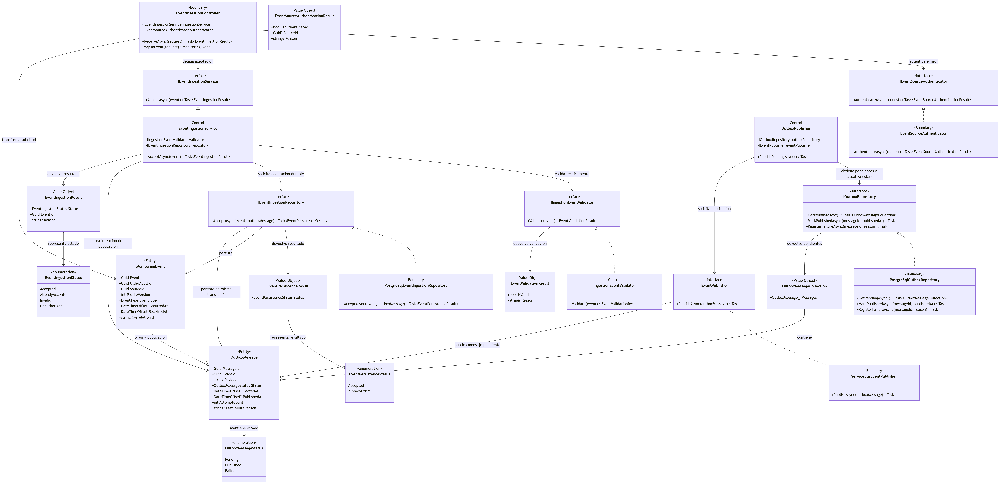
*Figura 16 — Diagrama de clases de diseño: Servicio de Ingesta de Eventos*
> **Imagen en tamaño completo:** [`clases-componente3.png`](../diagramas/clases-componente3.png) · **Fuente editable:** [`clases-componente3.mmd`](../diagramas/clases-componente3.mmd)


#### 10.3.2 Contratos de interfaz

| Método / Endpoint | Precondición | Postcondición | Excepciones |
|---|---|---|---|
| `EventIngestionController.`<br>`ReceiveAsync(request):`<br>`Task<EventIngestionResult>` | `request` no debe ser nulo y debe provenir de una fuente de monitoreo capaz de presentar las credenciales requeridas por el componente. | Se autentica al emisor, se transforma la solicitud en un `MonitoringEvent` y, cuando la autenticación es válida, se delega su aceptación mediante `IEventIngestionService`. Se devuelve un `EventIngestionResult` que indica si el evento fue aceptado, ya había sido aceptado, es inválido o el emisor no está autorizado. | Puede producir una excepción cuando la solicitud no puede interpretarse, ante una falla técnica inesperada durante la autenticación o el procesamiento, o cuando se cancela la operación. |
| `IEventSourceAuthenticator.`<br>`AuthenticateAsync(request):`<br>`Task<EventSourceAuthenticationResult>` | `request` no debe ser nulo y debe contener la información de autenticación requerida para identificar al emisor. | Se verifica la identidad del emisor y se devuelve un `EventSourceAuthenticationResult` que indica si está autenticado y, cuando corresponde, identifica la fuente mediante `SourceId`. Una autenticación inválida se representa mediante el resultado y no mediante una excepción. | Puede producir una excepción ante una falla técnica inesperada en el mecanismo de autenticación o ante la cancelación de la operación. |
| `IEventIngestionService.`<br>`AcceptAsync`<br>`(event: MonitoringEvent):`<br>`Task<EventIngestionResult>` | `event` no debe ser nulo y debe provenir de un emisor previamente autenticado. | Se valida técnicamente el evento y, si resulta válido, se genera su `OutboxMessage` y se solicita su aceptación durable. Si el `EventId` ya fue aceptado, se devuelve `AlreadyAccepted` sin crear un nuevo evento ni una nueva intención de publicación. Si la aceptación es exitosa, se devuelve `Accepted`. | Puede producir una excepción cuando ocurre una falla técnica que impide garantizar la aceptación durable, durante el acceso a persistencia o ante la cancelación de la operación. Los eventos inválidos o duplicados se representan mediante el resultado y no mediante excepciones. |
| `IIngestionEventValidator.`<br>`Validate(event: MonitoringEvent):`<br>`EventValidationResult` | `event` no debe ser nulo. | Se verifica que el evento contenga la estructura, identificadores, formatos y valores técnicos mínimos requeridos para su aceptación. Se devuelve un `EventValidationResult` que indica si el evento puede continuar con el proceso de ingesta y, cuando corresponda, la razón de su rechazo. | Puede producir una excepción únicamente ante una falla técnica inesperada durante la validación. Un evento técnicamente inválido se representa mediante `EventValidationResult`. |
| `IEventIngestionRepository.`<br>`AcceptAsync(event: MonitoringEvent,`<br>`outboxMessage: OutboxMessage):`<br>`Task<EventPersistenceResult>` | `event` y `outboxMessage` no deben ser nulos; `outboxMessage.EventId` debe corresponder a `event.EventId`. | El `MonitoringEvent` y su `OutboxMessage` se persisten **atómicamente en una misma transacción**. Si ambas escrituras se confirman, el evento se considera aceptado durablemente. Si `EventId` ya existe, no se crea un segundo evento ni un segundo mensaje de Outbox y se devuelve `AlreadyExists`. | Puede producir una excepción ante una falla técnica de persistencia, una violación de integridad distinta de la duplicidad esperada, la imposibilidad de completar la transacción de forma durable o la cancelación de la operación. |
| `OutboxPublisher.`<br>`PublishPendingAsync(): Task` | No Aplica. | Se recuperan los mensajes pendientes y se intenta publicar cada uno. Las publicaciones aceptadas se marcan como `Published`; ante fallas recuperables se registra el intento y el mensaje permanece disponible para un nuevo intento. | Puede producir una excepción ante una falla técnica que impida continuar de forma segura con el procesamiento del Outbox o ante la cancelación de la operación. Una falla individual de publicación debe registrarse sin provocar la pérdida del mensaje pendiente.                  |
| `IOutboxRepository.`<br>`GetPendingAsync():`<br>`Task<OutboxMessageCollection>` | No Aplica. | Se devuelve la colección de mensajes pendientes de publicación. Si no existen mensajes pendientes, se devuelve una colección vacía. | Puede producir una excepción ante una falla técnica de consulta o ante la cancelación de la operación. |
| `IEventPublisher.`<br>`PublishAsync(`<br>`outboxMessage: OutboxMessage): Task` | `outboxMessage` no debe ser nulo, debe encontrarse pendiente de publicación y debe contener un `Payload` válido. | Se envía el contenido del mensaje al Bus de Mensajería. Si el Bus acepta la publicación, la operación concluye satisfactoriamente. | Puede producir una excepción cuando el Bus no está disponible, ocurre un timeout, se rechaza la publicación, existe una falla de comunicación o se cancela la operación.                                                                                                             |

#### 10.3.3 Análisis de robustez

| Objeto | Tipo | Responsabilidad |
|---|---|---|
| `EventIngestionController`  | Boundary                           | Recibir las solicitudes provenientes de las fuentes de monitoreo, coordinar la autenticación del emisor, transformar la solicitud en un `MonitoringEvent` y delegar su aceptación mediante `IEventIngestionService`.                     |
| `IEventSourceAuthenticator` | Boundary                           | Definir el contrato para autenticar la fuente emisora del evento y devolver un resultado normalizado de autenticación, independientemente del mecanismo concreto utilizado.                                                             |
| `IEventIngestionRepository` | Boundary                           | Proporcionar acceso persistente para aceptar de forma durable un `MonitoringEvent`, almacenándolo atómicamente junto con su `OutboxMessage` y garantizando la idempotencia mediante la unicidad de `EventId`.                     |
| `IOutboxRepository`         | Boundary                           | Proporcionar acceso persistente a los mensajes pendientes del Outbox y permitir actualizar su estado e información de seguimiento después de cada intento de publicación.                                                              |
| `IEventPublisher`           | Boundary                           | Definir el contrato para publicar los mensajes pendientes hacia el Bus de Mensajería, aislando al componente de la tecnología concreta de mensajería utilizada.                                                                   |
| `EventIngestionService`     | Control                            | Coordinar el proceso de aceptación del evento, incluyendo validación técnica, creación del `OutboxMessage`, solicitud de persistencia durable e interpretación del resultado de aceptación o duplicidad.                   |
| `IngestionEventValidator`   | Control                            | Verificar que el evento recibido contenga la estructura, identificadores, formatos y valores técnicos mínimos requeridos para continuar con el proceso de ingesta.                                                                    |
| `OutboxPublisher`           | Control                            | Coordinar el procesamiento de los mensajes pendientes del Outbox, solicitar su publicación al Bus de Mensajería y registrar el resultado de cada intento sin perder los mensajes ante fallos temporales.                             |
| `MonitoringEvent`           | Entity                             | Representar el evento de monitoreo aceptado por el componente, incluyendo su identificador, fuente, adulto mayor asociado, tipo, versión del perfil, fechas e información necesaria para su trazabilidad y posterior procesamiento. |
| `OutboxMessage`             | Entity                             | Representar la intención durable de publicar un evento, incluyendo su identificador, referencia al evento, payload, estado de publicación, fechas e información de seguimiento de los intentos realizados.                         |

#### 10.3.4 Diagrama de secuencia — flujo principal

El siguiente diagrama de secuencia representa el flujo principal del Servicio de Ingesta de Eventos, desde la recepción de un evento proveniente de una fuente de monitoreo hasta su aceptación durable y posterior publicación en el Bus de Mensajería. El componente autentica al emisor, valida técnicamente el evento y persiste atómicamente el MonitoringEvent junto con su OutboxMessage. Posteriormente, OutboxPublisher recupera el mensaje pendiente y gestiona su publicación al Bus, actualizando su estado cuando la publicación se completa satisfactoriamente.

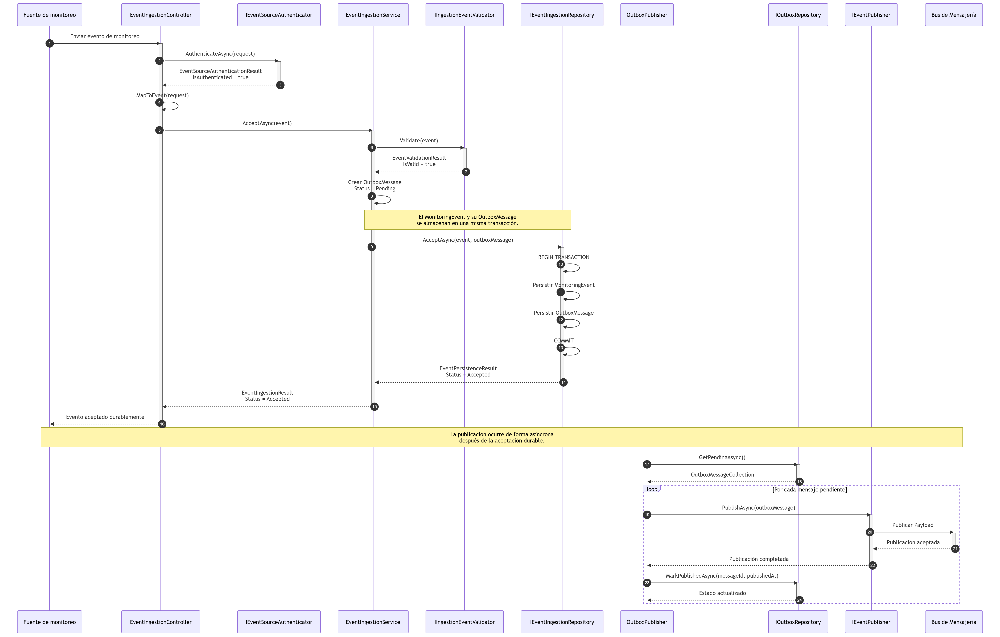
*Figura 17 — Secuencia: Aceptación durable y publicación de un evento de monitoreo*
> **Imagen en tamaño completo:** [`secuencia-comp3-principal.png`](../diagramas/secuencia-comp3-principal.png) · **Fuente editable:** [`secuencia-comp3-principal.mmd`](../diagramas/secuencia-comp3-principal.mmd)

El siguiente diagrama de secuencia representa un camino de error en el que ocurre una falla transitoria durante la publicación de un evento previamente aceptado de forma durable. El MonitoringEvent y su OutboxMessage permanecen persistidos, mientras OutboxPublisher registra la falla y mantiene el mensaje disponible para un intento posterior. De esta forma, una indisponibilidad temporal del Bus de Mensajería no provoca la pérdida del evento ni afecta su aceptación previa.

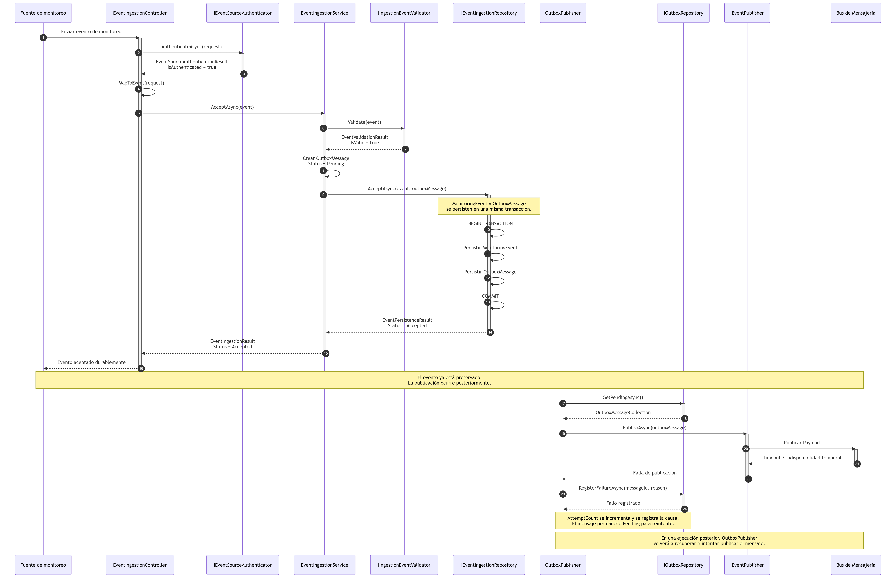
*Figura 18 — Secuencia: Falla transitoria durante la publicación de un evento*
> **Imagen en tamaño completo:** [`secuencia-comp3-error.png`](../diagramas/secuencia-comp3-error.png) · **Fuente editable:** [`secuencia-comp3-error.mmd`](../diagramas/secuencia-comp3-error.mmd)

--- 

### Componente 4 – API de Aplicación: Gestión de Configuración de Perfiles

> Para efectos de este diseño detallado, el alcance se limita a la gestión de la configuración de perfiles y excluye las funcionalidades del mismo contenedor relacionadas con la autenticación y autorización de usuarios, las consultas de estado e historial, la gestión de usuarios y cualquier otra operación de la API de Aplicación no asociada a la configuración versionada de perfiles.

**Responsabilidad:** Administrar de forma consistente y versionada la configuración de perfiles de monitoreo utilizada por el Motor de Reglas y el Servicio de Notificaciones, incluyendo las reglas de detección, los destinatarios, los canales y las preferencias de notificación. El componente garantiza la validación, persistencia íntegra, trazabilidad de los cambios y publicación de cada modificación como una nueva versión, sin alterar configuraciones históricas, asegurando que el sistema disponga de la información necesaria para que las alertas puedan detectarse y notificarse de forma segura, oportuna y pertinente. 

**Trazabilidad:** Soporta los casos de uso definidos en la Sección 1.4 relacionados con la gestión de perfiles de monitoreo, la configuración de reglas de detección y las preferencias de notificación. Asimismo, implementa los requerimientos funcionales RF-02 y RF-05 y contribuye directamente al cumplimiento del escenario QS-05 mediante el versionado, validación y publicación de configuraciones sin necesidad de recompilar ni redesplegar los componentes consumidores. En la Vista de estructura interna presentada en la Sección 7.2, corresponde principalmente al Contenedor 2 – API de Aplicación, responsable de exponer y ejecutar las operaciones de configuración, validación, versionado y persistencia. El Contenedor 1 – App Web actúa como interfaz de usuario desde la cual los usuarios autorizados consultan y modifican dicha configuración.
 
#### 10.4.1 Diagrama de clases de diseño

El siguiente diagrama presenta el diseño interno correspondiente a la Gestión de Configuración de Perfiles del componente API de Aplicación, incluyendo sus principales clases, interfaces y relaciones que permiten administrar de forma consistente y versionada los perfiles de monitoreo, las reglas de detección, los destinatarios, los canales y las preferencias de notificación, garantizando su validación, persistencia íntegra, trazabilidad de cambios y conservación de las versiones históricas.

El diseño se organiza alrededor de `ProfileConfigurationService`, responsable de coordinar la recuperación de la versión activa, la creación de una nueva `ProfileConfigurationVersion`, su validación y persistencia. Cada versión agrupa de forma coherente las reglas, destinatarios, canales y preferencias correspondientes. Una nueva versión se activa únicamente cuando toda la configuración ha sido validada y persistida de forma atómica, mientras que las versiones previamente publicadas pasan a formar parte del historial de configuración y permanecen persistidas para garantizar la trazabilidad y auditoría de los cambios.

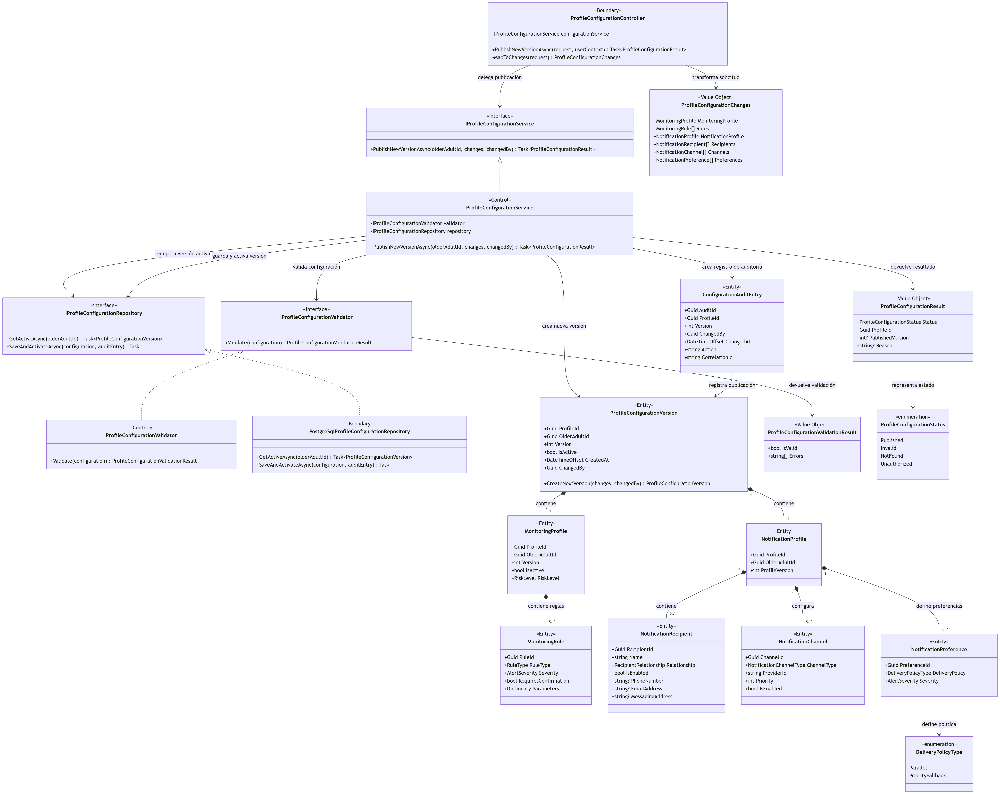
*Figura 19 — Diagrama de clases de diseño: Gestión de configuración de perfiles.*
> **Imagen en tamaño completo:** [`clases-componente4.png`](../diagramas/clases-componente4.png) · **Fuente editable:** [`clases-componente4.mmd`](../diagramas/clases-componente4.mmd)

#### 10.4.2 Contratos de interfaz

| Método / Endpoint | Precondición | Postcondición | Excepciones |
|---|---|---|---|
| `ProfileConfigurationController.`<br>`PublishNewVersionAsync`<br>`(request, userContext):`<br>`Task<ProfileConfigurationResult>` | `request` no debe ser nulo y debe contener una solicitud válida de modificación de la configuración del perfil. `userContext` debe corresponder a un usuario autenticado y autorizado para modificar la configuración del adulto mayor indicado. | La solicitud se transforma en `ProfileConfigurationChanges` y se delega su procesamiento mediante `IProfileConfigurationService`. Se devuelve un `ProfileConfigurationResult` indicando si la nueva versión fue publicada o si la operación no pudo completarse por una condición esperada. | Puede producir una excepción cuando la solicitud no puede interpretarse, ante una falla técnica inesperada durante el procesamiento o cuando se cancela la operación. |
| `IProfileConfigurationService.`<br>`PublishNewVersionAsync`<br>`(olderAdultId, changes, changedBy):`<br>`Task<ProfileConfigurationResult>` | `olderAdultId` y `changedBy` deben ser identificadores válidos y `changes` no debe ser nulo. El usuario debe estar autorizado para modificar la configuración indicada. | Si la configuración resulta válida, se crea y publica una nueva `ProfileConfigurationVersion` completa y consistente, que queda activa y asociada al registro de auditoría correspondiente. La versión anteriormente activa permanece persistida como parte del historial y no se modifica ni elimina. Se devuelve un `ProfileConfigurationResult` con el resultado de la operación. Las configuraciones inválidas no producen una nueva versión activa. | Puede producir una excepción ante una falla técnica al recuperar o persistir información, cuando no es posible completar la operación de forma atómica o cuando se cancela la operación. Las configuraciones inválidas se representan mediante `ProfileConfigurationResult` y no mediante excepciones. |
| `IProfileConfigurationRepository.`<br>`GetActiveAsync(olderAdultId):`<br>`Task<ProfileConfigurationVersion?>` | `olderAdultId` debe ser un identificador válido. | Se devuelve la versión activa completa de la configuración del perfil, incluyendo el `MonitoringProfile`, sus reglas, el `NotificationProfile`, sus destinatarios, canales y preferencias. Si no existe una versión activa, se devuelve `null`. | Puede producir una excepción ante una falla técnica de consulta, una inconsistencia al reconstruir la configuración almacenada o la cancelación de la operación. |
| `IProfileConfigurationValidator.`<br>`Validate(configuration):`<br>`ProfileConfigurationValidationResult` | `configuration` no debe ser nula. | Se valida la consistencia global de la nueva `ProfileConfigurationVersion`, incluyendo el `MonitoringProfile`, las reglas configuradas, el `NotificationProfile`, los destinatarios, los canales, las preferencias, verificando que la configuración contenga la información necesaria para ser utilizada correctamente por el Motor de Reglas y el Servicio de Notificaciones. Se devuelve un `ProfileConfigurationValidationResult` con el resultado y los errores encontrados, cuando corresponda. | Puede producir una excepción únicamente ante una falla técnica inesperada durante la validación. Una configuración inválida se representa mediante el resultado. |
| `IProfileConfigurationRepository.`<br>`SaveAndActivateAsync`<br>`(configuration, auditEntry): Task` | `configuration` y `auditEntry` no deben ser nulos; la configuración debe haber sido validada y representar una nueva versión del perfil. | La nueva `ProfileConfigurationVersion`, el `MonitoringProfile`, el `NotificationProfile`, sus elementos asociados y el registro de auditoría se persisten de forma atómica. La nueva versión queda activa y la versión previamente activa pasa a formar parte del historial sin ser eliminada ni sobrescrita. | Puede producir una excepción ante una falla técnica de persistencia, una violación de integridad, la imposibilidad de completar la transacción de forma atómica o la cancelación de la operación. |
                                                                                                           
#### 10.4.3 Análisis de robustez

| Objeto | Tipo | Responsabilidad |
|---|---|---|
| `ProfileConfigurationController`  | Boundary | Recibir desde la App Web las solicitudes de publicación de una nueva versión de configuración, transformar la solicitud en `ProfileConfigurationChanges` y delegar el procesamiento mediante `IProfileConfigurationService`. |
| `IProfileConfigurationRepository` | Boundary | Proporcionar acceso persistente a la configuración versionada del perfil, permitiendo recuperar la versión activa y persistir de forma atómica la nueva versión de configuración y el registro de auditoría, actualizando el estado de las versiones almacenadas. |
| `ProfileConfigurationService`     | Control  | Coordinar el proceso completo de publicación de una nueva versión, incluyendo la recuperación de la versión activa, la creación de la nueva `ProfileConfigurationVersion`, su validación, la generación del registro de auditoría y la persistencia y activación de la nueva versión. |
| `ProfileConfigurationValidator`   | Control  | Validar la consistencia de la nueva versión de configuración, incluyendo el perfil de monitoreo, reglas, perfil de notificación, destinatarios, canales, preferencias y datos requeridos antes de su publicación. |
| `ProfileConfigurationVersion`     | Entity   | Representar una versión completa, coherente y trazable de la configuración asociada a un adulto mayor, incluyendo la configuración utilizada por el Motor de Reglas y el Servicio de Notificaciones, permitiendo crear una nueva versión a partir de la configuración vigente y conservando el historial de versiones mediante el mecanismo de versionado.
| `MonitoringProfile`               | Entity   | Representar la configuración de monitoreo correspondiente a una versión del perfil, agrupando las reglas de detección que serán utilizadas por el Motor de Reglas para evaluar los eventos recibidos. |
| `MonitoringRule`                  | Entity   | Representar una regla de detección configurable asociada al perfil de monitoreo, incluyendo su tipo, severidad, parámetros y requisitos de confirmación. |
| `NotificationProfile`             | Entity   | Representar la configuración de notificación correspondiente a una versión del perfil, agrupando los destinatarios, canales y preferencias utilizados por el Servicio de Notificaciones.                                                                                         |
| `NotificationRecipient`           | Entity   | Representar un destinatario configurado para recibir alertas, incluyendo su relación con el adulto mayor, estado y datos de contacto disponibles.               |
| `NotificationChannel`             | Entity   | Representar un canal habilitado para la entrega de alertas (SMS, Email, Push, etc.), incluyendo su tipo, prioridad, estado y configuración requerida para su utilización por el Servicio de Notificaciones. |
| `NotificationPreference`          | Entity   | Representar las preferencias de notificación asociadas a una versión del perfil, incluyendo prioridades, horarios permitidos, severidad mínima y demás criterios utilizados por el Servicio de Notificaciones.                        |
| `ConfigurationAuditEntry`         | Entity   | Representar el registro trazable de la publicación de una versión, incluyendo quién realizó el cambio, cuándo ocurrió, qué versión fue afectada y el identificador de correlación asociado. |

#### 10.4.4 Diagrama de secuencia — flujo principal

El siguiente diagrama de secuencia representa el flujo principal para publicar una nueva versión de configuración de perfil. El componente recupera la versión activa, construye en memoria una nueva `ProfileConfigurationVersion` a partir de los cambios solicitados, valida la consistencia de la configuración y, al ser válida, registra la información de auditoría y persiste de forma atómica la nueva versión junto con sus perfiles y elementos asociados. Como parte de la misma operación, la nueva versión queda activa y la anterior pasa a formar parte del historial, donde permanece persistida para fines de trazabilidad y auditoría.

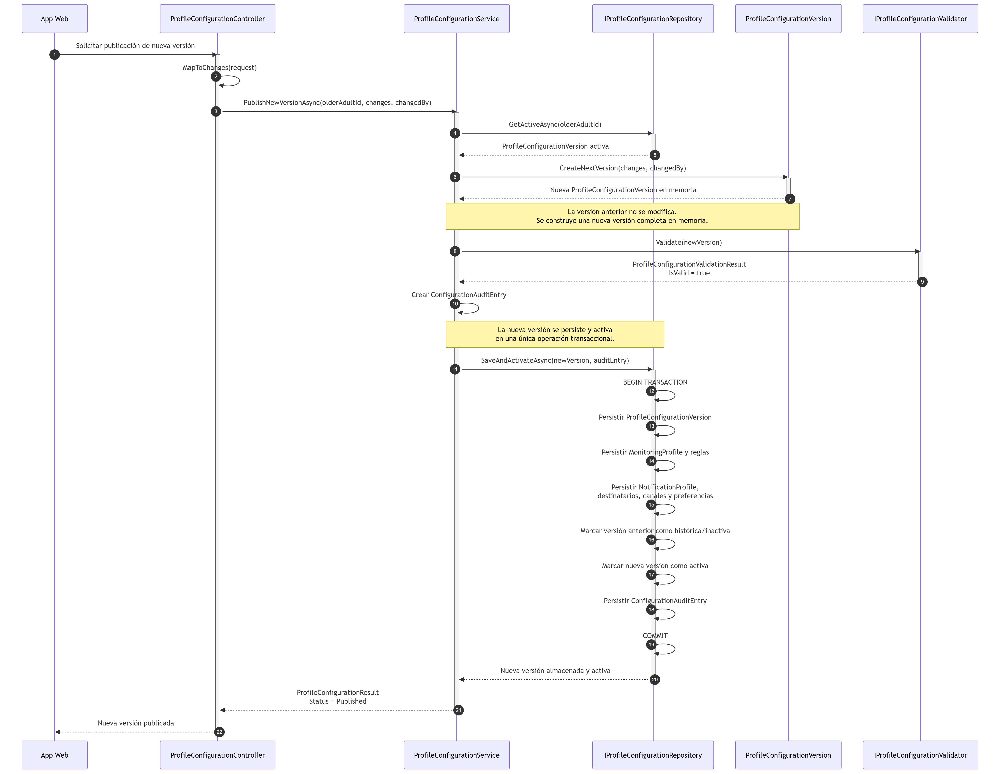
*Figura 20 — Secuencia: Publicación exitosa de una nueva versión de configuración de perfil*
> **Imagen en tamaño completo:** [`secuencia-comp4-principal.png`](../diagramas/secuencia-comp4-principal.png) · **Fuente editable:** [`secuencia-comp4-principal.mmd`](../diagramas/secuencia-comp4-principal.mmd)

El siguiente diagrama de secuencia representa un camino de error en el que la nueva `ProfileConfigurationVersion` ha sido construida y validada correctamente, pero ocurre una falla técnica durante su persistencia y activación. Al tratarse de una operación transaccional, los cambios no se confirman y la transacción se revierte, por lo que la versión previamente activa permanece vigente y no se genera una configuración parcial. La falla se propaga como un error técnico y la nueva versión podrá volver a publicarse una vez recuperada la disponibilidad del almacenamiento.

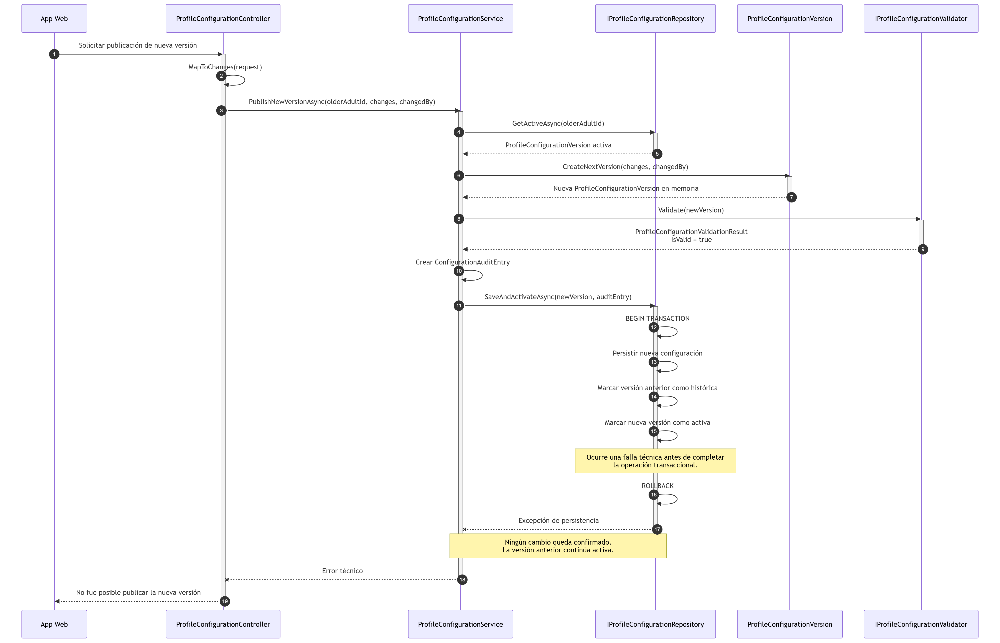
*Figura 21 — Secuencia: Falla al persistir y activar una nueva versión de configuración*
> **Imagen en tamaño completo:** [`secuencia-comp4-error.png`](../diagramas/secuencia-comp4-error.png) · **Fuente editable:** [`secuencia-comp4-error.mmd`](../diagramas/secuencia-comp4-error.mmd)

---

## 12. Principios y técnicas habilitadoras — evidencia

Los principios definidos previamente en la Sección 6 se utilizaron como criterios para guiar el diseño arquitectónico de SeniorCareHub. En esta sección se presenta la evidencia concreta de su aplicación en la arquitectura y en los componentes diseñados, además, se identifican las tensiones introducidas por su aplicación.

### 12.1 Evidencia de principios de diseño
| Principio | Evidencia en el diseño | Referencia | Tensión con otro principio |
|---|---|---|---|
| Separación de responsabilidades (Separation of Concerns) | A nivel de arquitectura, la ingesta (Servicio de Ingesta), la evaluación de reglas (Motor de Reglas), el despacho de notificaciones (Servicio de Notificaciones) son contenedores independientes que solo se comunican de forma asíncrona a través del Bus de Mensajería (§7.2), cada uno con ciclo de despliegue propio, tal como lo hace explícito la vista de comportamiento en sus tres flujos (§7.3). Dentro del Motor de Reglas, `EventMessageConsumer` únicamente transforma y delega el mensaje, `EventValidator` solo valida, y cada estrategia (`FallRuleEvaluator`, `InactivityRuleEvaluator`, `SafeZoneRuleEvaluator`) evalúa un único tipo de regla. El mismo patrón se repite en el Servicio de Notificaciones (`AlertMessageConsumer`, `ChannelSelectionService`, `DeliveryPolicyResolver`, `NotificationAdapterFactory` cada uno con una única razón de cambio) y en el Servicio de Ingesta, donde `EventIngestionController` solo recibe y delega, `IEventSourceAuthenticator` solo autentica, `IngestionEventValidator` solo valida la estructura técnica, y `OutboxPublisher` solo publica lo ya aceptado.  El componente Gestión de Configuración de Perfiles refuerza esta evidencia al separar ProfileConfigurationController, ProfileConfigurationService, ProfileConfigurationValidator e IProfileConfigurationRepository | §7.2; §7.4; §10.1.1–§10.1.3; §10.2.1–§10.2.3; §10.3.1–§10.3.3; §10.4.1–§10.4.3 | Tensión con KISS: separar responsabilidades incrementa el número de clases, interfaces y colaboraciones. La separación se limita a responsabilidades con razones de cambio distintas y que responden directamente a los drivers del sistema. |
| Diseño para el cambio (Open-Closed Principle) | El Motor de Reglas aplica Strategy (`IRuleEvaluator`) seleccionado por `RuleEvaluatorFactory`: agregar un tipo de regla no exige modificar `RuleProcessingService`. ADR-002 establece además que los perfiles son versionados y editables en tiempo de ejecución, satisfaciendo QS-05. El Servicio de Notificaciones extiende esta evidencia: `DeliveryPolicyResolver` selecciona entre `PriorityFallbackDeliveryStrategy` y `ParallelDeliveryStrategy` según la severidad de la alerta y la política configurada en el perfil, de modo que una nueva política de entrega se agrega sin tocar `NotificationProcessingService`; y `NotificationAdapterFactory` (ADR-004) permite incorporar un proveedor nuevo de la misma forma. | ADR-002; ADR-004; §10.1.1; §10.2.1; §10.4.1–§10.4.2; QS-05 | Tensión con KISS: cada estrategia e interfaz nueva incrementa la estructura del componente. SeniorCareHub admite un conjunto conocido de tipos de reglas y de políticas de entrega, evitando un motor dinámico o un lenguaje de reglas arbitrario. |
| Defensa en profundidad (Defense in Depth) | La protección se aplica en capas independientes: en el borde, la API de Aplicación autentica al usuario y aplica autorización por rol (§7.2.1, contenedor 2), mientras que el Servicio de Ingesta autentica al emisor mediante `IEventSourceAuthenticator` (§10.3.2) antes de aceptar cualquier evento; en la lógica de negocio, QS-04 exige que todo acceso no autorizado reciba HTTP 401/403 y quede auditado; en el transporte, todas las comunicaciones internas usan TLS (§7.2.2); en la infraestructura, el acceso de los servicios a Service Bus, PostgreSQL y Key Vault se realiza mediante identidades administradas de Microsoft Entra ID en lugar de credenciales en configuración (§7.4.2); y en el dato, los eventos aplican minimización y segregación de tópicos por sensibilidad (§8.4, punto 5). Ver el desarrollo completo del modelo de amenazas en §14.5. En el componente Gestión de Configuración de Perfiles, `PublishNewVersionAsync(request, userContext)` exige que el usuario esté autenticado y autorizado antes de modificar una configuración, y `ConfigurationAuditEntry` conserva trazabilidad del cambio. | §4 QS-04; §7.2.1; §7.2.2; §7.4.1–§7.4.2; §8.4; §10.3.2; §10.4.2–§10.4.3| Tensión con KISS y rendimiento: autenticación, autorización, auditoría e identidades administradas agregan controles e interacciones adicionales. La complejidad se concentra en las fronteras del sistema y se justifica por la sensibilidad de los datos y por REST-02. |
| Diseño para resiliencia (Fail Gracefully) | El Bus de Mensajería provee persistencia durable, reintentos, cola de mensajes muertos y sesiones ordenadas por adulto mayor (§7.2.1, contenedor 4), sustentando ADR-001 y la meta de "cero alertas críticas perdidas" de QA-03. El camino de error del Servicio de Notificaciones (§10.2.4) no confirma el mensaje al bus ante una falla transitoria, permitiendo su reentrega; el del Motor de Reglas (§10.1.4) hace lo mismo si falla la persistencia del estado de confirmación. El Componente 3 aporta la evidencia más directa de este principio: mediante el patrón Transactional Outbox (§11), `EventIngestionService` persiste el `MonitoringEvent` y su `OutboxMessage` en una misma transacción, de modo que una falla posterior en la publicación al bus (§10.3.4, camino de error) no compromete el evento ya aceptado — `OutboxPublisher` simplemente lo reintenta más tarde. |ADR-001; ADR-003; §7.3.2; §10.1.4; §10.2.4; §10.3.2–§10.3.4; §10.4.2–§10.4.4 | Tensión con KISS y QA-02: mensajería durable, reintentos, deduplicación y el patrón Outbox incrementan la complejidad y pueden agregar latencia. El diseño acepta este costo porque QA-03 prioriza evitar la pérdida silenciosa de eventos y alertas. |
| KISS (Keep It Simple) | ADR-002 rechaza explícitamente un motor de reglas dinámico o un lenguaje de reglas arbitrario a favor de un conjunto controlado y conocido de tipos de reglas parametrizables. El Servicio de Ingesta refuerza esta disciplina por diseño: su responsabilidad se acota deliberadamente a autenticar, validar técnicamente y garantizar la aceptación durable — la tabla de contenedores es explícita en que "no evalúa reglas" (§7.2.1, contenedor 3), esto evita que la lógica de detección se duplique o se filtre hacia el borde del sistema. |§7.2.1; ADR-002; ADR-004; §10.3; §10.4 | Tensión con OCP, DIP y resiliencia: mayor extensibilidad y tolerancia a fallos requieren interfaces, adaptadores y mecanismos de recuperación como el Outbox. KISS no significa minimizar el número de elementos, sino evitar los que no se justifican por un driver o escenario concreto. |
| Principio de menor privilegio (Principle of Least Privilege) | La API de Aplicación aplica autorización por rol a todas las operaciones expuestas, y QS-04 formaliza que el control de acceso se basa también en la relación entre el actor y el adulto mayor consultado: un familiar o cuidador solo accede a los adultos mayores con los que posee una relación autorizada, reflejando RF-04. El 100 % de los casos de la suite de autorización debe responder 401 o 403 según corresponda (§4 QS-04).  El Gestión de Configuración de Perfiles aporta evidencia contractual adicional: la publicación de una nueva versión exige un userContext autenticado y autorizado para modificar la configuración del adulto mayor indicado. | REST-01; REST-03; ADR-004; §10.1.2; §10.2.2; §10.3.2; §10.4.2 | Tensión con KISS: la autorización por rol y relación es más compleja que un esquema RBAC simple, pero un rol por sí solo no garantiza que un familiar acceda únicamente a quienes tiene autorización de consultar. Ver el riesgo residual de diseño de este mecanismo en §13.1 y §14.5. |
| Inversión / Aislamiento de dependencias externas (Dependency Inversion) | `INotificationAdapter` abstrae a los proveedores externos detrás de una interfaz común resuelta por `NotificationAdapterFactory` (ADR-004). Los repositorios (`IMonitoringProfileRepository`, `INotificationProfileRepository`, etc.) abstraen la persistencia. El Componente 3 añade dos abstracciones adicionales: `IEventSourceAuthenticator` aísla el mecanismo concreto de autenticación del emisor —"independientemente del mecanismo concreto utilizado", según su propio contrato (§10.3.2)— y `IEventPublisher` aísla la tecnología de mensajería utilizada para publicar al bus, de modo que el núcleo de ingesta no depende ni del wearable concreto ni del producto de mensajería elegido. | §5 REST-01, REST-03; §9 ADR-004; §10.1.2, §10.2.2 y §10.3.2 (contratos de interfaz) | Tensión con KISS: las interfaces introducen indirección y aumentan el número de elementos del diseño. Se mantienen en puntos donde existe variabilidad real —proveedor, mecanismo de autenticación, tecnología de mensajería— y no como abstracciones preventivas sin un cambio identificado. |

### 12.2 Técnicas habilitadoras evidenciadas

| Técnica habilitadora | Evidencia en SeniorCareHub | Contribución al diseño |
|---|---|---|
| **Abstracción mediante interfaces** | `IRuleEvaluator`, `INotificationAdapter`, `IChannelDeliveryStrategy`, `IEventPublisher`, `IEventSourceAuthenticator`, `IProfileConfigurationRepository`, `IProfileConfigurationValidator` y repositorios. | Reduce el acoplamiento con tecnologías, integraciones y algoritmos concretos y facilita sustitución, pruebas y evolución. |
| **Configuración y versionado** | ADR-002; `ProfileConfigurationVersion`; `MonitoringProfile`; `NotificationProfile`; reglas, destinatarios, canales y preferencias versionados. | Permite modificar comportamiento soportado sin recompilar ni redesplegar los consumidores y conserva el historial de configuraciones utilizadas. |
| **Diseño por contrato** | Precondiciones, postcondiciones y excepciones documentadas en §10.1.2, §10.2.2, §10.3.2 y §10.4.2. | Hace explícitas las obligaciones de los colaboradores y diferencia resultados esperados de negocio de fallos técnicos. |
| **Idempotencia y deduplicación** | `DeduplicationService`, consultas de tracking de notificaciones y unicidad de `EventId` en Ingesta. | Permite tolerar la semántica *at-least-once* sin producir deliberadamente alertas, notificaciones o eventos duplicados. |
| **Persistencia explícita del estado relevante** | `ConfirmationState`, `Notification`, `NotificationAttempt`, `OutboxMessage`, `ProfileConfigurationVersion` y `ConfigurationAuditEntry`. | Permite recuperar procesamiento después de reinicios y mantener trazabilidad durable de evaluaciones, entregas, publicaciones y cambios de configuración. |
| **Transactional Outbox** | `MonitoringEvent` y `OutboxMessage` se persisten atómicamente; `OutboxPublisher` publica posteriormente los mensajes pendientes. | Elimina la ventana de fallo entre persistir un evento y registrar de forma durable la intención de publicarlo al Bus. |
| **Activación atómica de configuración** | `SaveAndActivateAsync(configuration, auditEntry)` persiste la nueva versión completa y la auditoría en una misma operación transaccional, activándola solo si toda la escritura se confirma. | Evita configuraciones parciales y conserva la versión anterior como válida ante una falla durante la publicación de una nueva versión. |
| **Normalización de integraciones externas** | `INotificationAdapter`, `AdapterSendResult` y resultados normalizados de las estrategias de entrega. | Evita propagar contratos y semánticas particulares de proveedores hacia la lógica coordinadora. |
| **Trazabilidad distribuida y de configuración** | `correlationId`, versionado de perfiles, `ConfigurationAuditEntry`, telemetría centralizada y registros de intentos. | Permite reconstruir el recorrido de un evento y relacionar evento, alerta, versión de configuración, cambio administrativo y notificación. |

### 12.3 Tensiones y criterio de aplicación

Los principios adoptados no se maximizan de manera independiente. Separar responsabilidades y aplicar inversión de dependencias aumenta el número de clases y contratos, mientras KISS busca evitar complejidad innecesaria. SeniorCareHub resuelve esta tensión manteniendo abstracciones únicamente en fronteras con razones de cambio reales como: evaluadores de reglas, proveedores externos, persistencia, mensajería, autenticación de fuentes y gestión de configuración versionada.

La resiliencia introduce una tensión adicional con rendimiento y simplicidad. La mensajería durable, la deduplicación, la persistencia del estado temporal, Transactional Outbox y las transacciones de publicación de configuraciones agregan pasos al procesamiento, pero reducen el riesgo de pérdida silenciosa o de estados parciales ante fallos. Este costo se considera justificable por QA-03 y QA-05, siempre que las mediciones posteriores demuestren que el presupuesto de QS-02 continúa siendo alcanzable.

Finalmente, la idempotencia reduce los efectos de reentregas dentro de SeniorCareHub, pero no garantiza semántica `exactly-once` frente a proveedores externos. Si un proveedor acepta una notificación y el sistema falla antes de persistir el resultado, un reintento puede generar una entrega duplicada cuando el proveedor no soporta una clave de idempotencia. Este comportamiento debe considerarse un riesgo residual de integración y no una garantía de entrega exactamente una vez.

---

# BLOQUE 6 — CALIDAD Y TENDENCIAS
*Hito: Entrega final (S14)*

---

## 13. Análisis de calidad del diseño

Esta sección valida los escenarios QS-01 a QS-05 contra las vistas arquitectónicas, los ADRs y los **cuatro componentes detallados en la Sección 10**. Debido a que el alcance del proyecto corresponde al **diseño** y no a una implementación productiva completamente desplegada, las métricas cuantitativas se consideran criterios de aceptación. El diseño puede demostrar que existen mecanismos para perseguir esas metas, pero su cumplimiento definitivo requiere pruebas de carga, disponibilidad, inyección de fallos y seguridad.

### 13.1 Validación de escenarios de calidad


| Escenario | Medida requerida | Cómo el diseño la satisface | Decisiones que lo habilitan | Riesgo residual |
|---|---|---|---|---|
| **QS-01 — Disponibilidad** | Disponibilidad mensual del pipeline crítico ≥ 99.5 % (≤ 3.6 h de indisponibilidad/mes) | ADR-001 desacopla temporalmente Ingesta, Motor de Reglas y Notificaciones, permitiendo que un productor continúe aceptando trabajo aunque un consumidor esté temporalmente indisponible. La vista de despliegue mantiene una réplica mínima del Motor de Reglas y del Servicio de Notificaciones para evitar arranques en frío. | ADR-001; §7.2; §7.4.1–§7.4.2 | El diseño incorpora mecanismos orientados a alcanzar la meta, pero no demuestra por sí solo 99.5 %. La instancia única, la ausencia de redundancia de zona y la dependencia de PostgreSQL/Service Bus requieren validación operativa. Una meta superior obligaría a revisar la estrategia de redundancia. |
| **QS-02 — Rendimiento** | ≤ 5 s en p95 y ≤ 8 s en p99 desde la aceptación durable del evento hasta la aceptación por el primer proveedor | La propagación por eventos evita sondeo periódico; las sesiones ordenan únicamente por adulto mayor y permiten paralelismo entre personas distintas; ADR-002 utiliza tipos de reglas controlados; el Servicio de Notificaciones resuelve políticas y proveedores mediante contratos predefinidos. | ADR-001; ADR-002; §7.5.3; §10.1; §10.2; §10.3 | No existe todavía una prueba de carga ejecutada. Además, el tiempo entre la aceptación durable y la publicación efectiva del `OutboxMessage` forma parte del presupuesto de QS-02; la frecuencia y capacidad de `OutboxPublisher` deben dimensionarse para que esa espera no consuma una proporción significativa de los 5 s. El presupuesto temporal de §14.2.3 debe incluir explícitamente esta etapa. |
| **QS-03 — Tolerancia a fallos / Resiliencia** | 100 % de eventos críticos asociados a un estado durable y trazable; 0 alertas huérfanas; primer fallback < 10 s en p95 | El Bus mantiene mensajes no confirmados para reentrega; el Motor de Reglas persiste `ConfirmationState` y no confirma el mensaje cuando no puede completar el procesamiento de forma segura; el Servicio de Notificaciones registra intentos y dispone de estrategias de fallback/reintento; el Servicio de Ingesta utiliza Transactional Outbox para conservar durablemente un evento aceptado aunque falle su publicación posterior. La recuperación del estado de confirmación tras reinicios se resuelve en §7.5.3 mediante persistencia en BD Operativa y recuperación por la réplica que retoma la sesión. | ADR-001; ADR-003; §7.3.2; §7.5.3; §10.1.4; §10.2.1–§10.2.4; §10.3.4 | Falta ejecutar la prueba de inyección de fallos y medir el tiempo real de fallback. Además, la semántica *at-least-once* puede producir efectos duplicados frente a proveedores externos si el envío fue aceptado pero el resultado no pudo persistirse antes de una reentrega. **ADR-004 debe actualizarse para incluir explícitamente QA-03/QS-03, fallback, reintentos e idempotencia, ya que el diseño detallado de §10.2 ya contiene estas capacidades.** |
| **QS-04 — Seguridad y privacidad** | 100 % de casos de autorización con HTTP 401/403 según corresponda; registro auditable consultable < 5 s | La API concentra autenticación y autorización; QS-04 exige autorización por rol y relación; el Servicio de Ingesta autentica fuentes; las comunicaciones usan TLS; el despliegue utiliza identidades administradas y Key Vault para reducir exposición de credenciales. El Componente 4 exige un contexto de usuario autorizado para publicar configuraciones y persiste `ConfigurationAuditEntry` junto con la nueva versión. | REST-02; QS-04; §7.2.1–§7.2.2; §7.4.2; §10.3.2; §10.4.2–§10.4.4; §12 | Las identidades administradas resuelven autenticación servicio-a-servicio, no la autenticación y autorización de usuarios finales. El mecanismo concreto de identidad, las políticas de rol/relación, la protección de la bitácora y la medida de auditoría < 5 s deben validarse en implementación. |
| **QS-05 — Modificabilidad** | Nueva configuración disponible < 10 min sin recompilar ni redesplegar el Motor de Reglas | ADR-002 mantiene reglas y perfiles como configuración versionada. El Componente 4 materializa esa decisión mediante `ProfileConfigurationService`, `ProfileConfigurationVersion`, `ProfileConfigurationValidator`, `SaveAndActivateAsync` y `ConfigurationAuditEntry`: la nueva versión se construye, valida, persiste y activa de forma atómica, mientras la versión anterior permanece disponible para trazabilidad. `IRuleEvaluator`, `IChannelDeliveryStrategy` e `INotificationAdapter` mantienen estables los coordinadores ante nuevos evaluadores, políticas o proveedores compatibles. | ADR-002; ADR-004; §7.3.3; §10.1.1; §10.2.1; **§10.4.1–§10.4.4** | La creación, validación y activación de versiones ya está resuelta por diseño. Queda pendiente definir de forma única **cómo los consumidores seleccionan la versión aplicable** y garantizar su visibilidad dentro del límite de 10 min. Actualmente §7.3.3 supone que el Motor de Reglas consulta la versión vigente, mientras §10.1 y §10.3 incluyen `event.ProfileVersion`; esta semántica debe unificarse. Si se utiliza caché, también debe definirse su política de actualización o invalidación. |

### 13.1.1 Resultado de la validación

Los cinco escenarios poseen soporte explícito en la arquitectura, pero ninguno de los valores cuantitativos debe presentarse como demostrado mientras no existan pruebas ejecutadas. QS-03 y QS-05 poseen mecanismos estructurales particularmente claros —persistencia durable, reentrega, versionado, activación atómica, estrategias y adaptadores—, mientras QS-01, QS-02 y QS-04 dependen en mayor medida de configuración de infraestructura y validación operativa.

La incorporación del Componente 4 fortalece especialmente QS-05: la publicación de configuraciones ya no es una responsabilidad implícita de la API, sino un caso de uso diseñado con contratos, validación, persistencia atómica, historial y auditoría. El principal riesgo residual de QS-05 se desplaza por tanto desde **cómo crear una versión consistente** hacia **cómo los consumidores determinan y observan la versión vigente**.

## 13.2 Análisis de trade-offs entre atributos de calidad

| Conflicto | Atributo favorecido | Atributo sacrificado | Decisión que lo resolvió | Justificación |
|---|---|---|---|---|
| **Confiabilidad y disponibilidad vs. simplicidad operativa** | QA-01, QA-03 | Simplicidad de despliegue y depuración | ADR-001 — arquitectura orientada a eventos | Se acepta mayor complejidad operativa y consistencia eventual para aislar fallos y conservar mensajes cuando consumidores están temporalmente indisponibles. |
| **Exactitud de detección vs. rendimiento** | Reducción de falsas alarmas | QA-02 | ADR-003 — confirmación configurable y deduplicación | Alertar inmediatamente minimiza latencia pero aumenta falsas alarmas; la confirmación configurable permite aplicar espera solo cuando el tipo de evento lo requiere. |
| **Modificabilidad vs. rendimiento** | QA-05 | Parte del presupuesto de QA-02 | ADR-002 — tipos controlados y parámetros configurables | Una lógica fija sería más rápida, pero obligaría a redesplegar ante cambios. Se acepta el costo de leer y evaluar configuración dinámica. |
| **Consistencia de configuración vs. simplicidad de actualización** | QA-05, QA-04 | Simplicidad de persistencia | §10.4 — versionado y `SaveAndActivateAsync` | Actualizar reglas, destinatarios y canales por separado sería más simple, pero permitiría estados parciales. La publicación atómica de una `ProfileConfigurationVersion` agrega coordinación transaccional a cambio de una configuración coherente y auditable. |
| **Seguridad y privacidad vs. disponibilidad/rendimiento** | QA-04 | Parte de QA-01 y QA-02 | Autenticación, autorización, auditoría, TLS e identidades administradas | La sensibilidad de los datos y REST-02 hacen que estos controles sean obligatorios aun cuando agreguen validaciones y dependencias. |
| **Modificabilidad y resiliencia de canales vs. simplicidad estructural** | QA-05 y, cuando se aplica fallback, QA-03 | Simplicidad interna | ADR-004 — servicio multicanal con estrategias y adaptadores | Un proveedor integrado directamente sería más simple, pero aumentaría acoplamiento y dificultaría fallback y sustitución. Un servicio por proveedor introduciría duplicación y mayor costo operativo. |
| **Simplicidad de Ingesta vs. no pérdida del evento** | QA-03 | Simplicidad del flujo | Transactional Outbox en §10.3 | Persistir y publicar directamente deja una ventana de fallo entre ambos pasos. Outbox agrega una entidad y un publicador adicional, pero conserva durablemente la intención de publicación. |
| **Resiliencia de entrega vs. latencia y costo** | QA-03 | QA-02 y costo operativo | Estrategias `PriorityFallbackDeliveryStrategy` / `ParallelDeliveryStrategy` | Fallback y envío paralelo aumentan las oportunidades de entrega, pero implican más llamadas a proveedores y pueden consumir mayor latencia o costo. |

## 13.3 Métricas de diseño — estimación

La estimación principal se realiza al nivel solicitado por el template: los **cuatro componentes detallados en la Sección 10**. Se utiliza una evaluación cualitativa de cohesión y acoplamiento basada en la concentración de responsabilidades, número de dependencias, uso de abstracciones y exposición a tecnologías externas.

| Componente | Cohesión estimada | Acoplamiento estimado | Observación |
|---|---|---|---|
| **Motor de Reglas** | **Alta** | **Medio** | Todas sus clases colaboran alrededor de una finalidad común: evaluar eventos, aplicar confirmación/deduplicación y generar alertas. Tiene varias dependencias necesarias hacia perfiles, reglas, estado, persistencia y publicación, pero la mayoría se encuentran detrás de interfaces (`IRuleEvaluator`, repositorios, `IAlertPublisher`). |
| **Servicio de Notificaciones** | **Alta** | **Medio** | Su responsabilidad se mantiene centrada en convertir una alerta confirmada en entregas trazables. Integra configuración, políticas, adaptadores, tracking y proveedores, pero `IChannelDeliveryStrategy`, `INotificationAdapter` y repositorios reducen el acoplamiento directo con implementaciones concretas. |
| **Servicio de Ingesta de Eventos** | **Alta** | **Bajo–Medio** | Su alcance es deliberadamente angosto: autenticar la fuente, validar, aceptar de forma durable y publicar. Transactional Outbox separa aceptación y publicación, mientras `IEventSourceAuthenticator`, `IEventIngestionRepository` e `IEventPublisher` mantienen aislados los detalles tecnológicos. |
| **API de Aplicación — Gestión de Configuración de Perfiles** | **Alta** | **Bajo–Medio** | Las clases colaboran alrededor de una finalidad única: construir, validar, persistir, activar y auditar versiones coherentes de configuración. `ProfileConfigurationService` depende principalmente de `IProfileConfigurationRepository` e `IProfileConfigurationValidator`; no necesita invocar directamente al Motor de Reglas ni al Servicio de Notificaciones, ya que estos consumen posteriormente la configuración persistida. |

### 13.3.1 Observaciones a nivel de clases

Los puntos de mayor colaboración interna son `RuleProcessingService` y `NotificationProcessingService`. Esto no implica cohesión baja: ambos mantienen una finalidad única de orquestación. Su acoplamiento se considera **medio**, no alto, porque aunque dependen de varios colaboradores, estos se expresan principalmente mediante contratos estables y no mediante dependencias directas a PostgreSQL, Azure Service Bus o proveedores específicos.

`EventIngestionService` y `ProfileConfigurationService` presentan un conjunto menor de colaboradores y fronteras más acotadas. En el primer caso, la aceptación durable se delega al repositorio y la publicación se separa mediante Outbox; en el segundo, la validación y persistencia se delegan respectivamente a `IProfileConfigurationValidator` e `IProfileConfigurationRepository`. Por ello ambos se mantienen en un rango de acoplamiento **bajo–medio**.

Por contraste, clases como los evaluadores de reglas, `NotificationAdapterFactory`, `OutboxPublisher`, `ProfileConfigurationValidator` e implementaciones concretas de estrategias poseen responsabilidades más reducidas y menor número de dependencias, por lo que presentan cohesión alta y acoplamiento bajo.

### 13.3.2 Criterio de interpretación

Las métricas se utilizan como indicadores de calidad estructural y no como objetivos absolutos. Un componente distribuido que orquesta varias colaboraciones puede presentar acoplamiento medio y seguir siendo adecuado si esas dependencias están justificadas por su responsabilidad y se mantienen detrás de contratos estables. La principal señal de deterioro sería que un componente comenzara a incorporar responsabilidades ajenas a su frontera o dependencias tecnológicas directas que hoy permanecen aisladas.

---

# BLOQUE 7 — SECCIONES ESPECÍFICAS POR TIPO DE SISTEMA
*Hito: Entrega final (S14)*

---

## 14. Asuntos clave de diseño

Este capítulo analiza SeniorCareHub bajo las lentes transversales que atraviesan su arquitectura: su condición de sistema distribuido desplegado en la nube, su comportamiento concurrente y con restricciones temporales, y su relación con el dominio de Internet de las Cosas. Cada apartado se apoya en las vistas del capítulo 7 y en las decisiones registradas en los capítulos 8 y 9, y explicita tanto lo que el diseño resuelve como lo que deliberadamente deja fuera de alcance.

### 14.1 Sistemas distribuidos y computación en la nube

#### 14.1.1 Por qué SeniorCareHub es un sistema distribuido

SeniorCareHub cumple la caracterización clásica de un sistema distribuido: un conjunto de procesos independientes que se ejecutan en nodos separados, se comunican únicamente mediante paso de mensajes por red, no comparten memoria y no disponen de un reloj global común.

La vista de despliegue (§7.4) lo hace evidente. El wearable emite desde fuera de la nube; el Servicio de Ingesta y la API se ejecutan en un plan de App Service; el Motor de Reglas y el Servicio de Notificaciones lo hacen en un entorno de Container Apps con réplicas independientes; el bus y las bases de datos son servicios gestionados con su propio ciclo de vida; y los proveedores de notificación son sistemas de terceros administrados por organizaciones distintas.

Esta distribución no es un accidente de implementación sino una consecuencia directa de los drivers. QA-03 exige que ninguna alerta se pierda ante el fallo de un componente, y QA-01 una disponibilidad que no dependa del eslabón más débil de una cadena. Ambos requisitos son inalcanzables si la recepción, la evaluación y el despacho comparten destino: el análisis de alternativas de §8.3 descartó por ese motivo tanto el monolito sincrónico como los servicios acoplados por llamadas REST encadenadas.

#### 14.1.2 Consecuencias de la distribución y respuestas del diseño

| Consecuencia | Cómo se manifiesta en SeniorCareHub | Respuesta del diseño |
|---|---|---|
| Fallos parciales | Un componente puede caer mientras los demás siguen operando, y el que falla no puede avisar de forma confiable | El intermediario durable conserva el mensaje hasta que un consumidor lo confirma; la cola de mensajes muertos captura lo que agota los reintentos (§8.2) |
| Consistencia eventual | El dashboard puede no reflejar todavía un evento ya recibido por la ingesta | Se acepta explícitamente como consecuencia negativa del estilo (§8.4); las consultas de estado no se usan como fuente para decisiones críticas, que viajan por notificación |
| Entrega al menos una vez | Un mismo evento o alerta puede procesarse más de una vez tras un reintento | Idempotencia obligatoria en todos los consumidores, deduplicación por adulto mayor, tipo y período (ADR-003) y detección de duplicados del bus |
| Ausencia de reloj global | La ventana de confirmación compara instantes registrados en nodos distintos, cuyos relojes divergen | Las ventanas se calculan sobre la marca temporal del evento de origen y no sobre la del instante de procesamiento, de modo que un desfase entre nodos no altera el resultado de la evaluación |
| Orden parcial de mensajes | Dos eventos de una misma persona podrían evaluarse fuera de secuencia | Particionamiento por sesión con identificador del adulto mayor, que garantiza orden y exclusividad de consumo (§7.5.3) |
| Observabilidad fragmentada | Ninguna traza local explica por sí sola el recorrido de una alerta | Identificador de correlación propagado extremo a extremo y telemetría centralizada en Application Insights (§7.4.1) |

#### 14.1.3 Modelo de nube adoptado

El sistema se despliega bajo un modelo de **plataforma como servicio**, apoyándose en servicios gestionados para el cómputo, la mensajería y la persistencia. Esta elección se contrastó con dos alternativas.

Un modelo de **infraestructura como servicio**, con máquinas virtuales administradas por el equipo, habría otorgado control total sobre el sistema operativo y las versiones del intermediario y del motor de base de datos. Se descartó porque ese control no responde a ningún driver del sistema y, en cambio, traslada al equipo la responsabilidad de parchado, alta disponibilidad y respaldo, actividades que un equipo académico de tres personas no puede sostener con la fiabilidad que exige QA-01.

Un modelo **completamente sin servidor**, con funciones activadas por evento, resultaba atractivo por su costo en reposo. Se descartó por la misma razón que se rechazó el escalado a cero réplicas en §7.4.2: el arranque en frío introduce una demora de varios segundos que compite directamente contra el presupuesto de cinco segundos de QS-02. La decisión ilustra una tensión característica de la nube, entre elasticidad económica y latencia predecible, resuelta a favor de la segunda porque el dominio es la seguridad de una persona.

La adopción de servicios gestionados implica además un **modelo de responsabilidad compartida**: la operación del intermediario, del motor de base de datos y de la plataforma de ejecución corresponde al proveedor, mientras que el equipo conserva la responsabilidad sobre la lógica de negocio, el modelo de datos, la configuración de seguridad y el control de acceso. Los compromisos de disponibilidad publicados por el proveedor forman parte del razonamiento que sustenta la meta de QS-01, tal como se argumentó al dimensionar el despliegue.

#### 14.1.4 Falacias de la computación distribuida

El análisis de las ocho falacias formuladas por Deutsch y Gosling permite verificar qué supuestos implícitos podrían comprometer el diseño.

**La red es confiable.** El diseño no incurre en esta falacia: es precisamente su rechazo lo que motiva el estilo adoptado. La ingesta acepta el evento sin esperar la evaluación, y ningún mensaje se considera procesado hasta que el consumidor lo confirma.

**La latencia es cero.** Parcialmente atendida. El presupuesto de QS-02 contempla los saltos de red internos, pero el diseño depende de la latencia de proveedores externos sobre los que no tiene control. La mitigación es el tiempo límite por canal y el escalamiento al siguiente canal por prioridad (§7.3.2), no la esperanza de una respuesta rápida.

**El ancho de banda es infinito.** Atendida indirectamente. La minimización del contenido de los eventos, adoptada en §8.4 por motivos de privacidad, reduce también el volumen transportado. El sistema no transmite datos clínicos ni multimedia.

**La red es segura.** Atendida. Todo tráfico viaja cifrado, y el acceso entre servicios se realiza mediante identidades administradas en lugar de credenciales incrustadas en configuración (§7.4.2).

**La topología no cambia.** Atendida por construcción. Las réplicas de Container Apps se crean y destruyen según la carga, de modo que ningún componente puede asumir la dirección fija de otro: toda comunicación del camino crítico ocurre a través del intermediario y no por invocación directa entre pares.

**Hay un solo administrador.** No atendida, y es una limitación reconocida. Los proveedores de notificación son operados por terceros, con sus propias ventanas de mantenimiento, cuotas y cambios de contrato. La restricción REST-01 lo declara, y ADR-004 lo mitiga aislando cada proveedor tras una interfaz interna estable, pero el sistema sigue expuesto a decisiones ajenas.

**El costo de transporte es cero.** Parcialmente atendida. Cada salto por el intermediario consume operaciones facturables y añade trabajo de serialización. La decisión de no dividir en más contenedores de los necesarios, y de resolver la gestión de alertas dentro del Motor de Reglas en lugar de crear un contenedor propio (§7.6.5), responde en parte a este criterio.

**La red es homogénea.** No atendida, y tampoco es un objetivo. El sistema convive deliberadamente con tres protocolos distintos según la frontera: HTTP en el borde con el dispositivo, mensajería asincrónica en el interior y protocolos de proveedor en la salida. La heterogeneidad se administra mediante adaptadores en lugar de negarse.

#### 14.1.5 Límites reconocidos del diseño distribuido

**Sin replicación geográfica.** Todos los recursos residen en una única región. Una interrupción regional del proveedor deja al sistema completamente indisponible, sin ruta alterna. La meta de QS-01 se dimensionó contra ese supuesto.

**Base de datos como punto único de falla.** El intermediario protege las alertas en tránsito, pero el Motor de Reglas no puede evaluar sin acceso a las reglas y al estado de confirmación. Ante una caída prolongada de la base, los eventos se acumulan en el bus sin pérdida —lo que preserva QA-03— pero el sistema deja de detectar situaciones críticas en tiempo útil, lo que sí compromete QS-02.

**Zona de disponibilidad única.** Decisión consciente documentada en §7.4.2, coherente con la meta comprometida y no con una meta superior.

**El simulador no reproduce la adversidad real de la red.** Un dispositivo portado por una persona sufre pérdidas de cobertura, agotamiento de batería y reconexiones que el simulador no genera. Las garantías de no pérdida verificadas en pruebas cubren el tramo desde la ingesta en adelante, no el tramo entre el dispositivo y la nube.

**Ausencia de procesamiento en el borde.** Todo evento viaja íntegro a la nube antes de ser evaluado, incluidos aquellos que ninguna regla llegará a considerar. Las implicaciones de esta decisión se analizan en §14.3.

### 14.2 Sistemas concurrentes y de tiempo real

#### 14.2.1 Naturaleza concurrente del sistema

La concurrencia en SeniorCareHub proviene de cuatro fuentes simultáneas: múltiples adultos mayores emitiendo eventos al mismo tiempo, múltiples réplicas de cada servicio consumiendo del intermediario, múltiples usuarios consultando el dashboard, y múltiples notificaciones despachándose en paralelo hacia proveedores distintos.

La vista de concurrencia (§7.5) documenta las unidades de ejecución, los recursos compartidos y los mecanismos de sincronización adoptados. Este apartado no los repite: analiza el sistema desde la perspectiva temporal, que es la que determina si las garantías de concurrencia bastan para cumplir los compromisos asumidos.

#### 14.2.2 Clasificación temporal del sistema

SeniorCareHub es un sistema de **tiempo real blando**, no duro. La distinción es relevante y conviene sostenerla con precisión, porque determina qué técnicas de diseño corresponden y cuáles serían sobredimensionadas.

En un sistema de tiempo real duro, incumplir un plazo constituye un fallo del sistema con consecuencias equivalentes a producir un resultado incorrecto: el control de vuelo o un marcapasos operan bajo esa lógica. En un sistema de tiempo real blando, el valor del resultado se degrada progresivamente al superarse el plazo, pero el resultado sigue siendo útil.

La formulación misma de QS-02 evidencia la clasificación: la meta se expresa como cinco segundos **en el percentil 95**, no como un plazo absoluto para cada evento. Un requisito de tiempo real duro no admitiría un percentil, porque el cinco por ciento restante constituiría un fallo. En SeniorCareHub, una alerta entregada en siete segundos sigue cumpliendo su propósito: es peor que una entregada en tres, pero no equivale a no entregarla.

La consecuencia práctica es que el diseño no requiere un sistema operativo de tiempo real, planificación determinista de tareas, ni análisis de planificabilidad o de inversión de prioridades. Sí requiere, en cambio, administrar de forma explícita un presupuesto de latencia y verificar su cumplimiento mediante medición estadística.

#### 14.2.3 Presupuesto de latencia

Descomponer el objetivo de cinco segundos permite identificar dónde se consume realmente el tiempo y dónde tiene sentido optimizar. Las cifras siguientes son estimaciones de diseño que deben validarse mediante medición sobre el despliegue real; su valor está en las proporciones relativas más que en los valores absolutos.

| Etapa | Estimación | Observaciones |
|---|---|---|
| Recepción, validación y persistencia del evento | ~200 ms | Incluye la escritura en el Almacén de Eventos |
| Publicación y entrega por el intermediario | ~100 ms | Dos tránsitos por el bus a lo largo del flujo |
| Lectura de reglas y estado, y evaluación | ~300 ms | Incluye una lectura y una escritura sobre la BD Operativa |
| Publicación y entrega de la alerta confirmada | ~100 ms | Segundo tránsito por el intermediario |
| Resolución de destinatarios y canales | ~200 ms | Lectura del perfil de notificación |
| **Invocación al proveedor externo** | **1 000 – 3 000 ms** | **Etapa dominante y fuera del control del equipo** |
| Margen disponible | ~1 100 ms | Absorbe variabilidad y reintentos internos |

Conviene precisar los límites de la ventana que QS-02 efectivamente mide: el reloj inicia en la aceptación durable del evento y se detiene cuando el primer proveedor acepta la solicitud. La etapa de recepción y persistencia queda por lo tanto fuera de la ventana medida y opera como holgura adicional, y la entrega final al destinatario tampoco se contabiliza. El escenario acota además el percentil 99 a 8 segundos, lo que confirma el carácter estadístico —y no absoluto— de la garantía analizada en §14.2.2.

La conclusión relevante es que el tramo bajo control del equipo consume aproximadamente el veinte por ciento del presupuesto, mientras que la invocación al proveedor externo domina el resto. Optimizar el procesamiento interno tendría un efecto marginal sobre QS-02; en cambio, la elección del proveedor, la configuración de su tiempo límite y el orden de prioridad de canales son las palancas que efectivamente determinan el cumplimiento de la meta. Esta observación refuerza la decisión de ADR-004 de mantener a los proveedores tras adaptadores intercambiables.

Una segunda consecuencia afecta a la ventana de confirmación de ADR-003: cualquier ventana configurada se suma íntegramente al presupuesto. Con el margen estimado, una ventana superior a un segundo comprometería la meta para los eventos que la requieran. Por ello ADR-003 establece que los eventos de criticidad inmediata no esperan ventana alguna, lo que resuelve la tensión entre exactitud y latencia a favor de la latencia justo donde la persona corre riesgo.

#### 14.2.4 Riesgos temporales identificados

**Acumulación por contrapresión.** Si la tasa de eventos entrantes supera de forma sostenida la capacidad de evaluación, la cola crece y la latencia aumenta aunque no se pierda ningún mensaje. Conviene explicitar el matiz: la durabilidad del intermediario protege contra la pérdida, no contra la demora. La mitigación es el escalado automático de réplicas gobernado por la profundidad de la suscripción, con el techo de paralelismo que impone el particionamiento por sesión (§7.5.3).

**Expiración del bloqueo durante el procesamiento.** Si una evaluación excede la duración del bloqueo del mensaje, el intermediario lo reentrega y se produce trabajo duplicado que consume capacidad. La deduplicación evita la alerta doble, pero no el costo temporal. Es una condición de configuración a verificar mediante pruebas, no una propiedad garantizada por el diseño.

**Pausas de la plataforma de ejecución.** Las pausas por recolección de basura y el agotamiento del grupo de hilos en los servicios .NET introducen variabilidad no determinista en el percentil alto de latencia. Es una de las razones por las que la meta se expresa en percentil 95 y no como plazo absoluto.

**Arranque en frío.** Mitigado mediante la réplica mínima permanente decidida en §7.4.2, a costa del consumo en reposo.

**Divergencia de relojes.** Las ventanas temporales se calculan sobre la marca del evento de origen y no sobre la del instante de procesamiento, de modo que un desfase entre nodos no altera el resultado de la evaluación.

#### 14.2.5 Verificación de las garantías temporales

Las garantías de este sistema son estadísticas y por lo tanto deben verificarse por medición, no por demostración analítica. La telemetría centralizada descrita en §7.4.1, con identificador de correlación propagado extremo a extremo, permite reconstruir la latencia real de cada alerta y calcular el percentil comprometido sobre datos de operación. Sin esa instrumentación, QS-02 sería un objetivo declarado pero no verificable, lo que lo dejaría fuera de la definición de escenario de calidad medible.

### 14.3 Sistemas IoT y computación en el borde

#### 14.3.1 Aplicabilidad

SeniorCareHub pertenece al dominio de Internet de las Cosas, y conviene declararlo sin ambigüedad aunque el dispositivo esté simulado. La estructura del sistema es la canónica de una solución IoT: dispositivos en el extremo que emiten telemetría continua sobre el mundo físico —movimiento, inactividad, ubicación de una persona—, una capa de ingesta que autentica y valida esa telemetría, un procesamiento de eventos en la nube y una capa de actuación hacia humanos mediante notificaciones. La simulación sustituye al hardware, no al dominio: ninguna decisión arquitectónica del documento cambiaría si el emisor fuera un dispositivo físico, porque la frontera del sistema se definió desde §7.1 tratando al wearable como un sistema externo que se comunica por un protocolo declarado.

La pertenencia al dominio no es una observación tardía: la presencia de un asunto clave de diseño de esta categoría formó parte de los criterios de complejidad con los que se aprobó la propuesta del proyecto.

#### 14.3.2 Posición actual: borde delgado deliberado

En la arquitectura entregada, el borde es deliberadamente delgado: el dispositivo emite y nada más. Toda la inteligencia —validación semántica, evaluación de reglas, confirmación, deduplicación— reside en la nube. Esta posición, reconocida en §14.1.5 como límite del diseño distribuido, es una decisión y no una omisión, sostenida por tres razones.

Primero, la modificabilidad de QA-05: las reglas cambian en caliente precisamente porque viven como datos en un único lugar (ADR-002). Repartir lógica de detección hacia el dispositivo fragmentaría esa propiedad, obligando a sincronizar versiones de reglas entre la nube y una flota de dispositivos con conectividad intermitente. Segundo, la auditabilidad exigida por REST-02: cada alerta registra la versión de reglas que la evaluó, garantía trivial cuando la evaluación es centralizada y costosa cuando se distribuye. Tercero, el alcance: con un emisor simulado, cualquier lógica de borde sería software especulativo sin hardware que lo valide.

#### 14.3.3 Qué migraría al borde con dispositivos reales

Un despliegue con wearables físicos exigiría revisar la posición anterior, porque aparecen restricciones que el simulador no impone: batería, conectividad intermitente y el costo de transmitir todo. La evolución razonable, ya anticipada en §15.2, repartiría las responsabilidades así:

| Permanece en la nube | Migraría al borde |
|---|---|
| Evaluación de reglas configurables y su versionado | Filtrado de telemetría irrelevante (muestreo, agregación) para ahorrar batería y ancho de banda |
| Ventana de confirmación, correlación y deduplicación | Detección local de las condiciones de criticidad inmediata (caída), para alertar aun sin conectividad |
| Gestión de perfiles, canales y destinatarios | Almacenamiento temporal y reenvío de eventos durante pérdidas de cobertura (store-and-forward) |
| Historial, auditoría y trazabilidad | Señalización local a la persona (vibración, sonido) como canal de última instancia |

El criterio de reparto es explícito: al borde va lo que depende de la inmediatez o de la autonomía ante desconexión; en la nube queda lo que depende de la configurabilidad, la correlación entre eventos o la auditoría. La detección local de caídas es el caso más claro de migración: es la situación donde esperar el viaje a la nube cuesta más y donde la regla es más estable —una caída es una caída, con cualquier versión de configuración.

#### 14.3.4 Costos que introduciría el borde

La migración no sería gratuita, y conviene registrar los costos con la misma honestidad que los beneficios. La lógica de detección quedaría duplicada en dos implementaciones —la del dispositivo y la del Motor de Reglas— que deben mantenerse coherentes, reintroduciendo el problema de sincronización que la centralización evita hoy. La actualización del software del dispositivo se convertiría en una operación de despliegue adicional, con su propio ciclo de versiones y sus fallos parciales. Y el flujo de "aceptación tras persistir y publicar" documentado en §7.3.1 tendría que extenderse al tramo dispositivo-nube mediante confirmaciones y reenvío, tramo que hoy queda fuera de las garantías verificadas según se reconoce en §14.1.5.

Ninguno de estos costos invalida la evolución: la acota. El estilo orientado a eventos la absorbe sin cambio estructural —el borde se convierte en un productor más inteligente, pero el transporte, la confirmación y el despacho permanecen idénticos—, lo que confirma la conclusión de §15.5 sobre la estabilidad de la decisión registrada en ADR-001.

### 14.4 Sistemas con IA Generativa / Agentes

Este asunto clave de diseño **no aplica** porque SeniorCareHub no incorpora modelos de lenguaje, agentes autónomos ni ningún componente de IA generativa en su arquitectura actual. El término "inteligente" que describe al sistema en la sección 1.2 se refiere a la capacidad de interpretar eventos y aplicar reglas configurables, no a aprendizaje automático ni a razonamiento por modelos generativos. ADR-002 refuerza esta exclusión de forma deliberada: se evaluó y rechazó un motor de reglas completamente dinámico o un DSL arbitrario precisamente porque aumentaba la complejidad, los riesgos de seguridad y la dificultad de validación sin aportar un beneficio claro para el alcance del proyecto. El Motor de Reglas se implementa mediante el patrón Strategy sobre un conjunto controlado de evaluadores (`FallRuleEvaluator`, `InactivityRuleEvaluator`, `SafeZoneRuleEvaluator`), cuyo comportamiento es determinístico y auditable, solo evalúa condiciones parametrizadas.

### 14.5 Sistemas con seguridad crítica

SeniorCareHub requiere un análisis explícito de seguridad porque procesa información personal y sensible asociada a personas adultas mayores incluyendo identidad, ubicación, actividad y estado de monitoreo, por esta razión está sujeto a la restricción regulatoria REST-02 basada en la Ley N.° 8968 y posee superficies de ataque cuyo compromiso podría exponer información sensible, modificar configuraciones de monitoreo o interferir con la generación y entrega de alertas.

La aplicación de esta sección no implica clasificar SeniorCareHub como un sistema médico o clínico. El alcance del proyecto excluye diagnóstico médico, interpretación clínica especializada y atención directa de emergencias. El análisis se concentra en la protección de información sensible, la integridad de la configuración, la disponibilidad del pipeline de alertas y la trazabilidad de las operaciones.

#### 14.5.1 Modelo de amenazas — STRIDE simplificado

| Amenaza | Componente en riesgo | Mitigación en el diseño | Riesgo residual / estado |
|---|---|---|---|
| **Spoofing — Suplantación de identidad** | Servicio de Ingesta; API de Aplicación | El Servicio de Ingesta autentica al emisor mediante `IEventSourceAuthenticator` antes de aceptar un evento (§10.3.2). La API de Aplicación tiene como responsabilidad autenticar al usuario antes de exponer operaciones (§7.2.1). Las conexiones externas utilizan HTTPS/TLS (§7.2.2). | El mecanismo concreto de autenticación de usuarios finales todavía debe especificarse. Las identidades administradas de Microsoft Entra ID descritas en §7.4.2 resuelven autenticación servicio-a-servicio, no identidad de usuarios finales. |
| **Tampering — Alteración de información** | Eventos recibidos; configuración de perfiles, reglas, destinatarios y canales | TLS protege la información en tránsito. `IngestionEventValidator` valida la estructura técnica antes de aceptar eventos. En Gestión de Configuración, las modificaciones requieren un usuario autorizado y una nueva `ProfileConfigurationVersion` debe superar `ProfileConfigurationValidator` antes de persistirse y activarse mediante `SaveAndActivateAsync`. La nueva versión y su `ConfigurationAuditEntry` se almacenan de forma atómica; una falla conserva activa la versión anterior. | TLS no protege contra modificaciones realizadas por un actor legítimo pero indebidamente autorizado. La efectividad depende de que las políticas de autorización por rol y relación queden correctamente implementadas. |
| **Repudiation — Repudio de acciones** | Cambios de configuración; accesos a datos; intentos de notificación | Los cambios de configuración generan `ConfigurationAuditEntry`; cada intento de notificación se registra mediante `NotificationAttempt`; QS-04 exige registrar intentos de acceso con actor, recurso, acción, decisión, motivo, origen y `correlationId`. Las alertas conservan además la versión de configuración utilizada, permitiendo reconstruir la decisión que las produjo. | Debe definirse la política de retención, protección contra alteración y consulta de la bitácora. `EventId` e idempotencia aportan trazabilidad operacional, pero no constituyen por sí mismos un mecanismo completo de no repudio. |
| **Information Disclosure — Divulgación de información** | BD Operativa, Almacén de Eventos, Bus de Mensajería y frontera con proveedores externos | El diseño exige cifrado en tránsito; §8.4 establece minimización del contenido sensible y protección en reposo; la API aplica autorización por rol y relación; Managed Identity y Key Vault reducen exposición de credenciales técnicas. El Servicio de Notificaciones concentra la salida hacia terceros mediante `INotificationAdapter`, permitiendo controlar qué información abandona SeniorCareHub. | El cifrado en reposo está requerido por el diseño, pero su configuración concreta debe verificarse en despliegue. También debe definirse qué campos pueden enviarse a cada proveedor externo. REST-01 implica que dichos proveedores permanecen fuera del control directo del sistema. |
| **Denial of Service — Denegación de servicio** | Servicio de Ingesta y API de Aplicación | El intermediario durable desacopla la velocidad de consumo de la recepción y permite absorber temporalmente acumulación de trabajo después de que un evento ha sido aceptado. Los servicios pueden escalar de forma independiente dentro de los límites definidos en despliegue. | El Bus no protege directamente los endpoints HTTP frente a abuso o tráfico volumétrico. El diseño todavía no especifica `rate limiting`, `throttling` ni un control equivalente en API e Ingesta. Además, API e Ingesta comparten actualmente un App Service Plan B1. |
| **Elevation of Privilege — Elevación de privilegios** | API de Aplicación y operaciones de configuración | QS-04 y el principio de menor privilegio exigen autorización por rol y por relación con el adulto mayor. El Componente 4 exige que `PublishNewVersionAsync(request, userContext)` reciba un contexto de usuario autenticado y autorizado antes de modificar una configuración. | El mecanismo concreto de autorización de usuarios finales todavía debe detallarse: proveedor de identidad, representación de roles, relación cuidador/familiar–adulto mayor y evaluación de políticas. |

#### Observaciones sobre las amenazas prioritarias

Las amenazas con mayor impacto sobre el diseño son **Information Disclosure**, **Elevation of Privilege**, **Tampering** y **Denial of Service**.

La divulgación de información es especialmente relevante porque SeniorCareHub procesa identidad, ubicación, actividad y estado de monitoreo de personas adultas mayores. El control de acceso debe considerar no solo el rol del usuario, sino también su relación con la persona monitoreada:

```text
Autenticación
      ↓
¿Quién es el actor?
      ↓
Autorización por rol
      ↓
¿Puede realizar esta operación?
      ↓
Autorización por relación
      ↓
¿Puede realizarla sobre ESTE adulto mayor?
      ↓
Acceso autorizado
```

La alteración de configuración también tiene impacto directo sobre el comportamiento del sistema. El Componente 4 reduce este riesgo mediante versionado, validación y activación atómica:

```text
Solicitud de cambio
      ↓
Autorización
      ↓
ProfileConfigurationVersion
      ↓
ProfileConfigurationValidator
      ↓
SaveAndActivateAsync
      ↓
ConfigurationAuditEntry
```

Una falla durante la persistencia no debe dejar una configuración parcialmente activa.

Finalmente, frente a Denial of Service, la mensajería durable protege principalmente el desacoplamiento posterior a la aceptación de un evento. No debe confundirse con un mecanismo de protección del borde HTTP; esa capacidad permanece como riesgo abierto.

#### 14.5.2 Controles por capa

La estrategia sigue el principio de **Defense in Depth**, distribuyendo responsabilidades de protección entre varias fronteras del sistema.

| Capa | Control | Evidencia | Estado |
|---|---|---|---|
| **Borde — API de Aplicación** | Autenticación de usuarios | Responsabilidad del Contenedor 2 (§7.2.1) | **Responsabilidad definida; mecanismo concreto pendiente** |
| **Borde — API de Aplicación** | Autorización por rol y relación | QS-04; principio de menor privilegio; contratos de §10.4 | **Requerida por diseño; política detallada pendiente** |
| **Borde — Servicio de Ingesta** | Autenticación de la fuente | `IEventSourceAuthenticator` (§10.3.2) | **Diseñado** |
| **Borde — Servicio de Ingesta** | Validación técnica del evento | `IngestionEventValidator` (§10.3.2/§10.3.3) | **Diseñado** |
| **Transporte** | TLS en comunicaciones externas e internas | HTTPS/TLS, AMQP 1.0/TLS y PostgreSQL/TLS (§7.2.2) | **Definido arquitectónicamente** |
| **Lógica de aplicación** | Validación y activación coherente de configuración | `ProfileConfigurationValidator`, `SaveAndActivateAsync` (§10.4) | **Diseñado** |
| **Lógica de aplicación** | Idempotencia y deduplicación | `EventId` único en Ingesta, `DeduplicationService` en Motor de Reglas, tracking previo en Notificaciones | **Diseñado** |
| **Datos** | Cifrado en reposo | Requerido por QA-04 y §8.4 | **Requerido; configuración concreta pendiente** |
| **Datos** | Minimización de información transportada | Criterio establecido en §8.4 | **Definido como criterio; contratos finales deben validarlo** |
| **Datos / Mensajería** | Separación de eventos crudos y alertas confirmadas | Tópicos distintos en §7.5 | **Diseñado funcionalmente; no equivale por sí solo a clasificación por sensibilidad** |
| **Auditoría** | Registro de cambios de configuración | `ConfigurationAuditEntry` (§10.4) | **Diseñado** |
| **Auditoría** | Registro de intentos de entrega | `NotificationAttempt` (§10.2) | **Diseñado** |
| **Auditoría** | Registro de intentos de acceso | QS-04 | **Requerido; implementación concreta pendiente** |
| **Infraestructura** | Identidades administradas | §7.4.2 | **Definido en despliegue** |
| **Infraestructura** | Gestión de secretos | Azure Key Vault (§7.4) | **Definido en despliegue** |
| **Protección DoS** | `Rate limiting` / `throttling` | No definido actualmente | **Pendiente** |

## 15. Tendencias y evolución

### 15.1 Criterio de selección

Una sección de tendencias tiene poco valor si enumera tecnologías de moda sin relación con el sistema analizado. El criterio aplicado aquí es distinto: se incluyen únicamente aquellas tendencias que, de consolidarse, **modificarían una decisión ya tomada en este documento**. Cada apartado señala qué decisión pondría en cuestión y qué evidencia justificaría revisarla.

### 15.2 Tendencias con impacto sobre la arquitectura

#### Detección basada en modelos de aprendizaje automático

El sistema detecta situaciones críticas mediante reglas configuradas con parámetros explícitos (ADR-002). La alternativa emergente es sustituir o complementar esas reglas con modelos entrenados sobre patrones de movimiento, capaces de reconocer situaciones que ninguna regla anticipó y de reducir falsas alarmas mediante el reconocimiento del comportamiento habitual de cada persona.

El trade-off es de explicabilidad. Una regla puede responder por qué generó una alerta: el umbral de inactividad se superó durante un intervalo determinado. Un modelo entrega una puntuación sin justificación equivalente. En un dominio donde una alerta desencadena la intervención sobre una persona vulnerable, y donde la trazabilidad de la decisión es exigible ante una disputa, la explicabilidad no es una preferencia estética sino un requisito. A ello se suma que los marcos regulatorios sobre decisiones automatizadas que afectan a personas avanzan hacia mayores obligaciones de transparencia, lo que interactúa directamente con REST-02.

El propio ADR-003 ya prevé esta revisión al establecer que corresponde reconsiderar la decisión si las métricas muestran que las reglas configurables no alcanzan la exactitud necesaria. La evolución razonable no es sustituir las reglas sino añadir un modelo como señal adicional dentro de la etapa de confirmación, conservando la regla como criterio auditable.

#### Procesamiento en el borde

Actualmente todo evento viaja íntegro a la nube antes de ser evaluado, incluidos los que ninguna regla llegará a considerar. La tendencia hacia el procesamiento en el dispositivo permitiría filtrar localmente, detectar en el borde las condiciones más críticas y transmitir solo lo relevante.

El impacto sobre la arquitectura sería significativo: reduciría el volumen transportado, disminuiría la dependencia de la conectividad —hoy un supuesto no verificado, según se reconoce en §14.1.5— y acortaría la latencia de las alertas más urgentes al eliminar el trayecto de ida hacia la nube. La contrapartida es que la lógica de detección se fragmentaría entre el dispositivo y el servidor, con el consiguiente problema de mantener sincronizadas dos implementaciones de la misma regla y de actualizar el software del dispositivo. Las implicaciones se desarrollan en §14.3.

#### Registro de eventos como fuente de verdad

El Almacén de Eventos ya conserva el historial completo de lo recibido, lo que aproxima al sistema a un modelo donde el registro de eventos es la fuente primaria y los estados derivados se reconstruyen a partir de él. Adoptarlo formalmente permitiría reprocesar el historial con reglas nuevas —por ejemplo, para evaluar si una regla propuesta habría detectado un incidente pasado— y auditar cualquier alerta reconstruyendo el contexto exacto que la originó.

Es la evolución más natural del diseño actual porque no exige cambiar el estilo: el intermediario y el almacén ya están en su lugar. Lo que cambiaría es el tratamiento de la BD Operativa, que pasaría de fuente de verdad a proyección reconstruible.

#### Reducción del costo de arranque en las plataformas gestionadas

La decisión de mantener una réplica permanentemente activa (§7.4.2) responde a que el arranque en frío consume el presupuesto de latencia de QS-02. Es una decisión condicionada por el estado actual de la tecnología, no por una propiedad del dominio. Si las plataformas de ejecución bajo demanda reducen ese tiempo a magnitudes despreciables frente al presupuesto disponible, la decisión debe revisarse: se recuperaría el costo nulo en reposo sin sacrificar latencia. Es la tendencia con el camino de adopción más corto de todas las señaladas.

#### Interoperabilidad con sistemas clínicos

El sistema opera hoy de forma aislada respecto del ecosistema de salud. La adopción creciente de estándares de interoperabilidad para el intercambio de información clínica abre la posibilidad de que el historial de eventos y alertas se integre con expedientes médicos o con servicios de atención domiciliaria. Ese cambio no afectaría el camino crítico, pero sí exigiría revisar el modelo de datos y, sobre todo, el régimen de consentimiento y de tratamiento de datos personales, dado que el destinatario dejaría de ser un familiar para ser una institución.

### 15.3 Evolución prevista del sistema

| Horizonte | Evolución | Efecto sobre la arquitectura |
|---|---|---|
| Corto plazo | Instrumentar y validar QS-02 con mediciones reales; sustituir el simulador por dispositivos físicos | Ninguno estructural. Confirma o refuta el presupuesto de latencia estimado en §14.2.3 |
| Corto plazo | Incorporar canales de notificación adicionales | Ninguno: se resuelve agregando adaptadores según ADR-004 |
| Mediano plazo | Preprocesamiento en el borde | Nuevo componente en el dispositivo; la lógica de detección se reparte |
| Mediano plazo | Operación multiinquilino para organizaciones de cuidado | Aislamiento de datos por inquilino; afecta el modelo de datos y la autorización, no el estilo |
| Largo plazo | Detección asistida por modelos con explicabilidad | Nuevo evaluador dentro del Motor de Reglas; el contrato de la interfaz de evaluación se mantiene |
| Largo plazo | Despliegue multirregión | Revisión completa de §7.4: replicación de datos y consistencia entre regiones |

### 15.4 Condiciones que obligarían a revisar la arquitectura

Siguiendo el criterio de los ADR, conviene declarar de forma explícita qué evidencia obligaría a reabrir las decisiones estructurales:

- Que la medición demuestre que el percentil 95 de latencia excede los cinco segundos de forma sostenida, y que el análisis atribuya la causa al procesamiento interno y no al proveedor externo.
- Que el número de adultos mayores con eventos simultáneos supere el techo de paralelismo impuesto por el particionamiento por sesión (§7.5.3).
- Que el dominio exija garantías temporales duras en lugar de estadísticas, lo que invalidaría la clasificación de tiempo real blando de §14.2.2.
- Que aparezca un requisito de continuidad ante caída regional, que la decisión de zona única no puede satisfacer.
- Que los usuarios necesiten expresar reglas arbitrarias fuera del conjunto de evaluadores disponibles, condición ya prevista en ADR-002.

### 15.5 Lo que permanecería

Conviene cerrar señalando qué resistiría a todas las evoluciones anteriores. El estilo orientado a eventos con intermediario durable sobrevive a cada uno de los escenarios planteados: el procesamiento en el borde cambia dónde se origina el evento pero no cómo se transporta; los modelos de aprendizaje cambian cómo se evalúa pero no dónde; la interoperabilidad clínica agrega consumidores sin modificar productores. Esa estabilidad es, en sí misma, evidencia a favor de la decisión registrada en ADR-001: un estilo cuya vigencia no depende de qué tecnología se imponga en la siguiente década.

La frontera de puertos y adaptadores adoptada en §8.1 cumple una función equivalente en la dimensión tecnológica: absorbe el cambio de proveedores, de canales y eventualmente de plataforma de mensajería sin propagarlo hacia la lógica de detección, que es donde reside el valor del sistema.
 
---

# APÉNDICES

## 16. Glosario
El glosario define el lenguaje ubicuo utilizado en SeniorCareHub. Los términos se presentan según el significado que tienen dentro del proyecto y no necesariamente como definiciones generales aplicables a cualquier sistema.

| Término | Definición |
|---|---|
| **Aceptación durable** | Momento a partir del cual SeniorCareHub considera que un evento ha quedado almacenado de forma persistente y puede recuperarse después de una falla. En el Servicio de Ingesta se logra al confirmar la transacción que almacena `MonitoringEvent` junto con su `OutboxMessage`. QS-02 mide la latencia a partir de este punto. |
| **ADR (Architecture Decision Record)** | Documento que registra una decisión arquitectónica significativa, su contexto, alternativas evaluadas, consecuencias y condiciones de revisión (§9). |
| **Adulto Mayor** | Usuario final monitoreado por SeniorCareHub. Puede consultar su propio estado e historial mediante la App Web y se encuentra asociado a un perfil individual de monitoreo. |
| **Alerta** | Resultado confirmado del Motor de Reglas cuando uno o más eventos cumplen una condición de riesgo según las reglas y criterios de confirmación aplicables. La alerta se publica hacia el Servicio de Notificaciones y conserva trazabilidad hacia los eventos y la versión de configuración utilizados. |
| **AMQP (Advanced Message Queuing Protocol)** | Protocolo de mensajería utilizado entre los servicios internos y Azure Service Bus. SeniorCareHub utiliza AMQP 1.0 sobre TLS (§7.2.2). |
| **At-least-once** | Semántica de entrega en la que un mensaje puede entregarse una o más veces hasta que el consumidor confirma su procesamiento. Obliga a que los consumidores sean idempotentes y toleren reentregas. |
| **Atributo de calidad** | Propiedad medible del sistema que condiciona decisiones arquitectónicas. Los atributos prioritarios de SeniorCareHub son disponibilidad, rendimiento, resiliencia, seguridad/privacidad y modificabilidad (QA-01 a QA-05). |
| **Autorización por relación** | Regla de autorización según la cual un actor no obtiene acceso únicamente por poseer un rol válido, sino también por mantener una relación autorizada con el adulto mayor sobre el que intenta consultar o modificar información (QS-04). |
| **Bitácora de auditoría** | Registro persistente de accesos, cambios y acciones relevantes. QS-04 exige registrar datos como actor, recurso, acción, decisión, motivo, origen y `correlationId`, evitando almacenar innecesariamente el contenido sensible consultado. |
| **Bus de Mensajería** | Contenedor de infraestructura basado en Azure Service Bus que transporta eventos y alertas entre etapas del pipeline mediante mensajería asíncrona y durable. Proporciona tópicos, suscripciones, reintentos, sesiones y cola de mensajes muertos (§7.2). |
| **C4 (modelo)** | Modelo de visualización arquitectónica por niveles de abstracción utilizado en SeniorCareHub. El documento emplea contexto o Nivel 1 (§7.1), contenedores o Nivel 2 (§7.2) y componentes o Nivel 3 (§7.7). La vista de despliegue (§7.4) complementa estos niveles mostrando dónde se ejecutan los contenedores. |
| **Canal de notificación** | Medio utilizado para comunicar una alerta a un destinatario, por ejemplo SMS, correo electrónico o mensajería. Los canales se habilitan y priorizan mediante configuración. |
| **Cola de mensajes muertos (Dead-Letter Queue / DLQ)** | Mecanismo del intermediario de mensajería que retiene mensajes que no pudieron procesarse correctamente después de aplicar la política configurada de reintentos o que deben separarse para intervención posterior. |
| **ConfirmationState** | Estado durable utilizado por el Motor de Reglas para conservar una ventana de confirmación pendiente. Permite correlacionar eventos y recuperar el procesamiento después de un reinicio (§7.5.3, §10.1). |
| **Consistencia eventual** | Modelo en el que un cambio puede no ser visible inmediatamente en todos los componentes del sistema, pero se propaga posteriormente. Es una consecuencia asumida del estilo orientado a eventos (§8.4). |
| **correlationId** | Identificador propagado entre servicios, mensajes y registros para relacionar las operaciones que pertenecen al mismo flujo distribuido y reconstruir el recorrido de un evento o alerta. |
| **Cuidador Profesional** | Usuario que supervisa a uno o varios adultos mayores, consulta estado e historial, recibe alertas y puede ajustar configuraciones cuando posee autorización. |
| **DeadLetter** | Estado asociado al procesamiento fallido de un mensaje cuando este termina en la cola de mensajes muertos del broker. Debe distinguirse de los estados internos de una `Notification`; representa principalmente la situación del mensaje en la infraestructura de mensajería. |
| **Deduplicación** | Mecanismo para detectar trabajo ya procesado o efectos equivalentes. En Ingesta se apoya en la unicidad de `EventId`; en el Motor de Reglas evita generar alertas equivalentes; en Notificaciones se consulta el tracking previo antes de repetir deliberadamente una entrega. |
| **Defense in Depth** | Principio de seguridad según el cual la protección se distribuye en varias capas independientes, como autenticación, autorización, TLS, auditoría, protección de datos e identidades administradas (§6, §14.5). |
| **DeliveryPolicyResolver** | Colaborador del Servicio de Notificaciones que determina qué `IChannelDeliveryStrategy` aplicar según la severidad de la alerta y la política configurada para el perfil (§10.2). |
| **Escenario de calidad** | Descripción medible de cómo debe responder el sistema ante un estímulo. En SeniorCareHub los escenarios QS-01 a QS-05 se estructuran con fuente del estímulo, estímulo, entorno, artefacto, respuesta y medida de respuesta (§4). |
| **Estado de notificación** | Estado durable que representa el avance de una `Notification`, por ejemplo `Delivered`, `PendingRetry` o `FallbackInProgress`. El estado del mensaje en la DLQ debe tratarse separadamente como `DeadLetter`. |
| **Evento de monitoreo (`MonitoringEvent`)** | Registro individual emitido por una fuente de monitoreo y aceptado por el Servicio de Ingesta. Contiene la información mínima necesaria para que el Motor de Reglas determine si existe una situación de riesgo. |
| **Fallback** | Mecanismo de degradación controlada mediante el cual, si el canal o proveedor prioritario falla, el Servicio de Notificaciones intenta un canal alternativo aplicable según la política configurada (QS-03, ADR-004). |
| **Falsa alarma** | Alerta que, después de revisión humana, no corresponde a una emergencia real. SeniorCareHub reduce su probabilidad mediante correlación, ventanas de confirmación y deduplicación, sin afirmar que puede eliminarlas por completo. |
| **Idempotencia** | Propiedad por la que repetir una operación con la misma entrada no debería producir un efecto de negocio adicional no deseado. Es necesaria debido a la semántica *at-least-once*. |
| **Identidades administradas (Managed Identities)** | Mecanismo de Microsoft Entra ID utilizado para que servicios de Azure accedan a otros recursos sin almacenar credenciales técnicas directamente en la configuración. Resuelve autenticación servicio-a-servicio, no autenticación de usuarios finales (§7.4.2, §14.5). |
| **INotificationAdapter** | Interfaz interna que normaliza la comunicación con proveedores externos de notificación y evita que sus APIs particulares se propaguen hacia la lógica de negocio (§10.2). |
| **IRuleEvaluator** | Interfaz del patrón Strategy utilizada por el Motor de Reglas para evaluar diferentes tipos de reglas mediante implementaciones especializadas como `FallRuleEvaluator`, `InactivityRuleEvaluator` y `SafeZoneRuleEvaluator`. |
| **Menor privilegio (Principle of Least Privilege)** | Principio según el cual un actor o servicio recibe únicamente los permisos necesarios para cumplir su responsabilidad. En la API implica autorización por rol y por relación con el adulto mayor. |
| **Modificabilidad** | Atributo de calidad QA-05 que expresa la capacidad de cambiar parámetros, perfiles, canales y destinatarios soportados sin recompilar ni redesplegar el núcleo del sistema. |
| **Motor de Reglas** | Contenedor responsable de consumir eventos, recuperar la configuración aplicable, evaluarlos mediante reglas, aplicar confirmación y deduplicación y generar alertas confirmadas (§7.2, §10.1). |
| **Notificación (`Notification`)** | Representación del proceso de comunicar una alerta a un destinatario. Conserva su estado global y se relaciona con uno o más `NotificationAttempt`. Una alerta puede originar varias notificaciones para distintos destinatarios. |
| **NotificationAttempt** | Registro durable de un intento individual de entregar una notificación mediante un canal y proveedor determinados. Conserva fecha, resultado, proveedor, información de falla y datos necesarios para trazabilidad (§10.2). |
| **OutboxMessage** | Registro durable que representa la intención de publicar posteriormente un evento aceptado hacia el Bus de Mensajería. Se almacena en la misma transacción que `MonitoringEvent`. |
| **Particionamiento por sesión** | Estrategia de concurrencia que utiliza sesiones del Bus de Mensajería para mantener orden y exclusividad de procesamiento por adulto mayor sin utilizar bloqueos explícitos en el código (§7.5). |
| **Perfil de monitoreo** | Configuración individual asociada a un adulto mayor que contiene parámetros de monitoreo y reglas aplicables. Forma parte de la configuración versionada utilizada por el Motor de Reglas. |
| **ProfileVersion** | Identificador de la versión de configuración utilizada durante una evaluación. La versión aplicada debe quedar registrada en la alerta para permitir trazabilidad y para que etapas posteriores recuperen la configuración correspondiente. |
| **Proveedor externo de notificación** | Servicio fuera del control de SeniorCareHub que realiza la entrega efectiva por SMS, correo o mensajería. Sus contratos y fallos se aíslan mediante `INotificationAdapter` (REST-01, ADR-004). |
| **Publicación-suscripción (Publish-Subscribe)** | Estilo de mensajería donde los productores publican mensajes en un intermediario y los consumidores los reciben mediante suscripciones, sin que exista una dependencia directa entre productor y consumidor. |
| **Regla de monitoreo (`MonitoringRule`)** | Configuración que define una condición evaluable sobre un evento, por ejemplo umbral de inactividad, condición de caída o salida de zona segura. |
| **Resiliencia / Tolerancia a fallos** | Atributo de calidad QA-03 que expresa la capacidad del sistema de conservar trabajo, recuperarse de fallos parciales y evitar la pérdida silenciosa de eventos y alertas. |
| **Servicio de Ingesta** | Contenedor responsable de autenticar la fuente, validar técnicamente el evento y garantizar su aceptación durable. La publicación posterior al Bus se desacopla mediante Transactional Outbox (§10.3). |
| **Servicio de Notificaciones** | Contenedor responsable de consumir alertas confirmadas, resolver destinatarios y canales, aplicar una política de entrega, invocar proveedores externos y registrar los resultados de cada intento (§10.2). |
| **Situación de riesgo** | Condición detectada a partir de uno o más eventos que, después de evaluación y cuando corresponda confirmación, amerita generar una alerta. |
| **Strategy** | Patrón de diseño que encapsula algoritmos intercambiables detrás de una interfaz común. SeniorCareHub lo utiliza para evaluadores de reglas y estrategias de entrega de notificaciones (§11). |
| **STRIDE** | Modelo de clasificación de amenazas que agrupa Spoofing, Tampering, Repudiation, Information Disclosure, Denial of Service y Elevation of Privilege. Se utiliza en §14.5. |
| **Transactional Outbox** | Patrón de integración que persiste el cambio de negocio y la intención de publicar un mensaje dentro de la misma transacción local. En SeniorCareHub se aplica al guardar `MonitoringEvent` y `OutboxMessage`, mientras `OutboxPublisher` realiza la publicación posteriormente (§10.3, §11). |
| **Ventana de confirmación** | Período configurable durante el cual el Motor de Reglas conserva y correlaciona eventos antes de confirmar una situación de riesgo. Reduce falsas alarmas a cambio de consumir parte del presupuesto de latencia (ADR-003). |
| **Versionado de configuración** | Estrategia por la cual una modificación crea una nueva versión identificable en lugar de sobrescribir la anterior, permitiendo auditoría y trazabilidad de la configuración utilizada (ADR-002, QS-05). |
| **Wearable simulado** | Sistema externo que representa al dispositivo de monitoreo y emite eventos simulados de movimiento, inactividad, ubicación u otras condiciones definidas por el proyecto. No se utiliza hardware físico real (REST-03). |
| **Zona segura** | Área geográfica configurada como perímetro esperado para un adulto mayor. Las reglas relacionadas se evalúan mediante `SafeZoneRuleEvaluator`. |

---

# 17. Referencias

Las referencias se presentan en formato APA y se limitan a fuentes utilizadas para fundamentar conceptos, patrones, decisiones o tecnologías mencionadas en el documento.

## 17.1 Arquitectura y diseño de software

- Bass, L., Clements, P., & Kazman, R. (2021). *Software Architecture in Practice* (4th ed.). Addison-Wesley.

- Brown, S. (2014). *Software Architecture for Developers*. Leanpub.

- Brown, S. (s. f.). *The C4 model for visualising software architecture*. https://c4model.com/

- Budgen, D. (2003). *Software Design* (2nd ed.). Addison-Wesley.

- Gamma, E., Helm, R., Johnson, R., & Vlissides, J. (1995). *Design Patterns: Elements of Reusable Object-Oriented Software*. Addison-Wesley.

- Gomaa, H. (2011). *Software Modeling and Design: UML, Use Cases, Patterns, and Software Architectures*. Cambridge University Press.

## 17.2 Patrones empresariales e integración

- Fowler, M. (2002). *Patterns of Enterprise Application Architecture*. Addison-Wesley.

- Hohpe, G., & Woolf, B. (2003). *Enterprise Integration Patterns: Designing, Building, and Deploying Messaging Solutions*. Addison-Wesley.

- Richardson, C. (2018). *Microservices Patterns: With Examples in Java*. Manning Publications.


## 17.3 Seguridad y privacidad

- Asamblea Legislativa de la República de Costa Rica. (2011, 5 de setiembre). *Ley N.° 8968: Protección de la Persona frente al Tratamiento de sus Datos Personales*. *La Gaceta*, n.° 170, San José, Costa Rica.

- Shostack, A. (2014). *Threat Modeling: Designing for Security*. Wiley.

## 17.4 Documentación técnica de Microsoft Azure

- Microsoft. (s. f.). *Azure Service Bus documentation*. Microsoft Learn. https://learn.microsoft.com/azure/service-bus-messaging/

- Microsoft. (s. f.). *Azure Database for PostgreSQL documentation*. Microsoft Learn. https://learn.microsoft.com/azure/postgresql/

- Microsoft. (s. f.). *Managed identities for Azure resources*. Microsoft Learn. https://learn.microsoft.com/entra/identity/managed-identities-azure-resources/


*Documento generado bajo el template estándar PSWE-04 — Universidad Cenfotec — Maestría Profesional en Ingeniería del Software*
